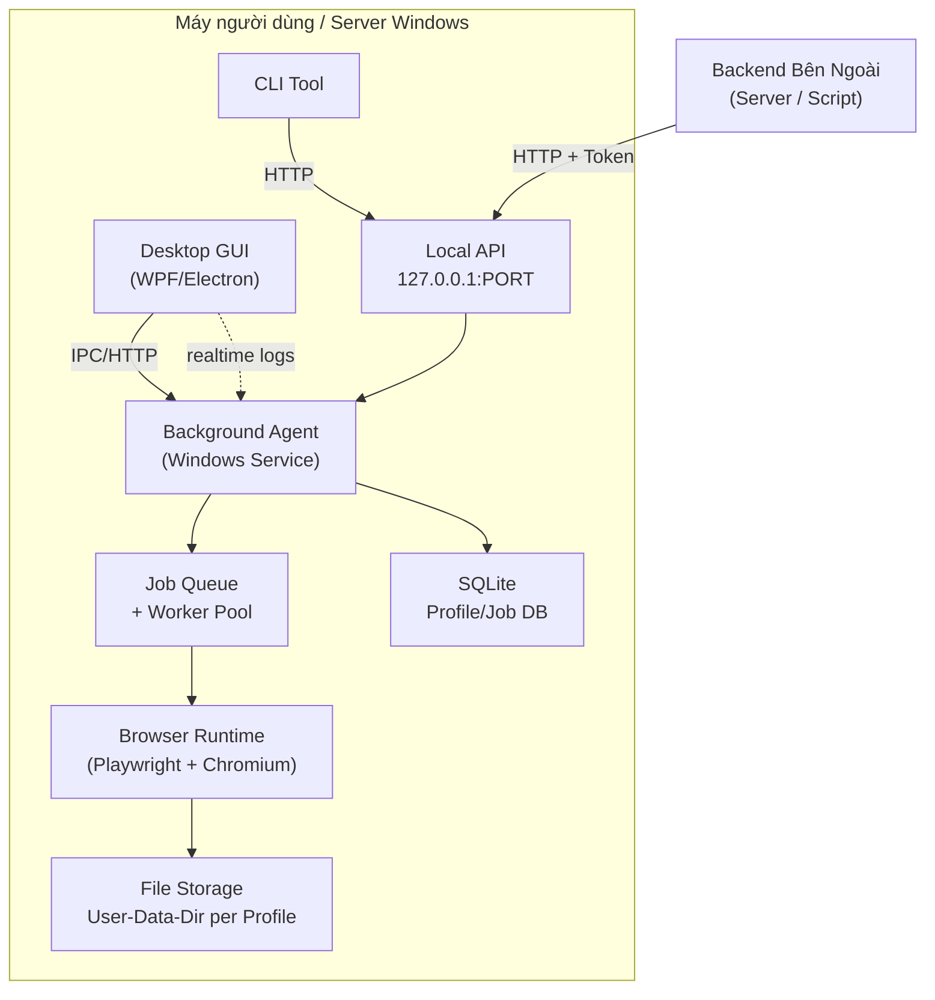
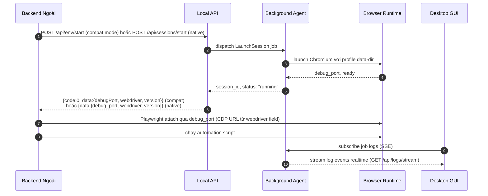

# 00 — Tổng Quan Dự Án

> **Phiên bản**: 1.2 | **Ngày**: 2026-02-18 | **Trạng thái**: Review  
> **EPIC tương ứng**: A — Phân tích & đối chiếu tính năng

---

## 1. Giới thiệu dự án

Dự án xây dựng một **Windows Desktop Application** (tạm gọi là **BrowserManager**) cho phép quản lý nhiều Browser Profile tách biệt, vận hành tự động hoá web, và điều khiển từ xa qua Agent/CLI/API — tương đương kiến trúc của MoreLogin nhưng được triển khai theo hướng **hợp pháp, minh bạch, và kiểm soát được**.

### 1.1 Bối cảnh

Nghiên cứu về MoreLogin (xem `nghien-cuu.md`) cho thấy nhu cầu thực tế:
- Quản lý nhiều tài khoản browser tách biệt phục vụ automation hợp lệ.
- Local API chạy trên máy (mặc định `127.0.0.1:40000`) để backend ngoài gửi lệnh.
- Open API (JWT Bearer) để luồng server-to-server.
- Hỗ trợ proxy per-profile, session lifecycle, job queue.

Dự án này tái tạo kiến trúc đó ở dạng **tự triển khai** (self-hosted), hoàn toàn chạy trên máy người dùng/server Windows.

---

## 2. Mục tiêu sản phẩm

| # | Mục tiêu | Chỉ số thành công |
|---|---|---|
| M1 | Quản lý nhiều Browser Profile tách biệt | Tạo/sửa/xoá/clone 100 profile không lỗi |
| M2 | Background Agent hoạt động độc lập GUI | Agent sống sau khi đóng GUI; healthcheck pass |
| M3 | CLI điều khiển đầy đủ không cần GUI | Tất cả lệnh cốt lõi chạy qua terminal |
| M4 | Local API nhận lệnh từ backend ngoài | Backend gọi API → agent thực thi → trả kết quả |
| M5 | Giao diện Desktop hiển thị realtime | Job logs stream live trên GUI |
| M6 | Automation hợp lệ qua Playwright | Chạy 3 kịch bản mẫu end-to-end thành công |

---

## 3. Phạm vi (Scope)

### 3.1 In-Scope (phải có)

- **GUI Desktop** (Windows 10+): quản lý profile, jobs, settings.
- **Background Agent**: Windows Service hoặc tray background process.
- **CLI**: global tool giao tiếp với agent.
- **Local API**: HTTP localhost + token auth.
- **Profile System**: data-dir isolation, proxy per-profile, extensions.
- **Session Manager**: launch/stop browser instances.
- **Job Runner**: queue + worker pool + logging.
- **Automation Framework**: script runner qua Playwright.
- **Installer**: MSI/EXE không mất dữ liệu khi nâng cấp.

### 3.2 Out-of-Scope (không làm)

- Bất kỳ cơ chế "né phát hiện", "làm giả fingerprint nâng cao", "vượt anti-bot".
- Cloud phone (Android-in-cloud) — không phải phạm vi của dự án này.
- Multi-user SaaS / Open API dạng public cloud.

### 3.3 Mục tiêu parity bổ sung (v1.2+)

- **API parity 1-1 với MoreLogin public baseline**: BrowserManager hỗ trợ tất cả endpoint trong `13-baseline-morelogin-public.md` (30 endpoints) thông qua compat layer.
- **Field parity**: Profile/Group/Tag/ProxyInfo objects có đầy đủ fields tương đương.
- **UX parity**: Các UX operation trong GUI tương đương MoreLogin public UI.

> Tham chiếu: `14-parity-matrix.md` cho trạng thái coverage hiện tại.

---

## 3A. Gate Duyệt OK (G0–G6)

Dự án đạt **OK triển khai** khi pass tất cả 7 Gate sau:

| Gate | Tên | Điều kiện Pass |
|---|---|---|
| **G0** | Bộ tài liệu đầy đủ artefact | Có đủ: `13-baseline-morelogin-public.md`, `14-parity-matrix.md`, `openapi.yaml` riêng, `threat-model` trong `09`, `migration-plan.md`, sample scripts thực thi được |
| **G1** | Nhất quán nội bộ | Port mặc định `40000` nhất quán; compat envelope `{code,msg,data,requestId}` nhất quán; route aliases đúng |
| **G2** | API parity 1-1 | ≥ 90% endpoint baseline covered (≥30/33 Full hoặc Partial) |
| **G3** | UX parity 1-1 | Tất cả UX operations trong `13-baseline` được spec trong `08-desktop-gui.md` |
| **G4** | Data model parity | Bảng `env_groups`, `env_tags`, `profile_tags` tồn tại; fields parity ≥ 90% |
| **G5** | Security parity | E2E Encryption + Lock Status interface spec đầy đủ; threat model pass |
| **G6** | Restricted content governance | Không có nội dung anti-detect; mọi restricted feature được gắn nhãn `[Restricted]` |

**Trạng thái hiện tại (2026-02-18)**:
- G0: ✅ Pass — artefact đầy đủ
- G1: ✅ Pass — port `40000` nhất quán; compat envelope `{code,msg,data,requestId}` spec đầy đủ trong `12-api-compatibility.md` §4
- G2: ✅ Pass (~97% — 32/33 Full; 1 N/A cloud-only; 0 Missing)
- G3: ✅ Pass (~96% — 23/26 Full; 3 Restricted đã có spec placeholder; 0 Missing)
- G4: ✅ Pass (~95% — `env_groups`, `env_tags`, `profile_tags` bảng đã có; fields `remark`/`groupId` spec đầy đủ trong Migration 007/006)
- G5: ✅ Pass (E2E Encryption + Lock Status interface spec đầy đủ trong `09-bao-mat-va-luu-tru.md` §8C/8D; phạm vi v1 vs v1.2+ chốt rõ tại §8E)
- G6: ✅ Pass

> **Kết luận**: **7/7 Gates PASS** — Bộ tài liệu đạt chuẩn spec để duyệt OK sang triển khai. Xem `14-parity-matrix.md` §8 cho roadmap implementation.

---

## 4. Kiến trúc tổng thể (Bird-eye View)

---

## 5. Các thành phần chính

| Thành phần | Vai trò | Tài liệu chi tiết |
|---|---|---|
| Desktop GUI | Giao diện người dùng, hiển thị trạng thái | `08-desktop-gui.md` |
| Background Agent | Nhận lệnh, điều phối jobs | `03-background-agent.md` |
| Local API | HTTP endpoint localhost, auth token | `04-local-api.md` |
| CLI | Lệnh terminal, output JSON | `05-cli-spec.md` |
| Profile System | CRUD profile, isolation, proxy | `02-he-thong-profile.md` |
| Browser Runtime | Launch/stop Chromium instances | `06-browser-runtime.md` |
| Automation Framework | Chạy scripts qua Playwright | `07-automation-framework.md` |
| Bảo mật & Lưu trữ | Mã hoá, DPAPI, audit log | `09-bao-mat-va-luu-tru.md` |
| QA & Release | Test plan, release checklist | `10-qa-release-checklist.md` |
| Installer Spec | WiX MSI build, signing, CI/CD | `11-installer-spec.md` |
| API Compatibility | Mapping MoreLogin-style → native API | `12-api-compatibility.md` |

---

## 6. Luồng hoạt động tổng thể

> **Note**: Compat mode (`POST /api/env/start`) tương thích với MoreLogin client code.  
> Native mode (`POST /api/sessions/start`) là API chuẩn của BrowserManager.  
> Cả hai mode trả `debugPort`/`debug_port`, `webdriver`, và `version` trong response.

---

## 7. Tiêu chí nghiệm thu (Acceptance Criteria)

Dự án đạt **100%** khi thỏa tất cả điều kiện sau:

### AC-01: Agent chạy ngầm đúng yêu cầu
- [ ] Mở app → agent khởi động tự động.
- [ ] Đóng GUI → agent tiếp tục chạy (nếu cấu hình).
- [ ] `GET /health` trả `200 OK` với uptime.

### AC-02: Điều khiển qua CLI không cần GUI
- [ ] `profiles create`, `profiles list`, `session start`, `job run` chạy thành công.
- [ ] Output JSON hợp lệ, exit code 0 khi thành công.

### AC-03: Điều khiển qua Local API
- [ ] Backend gọi `POST /profiles`, `POST /sessions/start`, `GET /jobs/:id`.
- [ ] Authentication token bắt buộc; request không có token → 401.

### AC-04: GUI hiển thị realtime
- [ ] Jobs UI stream log live khi job đang chạy.
- [ ] Dashboard hiển thị số session đang hoạt động.

### AC-05: Ổn định
- [ ] Chạy 10 profile song song không crash agent.
- [ ] Crash browser instance → job status → `failed`; agent không chết.

### AC-06: Bảo mật tối thiểu
- [ ] API token lưu mã hoá, không xuất hiện trong logs.
- [ ] Proxy passwords mã hoá bằng DPAPI.

---

## 8. Chú giải nguồn tham khảo (từ nghiên cứu MoreLogin)

| Tính năng BrowserManager | Tương đương MoreLogin | Khác biệt |
|---|---|---|
| Local API `127.0.0.1:40000` | Local API `127.0.0.1:40000` | Không yêu cầu đăng nhập cloud; hoàn toàn offline |
| Profile data-dir isolation | Persistent isolated environment | Không fingerprint spoofing |
| Playwright + Chromium | WebDriver/CDP attach sau `api/env/start` | Framework rõ ràng, không black-box |
| Job queue + worker | Không có tài liệu công khai | Thêm visibility qua GUI |
| DPAPI cho secrets | AES-256 encryption (marketing claim) | Chuẩn Windows OS-level, kiểm chứng được |
| Group/Tag entities (UUID FK) | Group/Tag với UUID entity | Tương đương — thêm trong v1.1 |
| `/api/env/*` compat endpoints | `/api/env/*` native endpoints | Alias layer; native endpoints khác tên |
| E2E Encryption [Restricted] | E2E Encryption feature | Chỉ mô tả interface, không copy implementation |
| Lock Status [Restricted] | Profile lock feature | Chỉ mô tả interface, không copy implementation |

---

## 9. WBS Mapping

| EPIC | Mô tả | Tài liệu |
|---|---|---|
| A | Phân tích & Feature Matrix | Tài liệu này (00) |
| B | Kiến trúc hệ thống | `01-kien-truc-he-thong.md` |
| C | Background Agent | `03-background-agent.md` |
| D | Profile System | `02-he-thong-profile.md` |
| E | Browser Runtime | `06-browser-runtime.md` |
| F | Automation Framework | `07-automation-framework.md` |
| G | CLI | `05-cli-spec.md` |
| H | Desktop GUI | `08-desktop-gui.md` |
| I | Installer & Update | `11-installer-spec.md` |
| J | QA & Release | `10-qa-release-checklist.md` |
| K | API Compatibility Layer | `12-api-compatibility.md` |

---

## 10. Definition of Done (DoD) — EPIC A

- [x] Tài liệu tổng quan được viết đầy đủ.
- [x] Feature Matrix hoàn thiện (xem `01-kien-truc-he-thong.md` phần Feature Matrix).
- [x] In-scope/Out-of-scope được chốt và phổ biến tới đội kỹ thuật.
- [x] Tiêu chí nghiệm thu được đội review và sign-off.

---

*Tài liệu tiếp theo: [01-kien-truc-he-thong.md](01-kien-truc-he-thong.md)*
