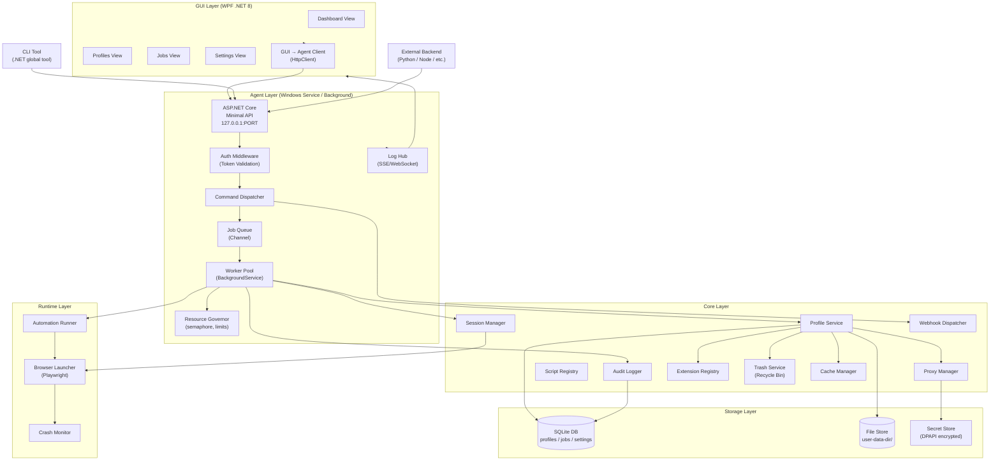
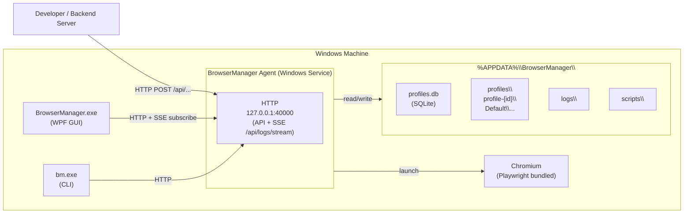
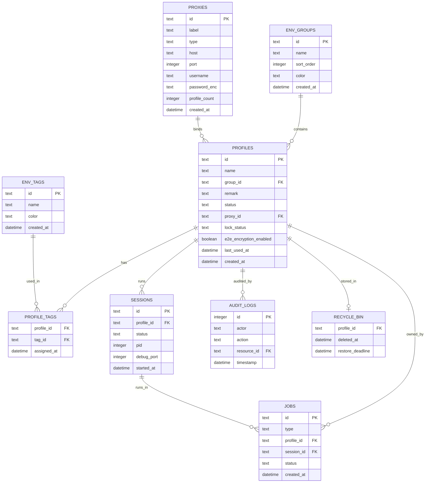

# 01 — Kiến Trúc Hệ Thống

> **Phiên bản**: 1.1 | **Ngày**: 2026-02-18 | **Trạng thái**: Review  
> **EPIC tương ứng**: B — Thiết kế kiến trúc & nền tảng

---

## 1. Mục tiêu tài liệu

Tài liệu này xác định:
- Stack công nghệ được chọn (với ADR — Architecture Decision Records).
- Sơ đồ kiến trúc chi tiết từng lớp.
- Database schema và migration strategy.
- Luồng dữ liệu liên module.
- Feature Matrix tổng hợp.

---

## 2. Stack Công Nghệ (Technology Stack)

### 2.1 ADR-001: GUI Framework

| Option | Ưu điểm | Nhược điểm |
|---|---|---|
| **WPF (.NET 8)** | Native Windows, hiệu năng cao, DPAPI dễ tích hợp | Chỉ Windows; UI cồng kềnh hơn |
| **WinUI 3** | Modern UI, fluent design | Còn mới, hệ sinh thái nhỏ |
| **Electron** | Nhanh UI, đa nền tảng, Web tech | RAM cao, bundle lớn |
| **Tauri (Rust + WebView)** | Nhẹ, nhanh, Rust backend | Hệ sinh thái nhỏ, learning curve |

**Quyết định: WPF (.NET 8)**  
Lý do: Dự án phạm vi Windows-only; DPAPI native; .NET ecosystem tốt cho Windows Service; dễ chia sẻ code giữa GUI và Agent.

### 2.2 ADR-002: Browser Runtime

| Option | Ưu điểm | Nhược điểm |
|---|---|---|
| **Playwright + Chromium** | Auto-bundled, stable API, CDP support, debugging | Bundle size ~150MB |
| **Selenium + ChromeDriver** | Phổ biến | Thiếu tính năng modern |
| **CEF (Chromium Embedded)** | Embed sâu vào app | Phức tạp, khó update |
| **Puppeteer** | Node.js ecosystem | Cần Node runtime |

**Quyết định: Playwright (.NET) + Chromium (bundled)**  
Lý do: Hỗ trợ `--user-data-dir` riêng cho từng profile; CDP debug port expose; proxy per-launch args; .NET native bindings.

### 2.3 ADR-003: IPC / Local API Transport

| Option | Ưu điểm | Nhược điểm |
|---|---|---|
| **HTTP localhost (ASP.NET Core)** | Quen thuộc, REST, dễ test với curl | Cần quản lý port conflict |
| **Named Pipe (IPC)** | Nhanh, OS-native | Khó debug từ bên ngoài |
| **gRPC over pipe** | Schema-driven, binary | Overhead setup, less REST-friendly |
| **SignalR** | Realtime built-in | Overhead nếu chỉ dùng cho local |

**Quyết định: ASP.NET Core (Minimal API) over HTTP localhost**  
Lý do: Dễ tích hợp backend ngoài (curl/Postman/Python requests); REST quen thuộc; dễ tích hợp WebSocket/SSE cho streaming logs.

### 2.4 ADR-004: Database

**Quyết định: SQLite (Microsoft.Data.Sqlite) + EF Core**  
Lý do: Không cần server; file-based dễ backup; EF Core migration; phù hợp desktop app.

### 2.5 ADR-005: CLI

**Quyết định: .NET global tool (single-file executable)**  
Lý do: Cùng .NET stack với Agent; giao tiếp qua Local API HTTP; publish single-file EXE.

### 2.6 ADR-006: Local Storage Strategy

**Quyết định: SQLite + EF Core Migrations, data in `%APPDATA%\BrowserManager\`**  
Lý do: File-based, không cần server, dễ backup, user-scoped DPAPI encryption.

### 2.7 ADR-007: MoreLogin Compatibility Mode — Alias endpoints + Port strategy

**Bối cảnh**: Nhiều backend automation đã viết sẵn code gọi MoreLogin Local API (`http://127.0.0.1:40000/api/env/*`). BrowserManager cần hỗ trợ drop-in compatibility để giảm effort migration cho users.

**Quyết định**:
- **Port mặc định: `40000`** — khớp với MoreLogin baseline để backend không cần đổi URL.
- **Compat endpoints**: Thêm alias routes `/api/env/*`, `/api/envgroup/*`, `/api/envtag/*`, `/api/proxyInfo/*` map tới native endpoints tương ứng.
- **Compat envelope**: Khi `compatibility.response_format: "morelogin"` trong config, response dùng `{code,msg,data,requestId}`.
- **Opt-in**: Compat mode mặc định **disabled** — user bật qua settings.

**Port conflict handling**:
- Nếu MoreLogin đang chạy trên cùng máy (port 40000 occupied): Agent log warning và exit với error.
- Workaround: đổi `api.port` sang giá trị khác (ví dụ `19000`).
- Document rõ trong UI: "Port 40000 is in use by another application. Please change the port in Settings."

**Trade-offs**:

| Option | Ưu điểm | Nhược điểm |
|---|---|---|
| Port 40000 (default) | Drop-in compat; zero config cho user | Conflict nếu cùng máy với MoreLogin |
| Port 19000 (alt) | Không conflict | Backend phải đổi URL |
| Port configurable (chosen) | Flexible | User cần biết config |

**Legal note**: Compatibility mode là "API behavior parity" — cùng endpoint path, cùng field names, cùng response format. Không copy brand, không copy proprietary business logic, không reverse engineer private APIs.

**ADR status**: ACCEPTED — 2026-02-18

---

## 3. Sơ Đồ Kiến Trúc Chi Tiết

### 3.1 Module Architecture



### 3.2 Deployment Diagram



---

## 4. Database Schema

### 4.0 ER Diagram



### 4.1 Bảng `profiles`

```sql
CREATE TABLE profiles (
    id           TEXT PRIMARY KEY,
    name         TEXT NOT NULL UNIQUE,
    group_name   TEXT,
    tags         TEXT,                      -- JSON array (legacy; use profile_tags for new code)
    status       TEXT DEFAULT 'inactive',  -- inactive | active | error | deleted
    proxy_id     TEXT REFERENCES proxies(id),
    start_url    TEXT,
    extensions   TEXT,                      -- JSON array of extension IDs (legacy; use extensions table for central mgmt)
    data_dir     TEXT NOT NULL,             -- absolute path
    -- Group FK (v1.1+)
    group_id     TEXT REFERENCES env_groups(id) ON DELETE SET NULL,
    remark       TEXT,                      -- free-text note (v1.1+)
    -- Browser/environment fields
    user_agent   TEXT,                      -- Custom User-Agent string
    kernel_ver   TEXT,                      -- Chromium kernel version
    os_version   TEXT,                      -- OS version string shown to browser
    screen_res   TEXT,                      -- Screen resolution (e.g. "1920x1080")
    timezone     TEXT,                      -- IANA timezone (e.g. "Asia/Ho_Chi_Minh")
    language     TEXT,                      -- Accept-Language header value
    headless_default BOOLEAN DEFAULT 0,
    -- Security interface fields (v1.1+) [Restricted — interface only]
    e2e_encryption_enabled BOOLEAN DEFAULT 0,
    lock_status  TEXT DEFAULT 'unlocked' CHECK (lock_status IN ('unlocked', 'locked')),
    -- Timestamps
    last_used_at DATETIME,                  -- last session start (v1.1+)
    created_at   DATETIME DEFAULT CURRENT_TIMESTAMP,
    updated_at   DATETIME DEFAULT CURRENT_TIMESTAMP,
    deleted_at   DATETIME,                  -- soft delete timestamp
    metadata     TEXT                       -- JSON blob for extra config
);
```

### 4.2 Bảng `proxies`

```sql
CREATE TABLE proxies (
    id           TEXT PRIMARY KEY,
    label        TEXT,
    type         TEXT NOT NULL,  -- http | https | socks5 | ssh
    host         TEXT NOT NULL,
    port         INTEGER NOT NULL,
    username     TEXT,
    password_enc TEXT,           -- DPAPI encrypted
    refresh_url  TEXT,
    last_checked DATETIME,
    last_status  TEXT,           -- ok | timeout | auth_error
    profile_count INTEGER NOT NULL DEFAULT 0,  -- denormalized cache (v1.1+)
    created_at   DATETIME DEFAULT CURRENT_TIMESTAMP
);
```

### 4.2a Bảng `env_groups` (v1.1+)

```sql
CREATE TABLE env_groups (
    id           TEXT PRIMARY KEY,  -- UUID
    name         TEXT NOT NULL UNIQUE,
    sort_order   INTEGER DEFAULT 0,
    color        TEXT,              -- hex color e.g. "#FF5733"
    created_at   DATETIME DEFAULT CURRENT_TIMESTAMP,
    updated_at   DATETIME DEFAULT CURRENT_TIMESTAMP
);

CREATE INDEX idx_env_groups_name ON env_groups(name);
```

### 4.2b Bảng `env_tags` (v1.1+)

```sql
CREATE TABLE env_tags (
    id           TEXT PRIMARY KEY,  -- UUID
    name         TEXT NOT NULL UNIQUE,
    color        TEXT NOT NULL DEFAULT '#808080',
    created_at   DATETIME DEFAULT CURRENT_TIMESTAMP,
    updated_at   DATETIME DEFAULT CURRENT_TIMESTAMP
);

CREATE INDEX idx_env_tags_name ON env_tags(name);
```

### 4.2c Bảng `profile_tags` — n-n junction (v1.1+)

```sql
CREATE TABLE profile_tags (
    profile_id   TEXT NOT NULL REFERENCES profiles(id) ON DELETE CASCADE,
    tag_id       TEXT NOT NULL REFERENCES env_tags(id) ON DELETE CASCADE,
    assigned_at  DATETIME DEFAULT CURRENT_TIMESTAMP,
    PRIMARY KEY (profile_id, tag_id)
);

CREATE INDEX idx_profile_tags_profile ON profile_tags(profile_id);
CREATE INDEX idx_profile_tags_tag     ON profile_tags(tag_id);
```

### 4.3 Bảng `sessions`

```sql
CREATE TABLE sessions (
    id          TEXT PRIMARY KEY,
    profile_id  TEXT NOT NULL REFERENCES profiles(id),
    status      TEXT NOT NULL,   -- launching | running | stopped | crashed
    pid         INTEGER,
    debug_port  INTEGER,
    headless    BOOLEAN DEFAULT 0,
    started_at  DATETIME,
    stopped_at  DATETIME,
    crash_count INTEGER DEFAULT 0
);
```

### 4.4 Bảng `jobs`

```sql
CREATE TABLE jobs (
    id           TEXT PRIMARY KEY,
    type         TEXT NOT NULL,   -- create_profile | launch_session | run_script | ...
    profile_id   TEXT REFERENCES profiles(id),
    session_id   TEXT REFERENCES sessions(id),
    status       TEXT NOT NULL,   -- queued | running | completed | failed | cancelled
    payload      TEXT,            -- JSON input params
    result       TEXT,            -- JSON output
    error_msg    TEXT,
    created_at   DATETIME DEFAULT CURRENT_TIMESTAMP,
    started_at   DATETIME,
    completed_at DATETIME,
    retry_count  INTEGER DEFAULT 0,
    max_retries  INTEGER DEFAULT 0
);
```

### 4.5 Bảng `job_logs`

```sql
CREATE TABLE job_logs (
    id          INTEGER PRIMARY KEY AUTOINCREMENT,
    job_id      TEXT NOT NULL REFERENCES jobs(id),
    level       TEXT NOT NULL,  -- INFO | WARN | ERROR | DEBUG
    message     TEXT NOT NULL,
    timestamp   DATETIME DEFAULT CURRENT_TIMESTAMP,
    metadata    TEXT            -- JSON
);
```

### 4.6 Bảng `settings`

```sql
CREATE TABLE settings (
    key         TEXT PRIMARY KEY,
    value       TEXT NOT NULL,
    updated_at  DATETIME DEFAULT CURRENT_TIMESTAMP
);
-- Ví dụ keys: api_port, api_token_hash, autostart, max_concurrent_sessions,
--             log_level, data_root_path, agent_version
```

### 4.7 Bảng `audit_logs`

```sql
CREATE TABLE audit_logs (
    id           INTEGER PRIMARY KEY AUTOINCREMENT,
    timestamp    DATETIME DEFAULT CURRENT_TIMESTAMP,
    actor        TEXT,          -- "gui" | "cli" | "api" | "agent"
    action       TEXT NOT NULL, -- "profile.create" | "session.start" | ...
    resource_id  TEXT,
    ip_address   TEXT,
    request_id   TEXT,
    result       TEXT,          -- "ok" | "error"
    detail       TEXT           -- JSON
);
```

### 4.8 Bảng `extensions` (Extension Registry trung tâm)

```sql
CREATE TABLE extensions (
    id             TEXT PRIMARY KEY,   -- UUID trong registry
    ext_id         TEXT NOT NULL,      -- Chrome extension ID (e.g. "cfhdojbkjhnklbpkdaibdccddilifddb")
    name           TEXT NOT NULL,
    version        TEXT,
    source_url     TEXT,               -- Chrome Web Store URL
    crx_path       TEXT,               -- local CRX file path sau khi download
    verified       BOOLEAN DEFAULT 0,  -- đã verify signature
    created_at     DATETIME DEFAULT CURRENT_TIMESTAMP
);

-- Bảng liên kết extension ↔ profile (n-n)
CREATE TABLE profile_extensions (
    profile_id   TEXT NOT NULL REFERENCES profiles(id),
    extension_id TEXT NOT NULL REFERENCES extensions(id),
    assigned_at  DATETIME DEFAULT CURRENT_TIMESTAMP,
    PRIMARY KEY (profile_id, extension_id)
);
```

### 4.9 Bảng `profile_trash` (Recycle Bin)

```sql
CREATE TABLE profile_trash (
    profile_id      TEXT PRIMARY KEY REFERENCES profiles(id),
    deleted_at      DATETIME NOT NULL DEFAULT CURRENT_TIMESTAMP,
    restore_deadline DATETIME NOT NULL,  -- deleted_at + 7 days
    deleted_by      TEXT,               -- "gui" | "cli" | "api"
    data_dir_size   INTEGER             -- bytes, for cleanup reporting
);
```

### 4.10 Bảng `webhooks`

```sql
CREATE TABLE webhooks (
    id              TEXT PRIMARY KEY,
    url             TEXT NOT NULL,
    events          TEXT NOT NULL,       -- JSON array: ["job.completed", "session.crashed"]
    secret_enc      TEXT,               -- DPAPI encrypted HMAC secret
    active          BOOLEAN DEFAULT 1,
    failure_count   INTEGER DEFAULT 0,  -- reset khi thành công
    last_triggered  DATETIME,
    created_at      DATETIME DEFAULT CURRENT_TIMESTAMP
);
```

### 4.11 Bảng `cache_clear_history`

```sql
CREATE TABLE cache_clear_history (
    id          INTEGER PRIMARY KEY AUTOINCREMENT,
    profile_id  TEXT NOT NULL REFERENCES profiles(id),
    types       TEXT NOT NULL,           -- JSON array: ["cookies","local_storage"]
    bytes_freed INTEGER DEFAULT 0,
    cleared_at  DATETIME DEFAULT CURRENT_TIMESTAMP,
    cleared_by  TEXT                     -- "gui" | "cli" | "api"
);
```

---

## 5. Migration Strategy

```
migrations/
  001_initial_schema.sql
  002_add_extensions_column.sql
  003_add_audit_logs.sql
  ...
```

Dùng **EF Core Migrations** hoặc **DbUp** (simple SQL runner).  
Rule:
- Mỗi migration chỉ `ALTER TABLE` theo hướng forward.
- Không xóa cột (chỉ đánh dấu deprecated).
- Upgrade installer chạy migration tự động trước khi agent khởi động.

---

## 6. Feature Matrix

| # | Tính năng | Ưu tiên | Module | CLI | API | GUI | DoD |
|---|---|---|---|---|---|---|---|
| F01 | Tạo profile | P0 | Profile System | ✅ | ✅ | ✅ | CRUD test pass |
| F02 | Sửa profile | P0 | Profile System | ✅ | ✅ | ✅ | Validate + update |
| F03 | Xoá profile (soft delete) | P0 | Profile System | ✅ | ✅ | ✅ | Vào trash; data-dir không xoá ngay |
| F03b | Recycle Bin / Restore | P1 | Profile System | ✅ | ✅ | ✅ | Restore trong 7 ngày |
| F04 | Clone profile | P1 | Profile System | ✅ | ✅ | ✅ | Tách data-dir |
| F05 | Import/Export profile | P1 | Profile System | ✅ | ✅ | ✅ | ZIP + manifest |
| F05b | Batch Operations | P1 | Profile System | ✅ | ✅ | ✅ | set_group/set_proxy/add_tag |
| F05c | Cache Management | P1 | Profile System | ✅ | ✅ | ✅ | Clear per-type, ghi history |
| F06 | Proxy per-profile | P0 | Proxy Manager | ✅ | ✅ | ✅ | Test connectivity |
| F07 | Launch session (headful) | P0 | Session Manager | ✅ | ✅ | ✅ | Browser mở |
| F08 | Launch session (headless) | P0 | Session Manager | ✅ | ✅ | ✅ | CDP port open |
| F09 | Stop session | P0 | Session Manager | ✅ | ✅ | ✅ | Process sạch |
| F09b | Close All sessions | P1 | Session Manager | ✅ | ✅ | ✅ | Bulk stop |
| F09c | Get All Debug Info | P1 | Session Manager | ✅ | ✅ | ❌ | CDP ports tổng hợp |
| F10 | Crash recovery | P1 | Session Manager | ❌ | ❌ | ✅ (hiển thị) | Auto detect crash |
| F11 | Job queue | P0 | Job Runner | ❌ | ✅ | ✅ | Queue không mất job |
| F12 | Realtime log stream (SSE) | P1 | Log Hub | ❌ | ✅ (SSE) | ✅ | Độ trễ < 1s |
| F13 | API auth token | P0 | Local API | ❌ | ✅ | ✅ (settings) | 401 đúng |
| F14 | Run automation script | P1 | Auto Framework | ✅ | ✅ | ✅ | 3+ script mẫu |
| F15 | Script registry | P2 | Auto Framework | ✅ | ✅ | ✅ | List/add/remove |
| F15b | Extension Bulk Management | P1 | Extension Registry | ✅ | ✅ | ✅ | Assign N profiles cùng lúc |
| F16 | Agent healthcheck | P0 | Agent | ❌ | ✅ | ✅ | GET /health = 200 |
| F17 | Settings (port, autostart) | P1 | Settings | ❌ | ✅ | ✅ | Persist + reload |
| F18 | Audit log | P1 | Audit | ❌ | ✅ | ✅ | Mọi action log |
| F19 | Resource governor | P1 | Agent | ❌ | ❌ | ✅ (config) | Max sessions enforce |
| F20 | Installer MSI | P0 | Installer | N/A | N/A | N/A | Install/uninstall |
| F21 | Webhook | P2 | Local API | ❌ | ✅ | ❌ | HMAC signed; retry policy |
| F22 | API Compatibility Layer | P3 | Local API | ❌ | ✅ | ❌ | /api/env/* mapping |

---

## 7. Thư Mục Dự Án (Solution Structure)

```
BrowserManager/
├── src/
│   ├── BrowserManager.Agent/          ← Windows Service + Local API
│   │   ├── Program.cs
│   │   ├── Api/                       ← ASP.NET Core Minimal API endpoints
│   │   ├── Jobs/                      ← Job handlers
│   │   ├── Services/                  ← Profile, Session, Proxy, Automation services
│   │   └── Worker/                    ← Background workers
│   │
│   ├── BrowserManager.Core/           ← Shared models, interfaces, DTOs
│   │   ├── Models/
│   │   ├── Interfaces/
│   │   └── Exceptions/
│   │
│   ├── BrowserManager.Data/           ← EF Core DbContext, migrations
│   │   ├── Migrations/
│   │   └── AppDbContext.cs
│   │
│   ├── BrowserManager.Gui/            ← WPF Desktop App
│   │   ├── Views/
│   │   ├── ViewModels/
│   │   └── Services/                  ← Agent client (HttpClient wrapper)
│   │
│   ├── BrowserManager.Cli/            ← .NET CLI tool
│   │   └── Commands/
│   │
│   └── BrowserManager.Runtime/        ← Playwright wrapper
│       ├── BrowserLauncher.cs
│       └── AutomationRunner.cs
│
├── tests/
│   ├── BrowserManager.Unit.Tests/
│   ├── BrowserManager.Integration.Tests/
│   └── BrowserManager.E2E.Tests/
│
├── scripts/                           ← Automation script samples
├── installer/                         ← WiX / NSIS installer config
└── docs/                              ← Tài liệu dự án
```

---

## 8. Threat Model (Tóm lược)

| Threat | Vector | Biện pháp |
|---|---|---|
| Token lộ trong logs | Log ghi Authorization header | Mask header trong log middleware |
| Token bị brute-force | Local API exposed | Rate limit, token min-length 32 chars |
| Proxy password lộ | Plain-text trong DB | DPAPI encrypt trước khi lưu |
| Local API exposed ngoài localhost | Misconfiguration | Bind cứng `127.0.0.1`, không `0.0.0.0` |
| SQLite DB bị copy | File system access | Không lưu secret plain-text; DPAPI |
| Process injection vào browser | Malware local | Out-of-scope; OS security responsibility |

---

## 9. Definition of Done (DoD) — EPIC B

- [ ] ADR được đội review và sign-off.
- [ ] Sơ đồ kiến trúc cập nhật sau mỗi thay đổi lớn.
- [ ] DB schema migration chạy thành công từ fresh install.
- [ ] Solution structure được tạo với skeleton projects.
- [ ] Threat model được security review.

---

*Tài liệu tiếp theo: [02-he-thong-profile.md](02-he-thong-profile.md)*
