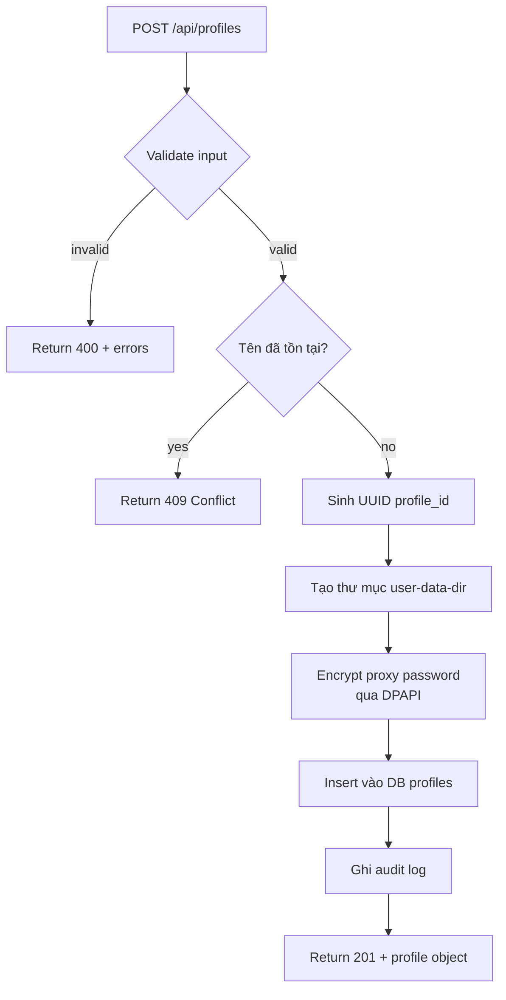
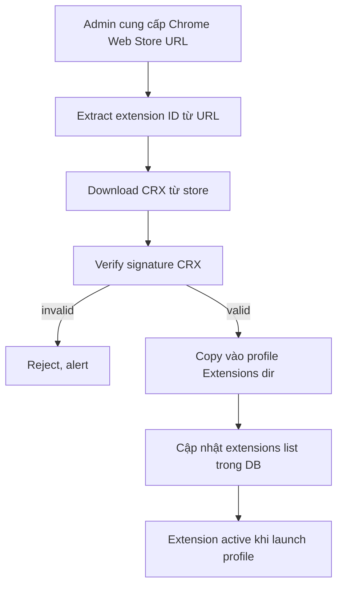
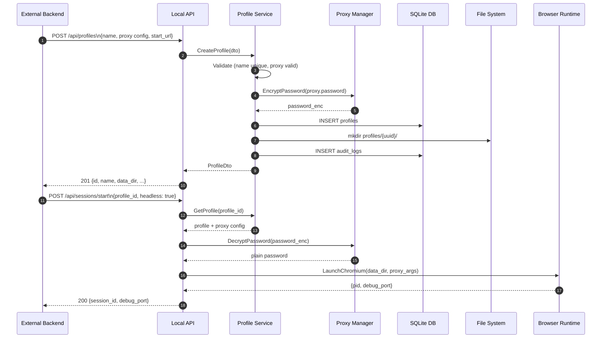

# 02 — Hệ Thống Profile

> **Phiên bản**: 1.2 | **Ngày**: 2026-02-18 | **Trạng thái**: Review  
> **EPIC tương ứng**: D — Profile System

---

## 1. Mục tiêu tài liệu

Mô tả đầy đủ cơ chế quản lý Browser Profile:
- CRUD + Clone + Import/Export.
- Data-directory isolation per profile.
- Proxy module (validate, test, encrypt).
- Extension management.
- Quy tắc đặt tên/ID.

---

## 2. Khái niệm Profile

Mỗi **Browser Profile** là một môi trường trình duyệt **tách biệt hoàn toàn**:
- Có thư mục dữ liệu riêng (`user-data-dir`) → cookie, localStorage, IndexedDB, extension data độc lập.
- Có cấu hình proxy riêng.
- Có danh sách extension riêng.
- Có start URL, tags, group riêng.

> **Tham chiếu MoreLogin**: `POST /api/env/create/quick` tạo profile với `envId` duy nhất; `user-data-dir` isolation là cơ chế cốt lõi để phân tách phiên. Dự án này áp dụng cùng nguyên lý nhưng hoàn toàn local, không cần cloud account.

---

## 3. Functional Requirements

### FR-P1: Tạo Profile

Trường bắt buộc:
- `name` (string, unique, max 100 chars)
- `group_id` (UUID FK → `env_groups.id`, optional — nếu NULL bị xếp vào **Ungrouped**)
- `remark` (string, optional, max 500 chars — ghi chú hiển thị rõ trong UI)

> **Trường cũ deprecated**: `group_name` (string) và `tags` (JSON string[]) vẫn được chấp nhận trong request compat nhưng sẽ bị loại bỏ ở v1.3. Xem `migration-plan.md` Migration 006.

Trường cấu hình proxy (optional nhưng recommended):
- `proxy.type` — `http | https | socks5 | ssh`
- `proxy.host`
- `proxy.port`
- `proxy.username`
- `proxy.password` (sẽ được mã hoá trước khi lưu)

Trường khác:
- `start_url` (string, optional, default blank)
- `extensions` (string[], optional — list extension IDs)
- `headless_default` (boolean, default false)

Trường **[Restricted]** — chỉ có trong agent v1.2+, kiểm tra `x-min-agent-version` trước khi dùng:
- `e2e_encryption_enabled` (boolean, default false) — xem [`09-bao-mat-va-luu-tru.md`](09-bao-mat-va-luu-tru.md) §8C
- `lock_status` (`"unlocked" | "locked"`, default `"unlocked"`) — xem [`09-bao-mat-va-luu-tru.md`](09-bao-mat-va-luu-tru.md) §8D

Hành động khi tạo:
1. Validate tên không trùng.
2. Sinh `profile_id` = UUID v4.
3. Tạo thư mục: `{data_root}/profiles/{profile_id}/`.
4. Lưu record vào DB `profiles`.
5. Tạo Job record `create_profile` → status `completed`.
6. Return profile object.



### FR-P2: Sửa Profile

- Cho phép cập nhật tất cả trường trừ `id`, `data_dir`.
- Validate proxy config nếu thay đổi.
- Không được sửa profile đang có session `running`.
- Ghi audit log.

### FR-P3: Xoá Profile

- **Soft delete** (mặc định): đặt `status = 'deleted'`, profile được chuyển vào Recycle Bin.
- Trong vòng **7 ngày**: có thể khôi phục qua `POST /api/profiles/{id}/restore`.
- Sau 7 ngày: Agent tự động xoá `data_dir` và bản ghi DB (permanent cleanup job).
- Không được xoá profile đang có session `running` → `409`.
- **Permanent delete**: `DELETE /api/profiles/{id}/permanent` — xoá ngay, không vào trash.
- Cascade: xoá job logs liên quan khi permanent delete.

### FR-P4: Clone Profile

Tạo profile mới từ profile gốc, với 2 mode:

| Mode | Mô tả |
|---|---|
| `metadata_only` | Sao chép tất cả cấu hình, tạo `data_dir` mới trống |
| `full_copy` | Sao chép metadata + toàn bộ `data_dir` (cookies, storage, extensions...) |

Tên clone mặc định: `{original_name} (Copy)`.

### FR-P5: Import/Export Profile

**Export:**
- Tạo file ZIP chứa:
  - `manifest.json` — metadata profile (không có secrets nếu option `exclude_secrets=true`).
  - `data_dir/` — toàn bộ user data (tuỳ chọn exclude).
- Output: `{profile_name}_{timestamp}.bm-profile.zip`.

**Import:**
- Giải nén ZIP.
- Đọc `manifest.json`.
- Kiểm tra conflict tên → tự động rename nếu trùng.
- Tạo profile mới từ manifest.
- Khôi phục `data_dir` (nếu có trong ZIP).

**manifest.json format:**
```json
// manifest.json format:
{
  "bm_version": "1.1",
  "exported_at": "2026-02-18T10:00:00Z",
  "profile": {
    "name": "Profile A",
    "group_id": "uuid",
    "group_name": "Group 1",
    "remark": "Account dùng cho campaign VN",
    "tags": ["ecommerce", "test"],
    "start_url": "https://example.com",
    "extensions": ["adblock_id"],
    "headless_default": false,
    "proxy": {
      "type": "socks5",
      "host": "proxy.example.com",
      "port": 1080,
      "username": "user"
      // password bị loại trừ nếu exclude_secrets=true
    }
  },
  "has_data_dir": true
}
```

---

## 3A. Profile Lifecycle Fields

### 3A.1 Timestamp Fields

Profile có các timestamp fields quan trọng để tracking lifecycle:

| Field | Type | Mô tả | Update Rule |
|---|---|---|---|
| `created_at` | DATETIME | Thời điểm tạo profile | Set once khi tạo, không thay đổi |
| `updated_at` | DATETIME | Thời điểm sửa profile metadata | Update mỗi khi PATCH `/api/profiles/{id}` |
| `last_used_at` | DATETIME | Thời điểm profile được sử dụng lần cuối | Update khi session start (xem §3A.2) |

### 3A.2 `last_used_at` — Định nghĩa và Update Rules

**Định nghĩa**: `last_used_at` là timestamp ghi nhận lần cuối profile được **start session**.

**Update khi**:
- ✅ `POST /api/sessions` (start session từ profile) → set `last_used_at = now()`
- ✅ MoreLogin compat: `POST /api/env/start` → set `last_used_at = now()`
- ✅ GUI: Click nút "Launch" trên profile → trigger start session → update `last_used_at`

**KHÔNG update khi**:
- ❌ Edit profile metadata (`PATCH /api/profiles/{id}`) — chỉ update `updated_at`
- ❌ Close session (`POST /api/sessions/{id}/stop`) — không đụng `last_used_at`
- ❌ View profile detail (`GET /api/profiles/{id}`) — read-only
- ❌ Session đang running — chỉ update khi **start**, không update liên tục

**Định dạng**:
- ISO 8601 format với timezone: `2026-02-19T10:30:00Z`
- Stored in DB as DATETIME (UTC)
- API response: string ISO 8601

**Headless/Automation mode**:
- ✅ Có update `last_used_at` khi start session headless
- Logic giống nhau cho cả GUI và headless — miễn là start session thì update

**Use cases**:
- Filter profiles theo "recently used" trong GUI
- Sort profiles by last used
- Identify stale profiles (không dùng > 30 ngày)
- Audit trail: khi nào profile được sử dụng

**Example API response**:
```json
{
  "id": "uuid",
  "name": "Profile A",
  "created_at": "2026-01-15T08:00:00Z",
  "updated_at": "2026-02-10T14:20:00Z",
  "last_used_at": "2026-02-19T10:30:00Z"
}
```

**Implementation notes**:
- Agent service `SessionManager.StartSession()` gọi `ProfileService.UpdateLastUsedAt(profileId)`
- Event: `SessionStarted` event → trigger update `last_used_at`
- Không cần transaction với session creation (eventual consistency OK)
- Xem `03-background-agent.md` §6 cho event mapping chi tiết

---

## 4. Data-Directory Isolation

### 4.1 Cấu trúc thư mục

```
{APPDATA}/BrowserManager/
└── profiles/
    ├── {profile-uuid-1}/
    │   ├── Default/
    │   │   ├── Cookies
    │   │   ├── Local Storage/
    │   │   ├── IndexedDB/
    │   │   ├── Extension State/
    │   │   └── ...
    │   └── Extensions/
    │       └── {ext-id}/
    ├── {profile-uuid-2}/
    │   └── ...
    └── ...
```

### 4.2 Quy tắc quản lý

- Mỗi profile có một thư mục UUID riêng → không thể conflict.
- Chromium launch với `--user-data-dir="{profile_dir}"` → hoàn toàn tách biệt.
- Không chia sẻ bất kỳ file nào giữa các profile.
- **Cleanup**: khi xoá profile, xoá thư mục (với confirmation nếu kích thước > 100MB).
- **Disk quota** (tuỳ chọn): giới hạn kích thước tối đa per profile, cảnh báo khi vượt ngưỡng.

### 4.3 Quyền truy cập

- Agent process chạy dưới user account của người dùng.
- Thư mục `profiles/` chỉ accessible bởi user account đó (không shared network path).
- Không dùng symlink để tránh directory traversal.

---

## 5. Proxy Module

### 5.1 Proxy config schema

```json
{
  "id": "uuid",
  "label": "US SOCKS5 #1",
  "type": "socks5",
  "host": "proxy.example.com",
  "port": 1080,
  "username": "proxyuser",
  "password": "DPAPI_ENCRYPTED_BASE64",
  "refresh_url": "https://api.provider.com/rotate?key=...",
  "last_checked": "2026-02-18T09:00:00Z",
  "last_status": "ok"
}
```

### 5.2 Proxy types hỗ trợ

| Type | Launch arg Playwright |
|---|---|
| `http` | `--proxy-server=http://host:port` |
| `https` | `--proxy-server=https://host:port` |
| `socks5` | `--proxy-server=socks5://host:port` |
| `ssh` | Tạo tunnel local SSH trước khi launch (xem 5.4) |

> **Ghi chú**: MoreLogin hỗ trợ thêm Trojan/Shadowsocks qua API. Dự án này chỉ hỗ trợ các protocol chuẩn ở phase 1.

### 5.3 Test proxy connectivity

Endpoint: `POST /proxies/{id}/test`

Logic:
1. Fetch `https://api.ipify.org?format=json` qua proxy config.
2. Timeout: 10 giây.
3. Return: `{status: "ok", ip: "x.x.x.x", latency_ms: 250}` hoặc `{status: "error", reason: "..."}`.

### 5.4 SSH Tunnel (nâng cao)

Khi `type = "ssh"`:
1. Tạo SOCKS5 local tunnel: `ssh -D {local_port} -N user@host`.
2. Launch Chromium với `--proxy-server=socks5://127.0.0.1:{local_port}`.
3. Giữ SSH process sống trong suốt session.
4. Kill SSH tunnel khi session stop.

### 5.5 Bảo mật proxy password

- Không bao giờ lưu plain-text trong DB.
- Encrypt bằng **Windows DPAPI** (`CryptProtectData`) → base64 → lưu vào trường `password_enc`.
- Decrypt chỉ khi cần truyền vào process launch args.
- Không log proxy password dưới bất kỳ hình thức nào.
- Export profile với `exclude_secrets=true` → loại trường `password` khỏi manifest.

---

## 6. Extension Management

### 6.1 Quản lý extension per-profile

- Mỗi profile có danh sách extension IDs allowlist.
- Extension được cài vào `profiles/{id}/Extensions/` (Playwright tự quản lý khi dùng `user-data-dir`).
- Hỗ trợ install từ:
  - **Chrome Web Store URL** (recommended, an toàn hơn vì từ store chính thức).
  - **Local ZIP/CRX** (chỉ admin role trong tương lai).

### 6.2 Extension install flow



### 6.3 Extension verification

Tương tự cơ chế MoreLogin mô tả trong blog bảo mật:
- Ưu tiên extension từ Chrome Web Store (có signature Google).
- Extension local phải được admin xác nhận.
- Log mọi thao tác install/remove extension.

---

## 7. API Endpoints — Profile

> Chi tiết OpenAPI xem `04-local-api.md`.

| Method | Path | Mô tả |
|---|---|---|
| `POST` | `/api/profiles` | Tạo profile mới |
| `GET` | `/api/profiles` | Danh sách profile (filter/search) |
| `GET` | `/api/profiles/{id}` | Chi tiết profile |
| `PATCH` | `/api/profiles/{id}` | Cập nhật profile |
| `DELETE` | `/api/profiles/{id}` | Xoá profile (đưa vào trash) |
| `POST` | `/api/profiles/{id}/clone` | Clone profile |
| `POST` | `/api/profiles/import` | Import từ ZIP |
| `GET` | `/api/profiles/{id}/export` | Export ZIP |
| `POST` | `/api/profiles/{id}/clear-cache` | Xoá cache profile (Cookies/LocalStorage/IndexedDB/Extension Data) |
| `GET` | `/api/profiles/trash` | Danh sách profile trong thùng rác |
| `POST` | `/api/profiles/{id}/restore` | Khôi phục profile từ thùng rác |
| `DELETE` | `/api/profiles/{id}/permanent` | Xoá vĩnh viễn khỏi thùng rác |
| `POST` | `/api/profiles/batch` | Thao tác hàng loạt (batch update group/proxy/tags) |
| `POST` | `/api/proxies` | Thêm proxy |
| `GET` | `/api/proxies` | Danh sách proxy |
| `POST` | `/api/proxies/{id}/test` | Test proxy connectivity |
| `DELETE` | `/api/proxies/{id}` | Xoá proxy |

---

## 7A. Cache Management

### FR-C1: Clear Cache per Profile

Cho phép xoá có chọn lựa từng loại dữ liệu cache trong profile (profile **không** cần đang chạy):

| Loại cache | Đường dẫn trong user-data-dir | Mô tả |
|---|---|---|
| `cookies` | `Default/Cookies` (SQLite file) | Session cookies |
| `local_storage` | `Default/Local Storage/leveldb/` | localStorage |
| `indexeddb` | `Default/IndexedDB/` | IndexedDB databases |
| `extension_data` | `Default/Extension State/`, `Default/Extension Scripts/` | Extension storage |
| `all` | Tất cả các mục trên | Xoá toàn bộ |

**Request:**
```json
POST /api/profiles/{id}/clear-cache
{
  "types": ["cookies", "local_storage", "indexeddb", "extension_data"]
}
```

**Business rules:**
- Không thể clear-cache khi profile đang có session `running` → trả `409`.
- Ghi vào bảng `cache_clear_history` sau mỗi lần xoá.
- Ghi audit log `profile.cache_clear`.

**Response:**
```json
{
  "data": {
    "profile_id": "uuid",
    "cleared": ["cookies", "local_storage"],
    "bytes_freed": 1048576,
    "cleared_at": "2026-02-18T10:30:00Z"
  }
}
```

---

## 7B. Recycle Bin / Soft Delete

### FR-D1: Xoá mềm Profile

Khi `DELETE /api/profiles/{id}`:
1. Đặt `profiles.status = 'deleted'`, `profiles.deleted_at = now()`.
2. Di chuyển bản ghi vào bảng `profile_trash`.
3. **Không** xoá `data_dir` ngay lập tức.
4. Sau **7 ngày**: Agent chạy cleanup job tự động xoá `data_dir` + bản ghi `profile_trash`.

### FR-D2: Danh sách Thùng Rác

```
GET /api/profiles/trash
→ Trả danh sách profiles đã xoá, kèm thời gian hết hạn restore
```

### FR-D3: Khôi phục Profile

```
POST /api/profiles/{id}/restore
→ Đặt status = 'inactive', xoá bản ghi khỏi profile_trash
```

**Business rule**: chỉ khôi phục được trong vòng 7 ngày kể từ `deleted_at`. Sau 7 ngày → `404`.

### FR-D4: Xoá vĩnh viễn (Permanent Delete)

```
DELETE /api/profiles/{id}/permanent
→ Xoá ngay data_dir + bản ghi DB, không thể hoàn tác
```

---

## 7C. Batch Operations

### FR-B1: Cập nhật Hàng Loạt

Cho phép áp dụng thay đổi cho nhiều profiles một lúc:

```json
POST /api/profiles/batch
{
  "profile_ids": ["uuid1", "uuid2", "uuid3"],
  "operations": [
    {"op": "set_group", "value": "Group 2"},
    {"op": "set_proxy", "value": "proxy-uuid"},
    {"op": "add_tag", "value": "campaign-x"},
    {"op": "remove_tag", "value": "old-tag"}
  ]
}
```

**Supported operations:**

| `op` | Mô tả |
|---|---|
| `set_group` | Đặt `group_id` cho tất cả profiles được chọn (nhận UUID hoặc `null` → Ungrouped) |
| `set_proxy` | Gán proxy (proxy_id) cho tất cả profiles được chọn |
| `add_tag` | Thêm tag (theo tag UUID) vào danh sách tags |
| `remove_tag` | Xoá tag khỏi danh sách tags |
| `set_start_url` | Đặt start_url |

**Response:**
```json
{
  "data": {
    "total": 3,
    "updated": 3,
    "failed": 0,
    "errors": []
  }
}
```

---

## 7D. Extension Bulk Management

### FR-E1: Extension Registry Trung Tâm

Extension được quản lý tập trung trong bảng `extensions` thay vì mỗi profile tự lưu riêng:

```json
GET /api/extensions         → Danh sách extensions đã đăng ký
POST /api/extensions        → Thêm extension vào registry
DELETE /api/extensions/{id} → Xoá khỏi registry (không xoá khỏi profiles đã assign)
POST /api/extensions/{id}/assign → Gán extension cho nhiều profiles
```

### FR-E2: Gán Extension Hàng Loạt

```json
POST /api/extensions/{ext_id}/assign
{
  "profile_ids": ["uuid1", "uuid2"],
  "action": "add"   // hoặc "remove"
}
```

**Lợi ích**: admin cài extension một lần → gán cho 100 profiles chỉ bằng 1 API call.

---

## 7E. Group Management

### FR-P6: Quản lý Group

Group là nhóm logic chứa các profiles. Mỗi profile thuộc **1 group** hoặc **Ungrouped** (`group_id = NULL`).

> **Parity**: MoreLogin `POST /api/envgroup/*` (4 endpoints). Xem `13-baseline-morelogin-public.md` §3.

**API Endpoints:**

| Method | Path | Mô tả |
|---|---|---|
| `POST` | `/api/envgroup/page` | Danh sách groups có phân trang |
| `POST` | `/api/envgroup/create` | Tạo group mới |
| `POST` | `/api/envgroup/edit` | Sửa tên group |
| `POST` | `/api/envgroup/delete` | Xoá group(s) |
| `GET` | `/api/groups` | (Native) Danh sách groups |
| `POST` | `/api/groups` | (Native) Tạo group |
| `PATCH` | `/api/groups/{id}` | (Native) Sửa group |
| `DELETE` | `/api/groups/{id}` | (Native) Xoá group |

**Business rules:**
- Tên group unique (case-insensitive).
- Khi xoá group: profiles trong group được chuyển về `group_id = NULL` (Ungrouped) — không cascade xóa profiles.
- Delete batch (mảng `groupIds`) được hỗ trợ.
- `envCount` (số profile trong group) là computed field — tính từ `SELECT COUNT(*) FROM profiles WHERE group_id = ?`.

**Group object:**
```json
{
  "groupId": "uuid",
  "groupName": "Marketing Team",
  "envCount": 15,
  "createdAt": "2026-02-18T10:00:00Z",
  "updatedAt": "2026-02-18T11:00:00Z"
}
```

---

## 7F. Tag Management

### FR-P7: Quản lý Tag

Tag là nhãn màu gắn với profile. Mỗi profile có thể gắn **nhiều tag** (mối quan hệ M:N qua bảng `profile_tags`).

> **Parity**: MoreLogin `GET /api/envtag/all` + `POST /api/envtag/*` (4 endpoints). Xem `13-baseline-morelogin-public.md` §4.

**API Endpoints:**

| Method | Path | Mô tả |
|---|---|---|
| `GET` | `/api/envtag/all` | Tất cả tags (compat) |
| `POST` | `/api/envtag/create` | Tạo tag mới (compat) |
| `POST` | `/api/envtag/edit` | Sửa tag (compat) |
| `POST` | `/api/envtag/delete` | Xoá tag(s) (compat) |
| `GET` | `/api/tags` | (Native) Danh sách tags |
| `POST` | `/api/tags` | (Native) Tạo tag |
| `PATCH` | `/api/tags/{id}` | (Native) Sửa tag |
| `DELETE` | `/api/tags/{id}` | (Native) Xoá tag |

**Business rules:**
- Tên tag unique (case-insensitive).
- `color` phải là valid hex color (`#RRGGBB`).
- Khi xóa tag: rows trong `profile_tags` bị xóa CASCADE.
- `envCount` là computed field — `SELECT COUNT(*) FROM profile_tags WHERE tag_id = ?`.

**Tag object:**
```json
{
  "tagId": "uuid",
  "tagName": "VIP",
  "color": "#FF5733",
  "envCount": 5
}
```

**Gắn tag vào profile (batch):**
```json
POST /api/profiles/batch
{
  "profile_ids": ["uuid1", "uuid2"],
  "operations": [
    {"op": "add_tag", "value": "tag-uuid"},
    {"op": "remove_tag", "value": "other-tag-uuid"}
  ]
}
```

---

## 7G. Cloud Cache (Not Supported)

### FR-C2: Cloud Cache Endpoint

`POST /api/env/cache/cleanCloud` là thiết năng của MoreLogin Cloud. BrowserManager là self-hosted, **không có cloud cache**.

Khi gọi endpoint này, agent trả về HTTP 501:

```json
{
  "code": 50100,
  "msg": "Cloud cache is not supported in self-hosted mode. Use POST /api/profiles/{id}/clear-cache for local cache.",
  "data": null,
  "requestId": "req-abc123"
}
```

Client code đang dùng MoreLogin nên bắt chiếp response 501 và fallback sang `POST /api/profiles/{id}/clear-cache` nếu cần xóa local cache.

---

## 8. Luồng nghiệp vụ: Backend tạo và launch Profile



---

## 9. Xử lý lỗi và rollback

| Lỗi | Hành động |
|---|---|
| Tên profile trùng | Return 409; không tạo thư mục |
| Tạo thư mục thất bại (quyền) | Return 500; không insert DB |
| Proxy test timeout | Vẫn lưu profile, đánh dấu proxy `last_status: timeout` |
| Import ZIP corrupted | Return 400; không tạo gì |
| Xoá profile đang chạy | Return 409; yêu cầu stop session trước |

---

## 10. Definition of Done (DoD) — EPIC D

- [ ] CRUD profile (create/read/update/delete) ổn định, có unit test.
- [ ] Clone profile (cả 2 mode) pass test.
- [ ] Import/Export ZIP round-trip không mất data.
- [ ] Proxy test connectivity hoạt động chính xác.
- [ ] Proxy password không bao giờ xuất hiện trong logs hoặc API response.
- [ ] Data-dir isolation: 2 profile chạy đồng thời không chia sẻ cookie.
- [ ] Extension install từ Chrome Web Store URL hoạt động.
- [ ] 100 profile tạo liên tiếp không lỗi; disk dọn sạch khi xoá.

---

*Tài liệu tiếp theo: [03-background-agent.md](03-background-agent.md)*
