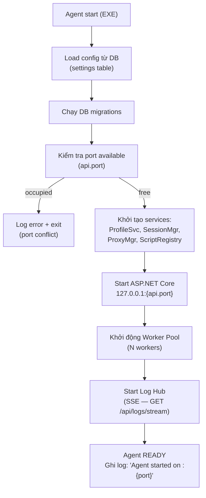
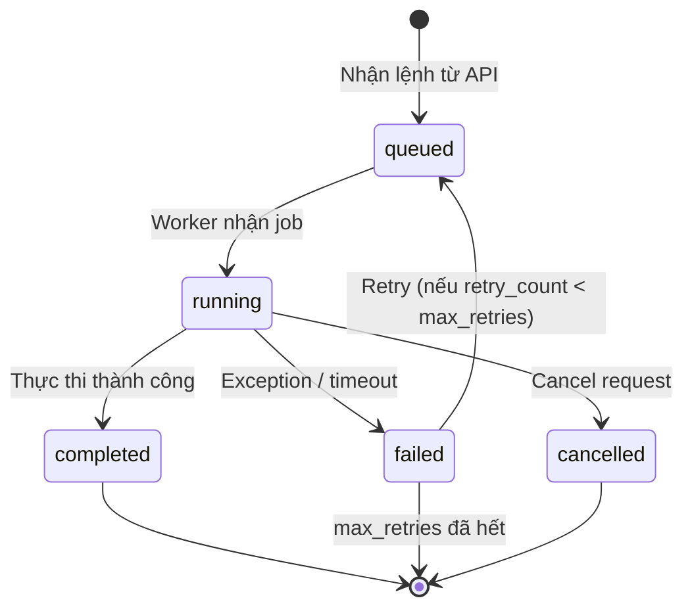
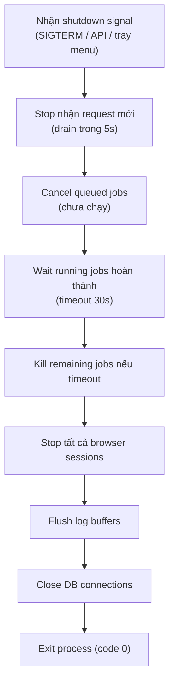

# 03 — Background Agent

> **Phiên bản**: 1.1 | **Ngày**: 2026-02-18 | **Trạng thái**: Review  
> **EPIC tương ứng**: C — Agent chạy ngầm (core)

---

## 1. Mục tiêu tài liệu

Mô tả đầy đủ Background Agent:
- Cách chạy như Windows Service hoặc tray background process.
- IPC / Local API server bootstrapping.
- Job queue + worker pool.
- Resource governor.
- Logging và audit trail.
- Healthcheck.

---

## 2. Khái niệm Agent

**Background Agent** là thành phần trung tâm của hệ thống:

```
CLI ──────────┐
GUI Client ───┼──► Local API ──► Agent ──► Job Queue ──► Workers ──► Browser Runtime
Ext. Backend ─┘
```

Agent phải:
- **Sống độc lập** với GUI (GUI đóng → Agent tiếp tục chạy).
- **Nhận lệnh** từ mọi client (CLI, GUI, backend ngoài) qua Local API.
- **Thực thi jobs** theo queue + worker pool.
- **Giám sát tài nguyên** (CPU, RAM, số session đồng thời).
- **Log mọi thứ** với correlation ID.

---

## 3. Deployment Mode

### Mode 1: Windows Service (khuyến nghị cho server / auto-start)

```
sc create BrowserManagerAgent binPath= "C:\Program Files\BrowserManager\agent.exe"
sc start BrowserManagerAgent
```

- Chạy khi Windows khởi động, kể cả khi chưa có user login.
- Quản lý qua `services.msc` hoặc `sc` command.
- Log ra Windows Event Log + file log.

### Mode 2: System Tray Background Process (khuyến nghị cho desktop user)

- Chạy khi user đăng nhập, xuất hiện icon tray.
- Right-click tray → Stop Agent / Open GUI / Settings.
- Auto-start qua Windows Startup registry key.

### Cấu hình (Settings DB)

| Key | Default | Mô tả |
|---|---|---|
| `agent.mode` | `tray` | `tray` hoặc `service` |
| `agent.autostart` | `true` | Tự khởi động khi login/boot |
| `api.port` | `40000` | Port HTTP Local API (theo baseline MoreLogin — ADR-007) |
| `api.bind_address` | `127.0.0.1` | **Không được đổi thành 0.0.0.0** |

> **Ghi chú về Port**: Mặc định `40000` để tương thích với MoreLogin baseline (ADR-007).  
> Nếu MoreLogin đang chạy trên cùng máy, đổi `api.port` sang giá trị khác (ví dụ `19000`) để tránh port conflict.  
> Xem `01-kien-truc-he-thong.md` §2.7 (ADR-007) cho chi tiết về port strategy.

> **Ghi chú Log Stream**: Log stream dùng **SSE (Server-Sent Events)** qua endpoint `GET /api/logs/stream` trên cùng `api.port`. Không có port WebSocket riêng — tham chiếu `api.log_port` bị bãi bỏ. Chuẩn duy nhất là SSE theo `04-local-api.md`.

---

## 4. Startup Sequence



---

## 5. IPC / Local API

### 5.1 Binding

Agent bind **chỉ** trên `127.0.0.1:{port}`:
```csharp
builder.WebHost.UseUrls($"http://127.0.0.1:{config.ApiPort}");
```

**Không bao giờ** bind `0.0.0.0` hoặc `*` → ngăn truy cập từ mạng ngoài.

### 5.2 Token Authentication

Xem `04-local-api.md` cho chi tiết đầy đủ. Tóm tắt:
- Token 32+ ký tự random, sinh lần đầu, lưu hashed (SHA-256) trong DB.
- Mỗi request phải có header `Authorization: Bearer {token}`.
- Middleware kiểm tra trước khi dispatch.

### 5.3 Endpoints cốt lõi (Agent level)

| Method | Path | Mô tả |
|---|---|---|
| `GET` | `/health` | Healthcheck (không cần auth) |
| `GET` | `/api/agent/status` | CPU, RAM, session count, uptime |
| `POST` | `/api/agent/shutdown` | Tắt agent (cần auth + admin scope) |
| `POST` | `/api/agent/token/rotate` | Sinh token mới |

---

## 6. Job Queue & Worker Pool

### 6.1 Kiến trúc

```
Dispatcher ──► Channel<JobRequest> (queue)
                        │
                ┌───────┼───────┐
                ▼       ▼       ▼
            Worker1  Worker2  Worker3  ...  WorkerN
                │       │       │
                ▼       ▼       ▼
            Browser  Browser  Browser
            Runtime  Runtime  Runtime
```

Cài đặt bằng .NET `Channel<T>` (bounded capacity) + `BackgroundService` workers.

### 6.2 Job types

| Type | Mô tả | Timeout mặc định |
|---|---|---|
| `create_profile` | Tạo profile (mkdir + DB insert) | 30s |
| `delete_profile` | Xoá profile + data-dir | 60s |
| `clone_profile` | Clone metadata + optional data-dir | 120s |
| `import_profile` | Import từ ZIP | 120s |
| `export_profile` | Export ZIP | 120s |
| `launch_session` | Launch Chromium | 30s |
| `stop_session` | Stop Chromium | 15s |
| `run_script` | Chạy automation script | Cấu hình per-script |
| `test_proxy` | Test proxy connectivity | 15s |

### 6.3 Job lifecycle



### 6.4 Job record schema (runtime)

```csharp
public record JobRequest
{
    public string Id { get; init; } = Guid.NewGuid().ToString();
    public string Type { get; init; }
    public string? ProfileId { get; init; }
    public JsonDocument Payload { get; init; }
    public int MaxRetries { get; init; } = 0;
    public CancellationToken CancellationToken { get; init; }
}
```

### 6.5 Worker pool configuration

| Cấu hình | Default | Mô tả |
|---|---|---|
| `worker.count` | `4` | Số worker đồng thời |
| `worker.queue_capacity` | `100` | Max jobs trong queue |
| `session.max_concurrent` | `10` | Max browser instances cùng lúc |
| `job.default_timeout_sec` | `120` | Timeout nếu job không tự kết thúc |

---

## 7. Resource Governor

### 7.1 Semaphore cho browser sessions

```csharp
private readonly SemaphoreSlim _sessionSemaphore;
// Khởi tạo với max_concurrent từ config

// Trước khi launch:
await _sessionSemaphore.WaitAsync(cancellationToken);
try {
    // Launch browser
} finally {
    // Session released khi stop → semaphore.Release()
}
```

### 7.2 CPU/RAM monitoring

Agent thu thập metrics định kỳ (mỗi 5 giây):
- CPU usage của agent process + child browser processes.
- RAM usage.
- Số session đang chạy.

Khi vượt ngưỡng cảnh báo:
- `cpu > 80%` trong 30s liên tiếp → log WARN + thông báo GUI.
- `ram > 4GB` → log WARN + thông báo GUI.
- Không tự kill sessions — để người dùng quyết định.

### 7.3 Kill tree process

Khi stop session:
1. Gửi `session.Stop()` qua Playwright.
2. Nếu sau 5s process vẫn tồn tại → `Process.Kill(entireProcessTree: true)`.
3. Dọn temp files nếu có.

---

## 8. Logging

### 8.1 Log levels

`TRACE | DEBUG | INFO | WARN | ERROR | FATAL`

Cấu hình mặc định: `INFO` (có thể đổi sang `DEBUG` để troubleshoot).

### 8.2 Log format

```
{timestamp} [{level}] [{correlation_id}] [{component}] {message} {json_extra}
```

Ví dụ:
```
2026-02-18T10:30:00Z [INFO] [req-abc123] [ProfileService] Profile created profile_id=550e8400 name="Profile A"
2026-02-18T10:30:01Z [ERROR] [req-abc123] [SessionManager] Launch failed profile_id=550e8400 error="proxy timeout"
```

### 8.3 Log destinations

| Destination | Mô tả |
|---|---|
| File | `%APPDATA%/BrowserManager/logs/agent-{date}.log` (rotate daily, keep 30 days) |
| Windows Event Log | Chỉ WARN/ERROR/FATAL |
| **SSE stream** (`GET /api/logs/stream`) | Tất cả logs từ mức cấu hình trở lên (GUI subscribe — **chỉ SSE, không WebSocket**) |
| SQLite `job_logs` | Log gắn với job_id để xem per-job |

### 8.4 Log masking

Các trường phải mask:
- `Authorization` header → `Bearer ***`
- `password`, `password_enc` → `***`
- `proxy.password` → `***`
- `api_token` → `***`

Dùng middleware log enricher để mask trước khi ghi.

### 8.5 Correlation ID

Mỗi request HTTP có `X-Request-ID` header (hoặc sinh tự động).  
Correlation ID truyền qua toàn bộ job execution → có thể trace request → job → browser action.

---

## 9. Audit Trail

Mọi action tạo/sửa/xoá resource đều ghi vào `audit_logs`:

```json
{
  "timestamp": "2026-02-18T10:30:00Z",
  "actor": "api",
  "action": "profile.create",
  "resource_id": "550e8400-...",
  "ip_address": "127.0.0.1",
  "request_id": "req-abc123",
  "result": "ok",
  "detail": {"name": "Profile A", "group": "Group 1"}
}
```

Action list:
- `profile.create`, `profile.update`, `profile.delete`, `profile.clone`
- `profile.import`, `profile.export`
- `session.start`, `session.stop`
- `job.run`, `job.cancel`
- `proxy.add`, `proxy.delete`, `proxy.test`
- `agent.shutdown`, `agent.token.rotate`
- `settings.update`

### 9.1 Session Lifecycle Events and Profile Updates

**Event: `session.start`**

Khi session được start (qua `POST /api/sessions` hoặc `POST /api/env/start`):

1. **Action logged**: `session.start` với `profile_id`, `session_id`, `headless` flag
2. **Profile update**: `last_used_at` được set = current timestamp (UTC)
3. **Implementation**:
```csharp
// In SessionManager.StartSession()
var session = await CreateBrowserSession(profileId, options);
await _profileService.UpdateLastUsedAt(profileId, DateTime.UtcNow);
await _auditLog.Log("session.start", profileId, sessionId);
```

**Event: `session.stop`**

Khi session được stop (qua `POST /api/sessions/{id}/stop` hoặc `POST /api/env/close`):

1. **Action logged**: `session.stop` với `profile_id`, `session_id`, `duration_seconds`
2. **Profile update**: KHÔNG update `last_used_at` (chỉ update khi start)
3. **Implementation**:
```csharp
// In SessionManager.StopSession()
await CloseBrowserGracefully(sessionId);
await _auditLog.Log("session.stop", profileId, sessionId, new { duration_seconds });
// Note: NO UpdateLastUsedAt here
```

**Event flow diagram**:
```
User clicks Launch
    ↓
POST /api/sessions {profile_id}
    ↓
SessionManager.StartSession()
    ↓
├─ CreateBrowserSession()
├─ ProfileService.UpdateLastUsedAt() ← UPDATE last_used_at
├─ AuditLog("session.start")
└─ Return session object

User clicks Stop
    ↓
POST /api/sessions/{id}/stop
    ↓
SessionManager.StopSession()
    ↓
├─ CloseBrowser()
├─ AuditLog("session.stop")
└─ Return success (NO last_used_at update)
```

Xem `02-he-thong-profile.md` §3A.2 cho chi tiết về `last_used_at` rules.

---

## 10. Healthcheck

### Endpoint: `GET /health` (không cần auth)

Response:
```json
{
  "status": "healthy",
  "version": "1.0.0",
  "uptime_seconds": 3600,
  "sessions": {
    "active": 3,
    "max": 10
  },
  "jobs": {
    "queued": 1,
    "running": 3
  },
  "timestamp": "2026-02-18T10:30:00Z"
}
```

Status values:
- `healthy` — hoạt động bình thường.
- `degraded` — có vấn đề nhưng vẫn xử lý được (ví dụ DB chậm).
- `unhealthy` — không thể xử lý requests.

### Watchdog

Tray app (hoặc GUI) check `/health` mỗi 30 giây:
- 2 lần liên tiếp fail → hiển thị cảnh báo, đề nghị restart agent.

---

## 11. Shutdown Sequence



---

## 12. Definition of Done (DoD) — EPIC C

- [ ] Agent khởi động như Windows Service và như tray process.
- [ ] Local API trả `200` trên `GET /health` sau khi start.
- [ ] Token auth: request không có token → `401`.
- [ ] Job queue: tạo 10 jobs đồng thời, tất cả chạy đúng thứ tự ưu tiên.
- [ ] Worker pool: max concurrent sessions được enforce (semaphore).
- [ ] Log masking: không có password/token nào xuất hiện trong log file.
- [ ] Audit log: mọi action ghi đúng vào `audit_logs`.
- [ ] Shutdown sạch: không treo process sau khi stop.
- [ ] Restart agent sau crash: auto-restart nếu dùng Windows Service.

---

*Tài liệu tiếp theo: [04-local-api.md](04-local-api.md)*
