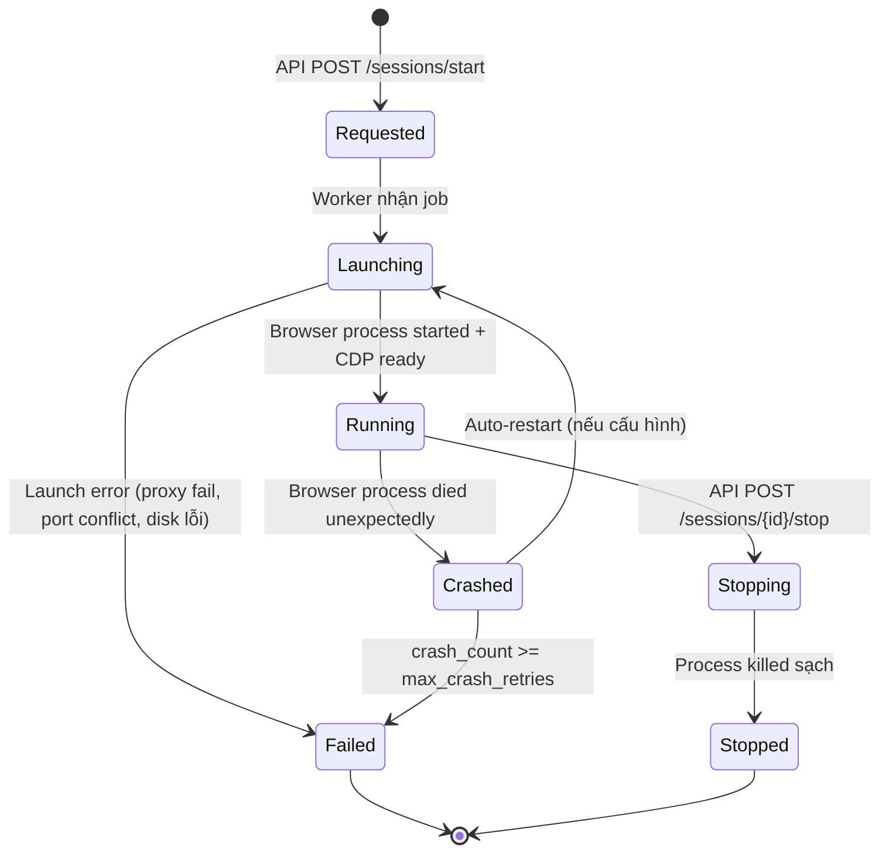
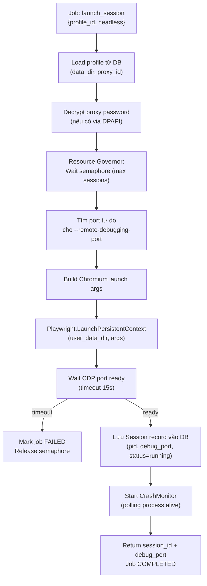
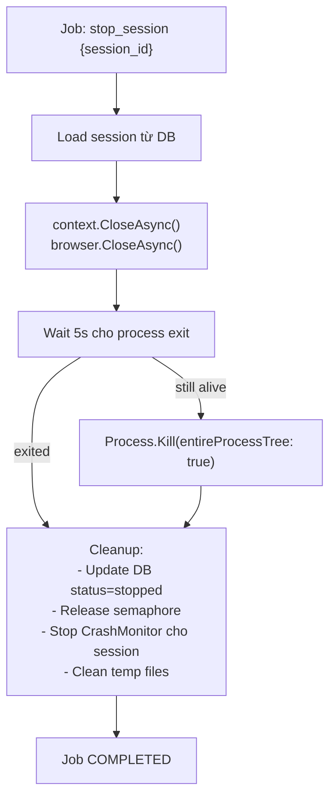

# 06 — Browser Runtime & Session Manager

> **Phiên bản**: 1.1 | **Ngày**: 2026-02-18 | **Trạng thái**: Review  
> **EPIC tương ứng**: E — Browser Runtime & Session Manager

---

## 1. Mục tiêu tài liệu

Mô tả đầy đủ:
- Tích hợp Playwright + Chromium.
- Session lifecycle (launch → running → stop/crash).
- Cơ chế crash detection và recovery.
- Resource cleanup.
- Hook điểm để automation scripts attach.

---

## 2. Lựa chọn Runtime

**Playwright (.NET) + Bundled Chromium** — quyết định từ `ADR-002`.

### 2.1 Điểm mạnh của Playwright cho dự án này

| Tính năng | Mô tả |
|---|---|
| `--user-data-dir` | Mỗi launch dùng thư mục dữ liệu riêng → profile isolation |
| `--remote-debugging-port` | Expose CDP (Chrome DevTools Protocol) để automation attach |
| `--proxy-server` | Proxy per-launch args |
| Bundled Chromium | Không cần cài Chrome riêng; version cố định |
| Process management | Playwright quản lý browser process lifecycle |
| .NET native bindings | Tích hợp tốt với Agent (.NET service) |

> **Tham chiếu MoreLogin**: `POST /api/env/start` trả `debug_port` và `webdriver_path` cho client tự attach. Dự án này làm tương tự — trả `debug_port` để automation scripts tự connect qua CDP/WebDriver.

---

## 3. Session Lifecycle



---

## 4. Launch Sequence



---

## 5. Chromium Launch Arguments

### 5.1 Arguments cơ bản

```csharp
var args = new List<string>
{
    $"--user-data-dir=\"{profile.DataDir}\"",
    $"--remote-debugging-port={debugPort}",
    "--no-first-run",
    "--no-default-browser-check",
    "--disable-background-networking",
    "--disable-sync",
    "--disable-translate",
    "--password-store=basic",
    "--use-mock-keychain",
};

if (headless)
{
    args.Add("--headless=new");
    args.Add("--disable-gpu");
}

if (profile.StartUrl != null)
{
    args.Add(profile.StartUrl);
}
```

### 5.2 Proxy arguments

```csharp
if (proxy != null)
{
    args.Add($"--proxy-server={proxy.Type}://{proxy.Host}:{proxy.Port}");
    
    if (proxy.Username != null)
    {
        // Playwright handles proxy auth via context.SetHttpCredentials
    }
}
```

### 5.3 Extensions arguments

```csharp
if (profile.Extensions.Any())
{
    var extPaths = profile.Extensions
        .Select(id => Path.Combine(profile.DataDir, "Extensions", id))
        .Where(Directory.Exists);
    
    args.Add($"--load-extension={string.Join(",", extPaths)}");
    args.Add($"--disable-extensions-except={string.Join(",", extPaths)}");
}
```

### 5.4 Arguments bị cấm (out-of-scope)

Các args sau **không được thêm** vì liên quan đến anti-detection:
- `--disable-blink-features=AutomationControlled`
- Bất kỳ arg nào modify `navigator.webdriver`
- Canvas fingerprint spoofing hooks
- Custom User-Agent spoofing

---

## 6. Port Management

### 6.1 Tìm port tự do

```csharp
public static int FindAvailablePort(int startPort = 9222, int maxAttempts = 100)
{
    for (int i = 0; i < maxAttempts; i++)
    {
        int port = startPort + i;
        if (!IsPortInUse(port))
            return port;
    }
    throw new InvalidOperationException("No available debug ports found");
}

private static bool IsPortInUse(int port)
{
    var listeners = IPGlobalProperties.GetIPGlobalProperties()
        .GetActiveTcpListeners();
    return listeners.Any(l => l.Port == port);
}
```

### 6.2 Port range

- Debug ports: `9222` – `9322` (100 slots = max 100 concurrent sessions).
- Nếu cần nhiều hơn: mở rộng range trong config.

---

## 7. Crash Monitor

### 7.1 Cơ chế phát hiện crash

```csharp
public class CrashMonitor : BackgroundService
{
    // Mỗi 5 giây kiểm tra tất cả running sessions
    protected override async Task ExecuteAsync(CancellationToken ct)
    {
        while (!ct.IsCancellationRequested)
        {
            await Task.Delay(TimeSpan.FromSeconds(5), ct);
            
            var runningSessions = await _sessionRepo.GetByStatus("running");
            foreach (var session in runningSessions)
            {
                if (!IsProcessAlive(session.Pid))
                {
                    await HandleCrash(session);
                }
            }
        }
    }
    
    private async Task HandleCrash(Session session)
    {
        _logger.LogWarning("Session {Id} crashed (PID {Pid})", session.Id, session.Pid);
        
        session.CrashCount++;
        session.Status = "crashed";
        await _sessionRepo.Update(session);
        
        await _auditLog.Write("session.crashed", session.Id);
        await _semaphore.Release(); // giải phóng slot
        
        // Notify GUI qua log stream
        await _logHub.Broadcast(new LogEvent 
        { 
            Level = "WARN", 
            Message = $"Session {session.Id} crashed (profile: {session.ProfileId})" 
        });
        
        // Auto-restart nếu cấu hình cho phép
        if (session.CrashCount < _config.MaxCrashRetries)
        {
            await _jobQueue.Enqueue(new JobRequest 
            { 
                Type = "launch_session",
                ProfileId = session.ProfileId 
            });
        }
    }
}
```

### 7.2 Crash recovery policy

| Cấu hình | Default | Mô tả |
|---|---|---|
| `session.max_crash_retries` | `2` | Số lần auto-restart tối đa |
| `session.crash_cooldown_sec` | `10` | Thời gian chờ trước khi restart |

Sau `max_crash_retries` lần crash:
- Session status → `failed`.
- Job status → `failed`.
- Notification gửi qua log stream + webhook `session.crashed`.

---

## 8. Stop Sequence



---

## 9. CDP / WebDriver Access

Sau khi session `running`:
- `debug_port` được trả trong response.
- Client (automation script / backend ngoài) tự connect:

```javascript
// Node.js + Playwright
const browser = await chromium.connectOverCDP(`http://127.0.0.1:${debugPort}`);
const context = browser.contexts()[0];
const page = context.pages()[0];
```

```python
# Python + Playwright
browser = await playwright.chromium.connect_over_cdp(f"http://127.0.0.1:{debug_port}")
```

```csharp
// C# + Playwright (Automation Runner nội bộ)
var browser = await playwright.Chromium.ConnectOverCDPAsync($"http://127.0.0.1:{debugPort}");
```

---

## 10. Resource Cleanup

### Sau khi session stop/crash:

1. Close browser context và browser object.
2. Kill process tree nếu còn sống.
3. Release semaphore slot.
4. Update DB session record.
5. **Không xoá `data_dir`** — dữ liệu profile phải được giữ nguyên để dùng lần sau.

### Temp files:

- Playwright tạo temp dir riêng: `TEMP\playwright-*` → tự cleanup khi browser close.
- Nếu crash → `TempDir` có thể còn lại → CrashMonitor dọn dẹp sau 5 phút.

### Leak detection (test):

- Stress test: start/stop 100 sessions liên tiếp.
- Verify: không có orphaned Chromium processes.
- Verify: semaphore count trở về `max_concurrent` sau tất cả sessions stop.

---

## 11. Session Data Model (runtime)

```csharp
public class Session
{
    public string Id { get; set; } = Guid.NewGuid().ToString();
    public string ProfileId { get; set; }
    public SessionStatus Status { get; set; }
    public int Pid { get; set; }
    public int DebugPort { get; set; }
    public bool Headless { get; set; }
    public DateTime StartedAt { get; set; }
    public DateTime? StoppedAt { get; set; }
    public int CrashCount { get; set; }
    
    // Runtime-only (không persist)
    public IBrowserContext? BrowserContext { get; set; }
    public CancellationTokenSource? MonitorCts { get; set; }
}

public enum SessionStatus
{
    Launching,
    Running,
    Stopping,
    Stopped,
    Crashed,
    Failed
}
```

---

## 12. Performance Targets

| Metric | Target |
|---|---|
| Launch time (headful, no proxy) | < 5 giây |
| Launch time (headless, với proxy) | < 8 giây |
| Stop time (graceful) | < 5 giây |
| Crash detection latency | < 10 giây |
| Memory per session (headless) | < 200MB |
| Memory per session (headful) | < 350MB |

---

## 13. Definition of Done (DoD) — EPIC E

- [ ] Launch session thành công (headful + headless).
- [ ] `debug_port` trả về, client attach được qua CDP.
- [ ] Proxy per-session hoạt động (verify qua IP check).
- [ ] Stop session: process dọn sạch, không zombie.
- [ ] Crash detection: kill browser process → job status `failed` trong < 10s.
- [ ] Auto-restart hoạt động (crash retry).
- [ ] Semaphore enforce: không vượt `max_concurrent`.
- [ ] Stress test: 100 start/stop liên tiếp không rò rỉ tài nguyên.
- [ ] Extensions load đúng từ `data_dir`.

---

*Tài liệu tiếp theo: [07-automation-framework.md](07-automation-framework.md)*
