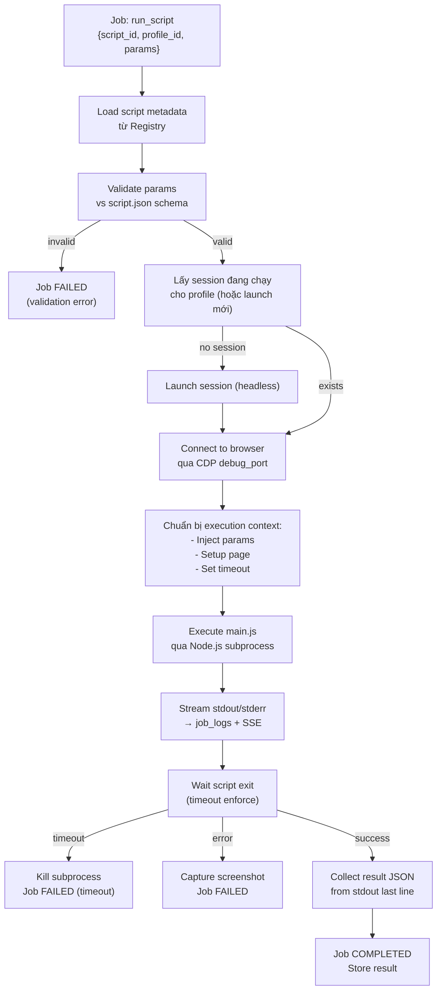

# 07 — Automation Framework

> **Phiên bản**: 1.1 | **Ngày**: 2026-02-18 | **Trạng thái**: Review  
> **EPIC tương ứng**: F — Automation Framework (hợp lệ)

---

## 1. Mục tiêu tài liệu

Mô tả hệ thống chạy automation scripts:
- Định nghĩa "Script Package" (metadata + code).
- Script Runner: chạy script theo job.
- Script Registry: lưu trữ và quản lý version.
- Sandbox cơ bản.
- 3 script mẫu.

---

## 2. Triết lý thiết kế

Automation Framework phục vụ các tác vụ **hợp lệ**:
- Điền form, navigate, extract dữ liệu (web scraping hợp lệ).
- Login workflow automation (cho tài khoản của chính người dùng).
- Testing / QA web application.
- Monitoring uptime và content.

**Không hỗ trợ** cơ chế vượt anti-bot, fake fingerprint, hay automation vi phạm Terms of Service.

---

## 3. Script Package

### 3.1 Cấu trúc Script Package

Mỗi script là một **thư mục** chứa:

```
scripts/
└── {script-id}/
    ├── script.json        ← metadata
    ├── main.js            ← entry point (JavaScript)
    └── helpers/           ← module con (tuỳ chọn)
        └── utils.js
```

### 3.2 Metadata `script.json`

```json
{
  "id": "login-script",
  "name": "Login Script",
  "version": "1.0.0",
  "description": "Performs login flow on target website",
  "author": "team",
  "created_at": "2026-02-18T00:00:00Z",
  "entry": "main.js",
  "runtime": "playwright-js",
  "timeout_sec": 120,
  "max_retries": 2,
  "params": [
    {
      "name": "target_url",
      "type": "string",
      "required": true,
      "description": "URL to navigate to"
    },
    {
      "name": "username",
      "type": "string",
      "required": true
    },
    {
      "name": "password",
      "type": "string",
      "required": true,
      "sensitive": true
    },
    {
      "name": "take_screenshot",
      "type": "boolean",
      "required": false,
      "default": false
    }
  ]
}
```

### 3.3 Script runtimes hỗ trợ

| Runtime | Mô tả | Entry file |
|---|---|---|
| `playwright-js` | JavaScript chạy qua Node + Playwright | `main.js` |
| `playwright-python` | Python chạy qua Playwright Python | `main.py` |
| `playwright-dotnet` | C# compiled script (DLL) | `main.dll` |

Phase 1 chỉ implement `playwright-js` (phổ biến nhất).

---

## 4. Script Runner

### 4.1 Luồng chạy script



### 4.2 Script Execution Context

Script nhận context qua environment variables + stdin JSON:

```javascript
// main.js nhận params qua process.env
const params = JSON.parse(process.env.BM_PARAMS);
const debugPort = process.env.BM_DEBUG_PORT;
const jobId = process.env.BM_JOB_ID;
const sessionId = process.env.BM_SESSION_ID;

// Kết nối vào browser đang chạy
const { chromium } = require('playwright');
const browser = await chromium.connectOverCDP(`http://127.0.0.1:${debugPort}`);
const context = browser.contexts()[0];
const page = context.pages()[0] || await context.newPage();

// Script logic...

// Kết quả output (dòng cuối cùng của stdout phải là JSON)
console.log(JSON.stringify({ status: "ok", data: { ... } }));
process.exit(0);
```

### 4.3 Subprocess management

```csharp
public class ScriptRunner
{
    public async Task<ScriptResult> RunAsync(ScriptRunContext ctx, CancellationToken ct)
    {
        var psi = new ProcessStartInfo
        {
            FileName = "node",
            Arguments = ctx.Script.EntryPath,
            UseShellExecute = false,
            RedirectStandardOutput = true,
            RedirectStandardError = true,
            Environment =
            {
                ["BM_PARAMS"] = JsonSerializer.Serialize(ctx.Params),
                ["BM_DEBUG_PORT"] = ctx.Session.DebugPort.ToString(),
                ["BM_JOB_ID"] = ctx.JobId,
                ["BM_SESSION_ID"] = ctx.Session.Id,
                // Restrict file system access (xem sandbox section)
                ["NODE_PATH"] = ctx.Script.Directory,
            }
        };

        using var process = Process.Start(psi)!;
        using var timeoutCts = CancellationTokenSource.CreateLinkedTokenSource(ct);
        timeoutCts.CancelAfter(TimeSpan.FromSeconds(ctx.TimeoutSec));

        // Stream logs
        process.OutputDataReceived += (_, e) =>
        {
            if (e.Data != null) _logHub.Send(ctx.JobId, "INFO", e.Data);
        };
        process.ErrorDataReceived += (_, e) =>
        {
            if (e.Data != null) _logHub.Send(ctx.JobId, "ERROR", e.Data);
        };
        process.BeginOutputReadLine();
        process.BeginErrorReadLine();

        await process.WaitForExitAsync(timeoutCts.Token);
        
        // Last line of stdout = result JSON
        var result = ParseLastJsonLine(process);
        return result;
    }
}
```

### 4.4 Artifact khi lỗi

Khi script thất bại:
1. Chụp screenshot: `page.screenshot({ path: "artifacts/{job_id}/error.png" })`
2. Capture HAR nếu bật: `page.routeFromHAR(...)`
3. Lưu console logs.
4. Đính kèm artifacts vào job record.

---

## 5. Script Registry

### 5.1 Cấu trúc Registry

```
{APPDATA}/BrowserManager/scripts/
├── login-script/
│   ├── script.json
│   └── main.js
├── form-fill/
│   ├── script.json
│   └── main.js
└── health-check/
    ├── script.json
    └── main.js
```

### 5.2 Registry operations

| Operation | Mô tả |
|---|---|
| `list` | Liệt kê tất cả scripts (id, name, version) |
| `add` | Thêm script từ local path hoặc upload ZIP |
| `get` | Xem metadata + params schema |
| `remove` | Xoá script |
| `validate` | Kiểm tra script.json hợp lệ, entry file tồn tại |

### 5.3 Versioning đơn giản

- Mỗi script có `version` trong `script.json`.
- Khi update: backup phiên bản cũ vào `{id}/.versions/{version}/`.
- Giữ tối đa 5 versions.

---

## 6. Sandbox Cơ Bản

### 6.1 File system restriction

Script Node.js chạy trong process riêng với:
- Working directory = script directory.
- `NODE_PATH` chỉ trỏ đến script directory.
- Không có quyền đọc thư mục `profiles/` hoặc `logs/` trực tiếp.

```csharp
// Không cho script access các thư mục nhạy cảm
Environment["BM_PROFILES_DIR"] = ""; // không expose
Environment["BM_DB_PATH"] = ""; // không expose
```

### 6.2 Network restriction (tuỳ chọn, phase 2)

Giai đoạn đầu: không restrict network (script có thể gọi bất kỳ URL).  
Phase 2: option whilelist domains per script.

### 6.3 Timeout enforcement

- Agent enforce timeout bằng `CancellationToken`.
- Khi timeout: `process.Kill(entireProcessTree: true)`.
- Screenshot được chụp trước khi kill (best-effort).

---

## 7. Sample Scripts

### Script 1: `health-check` — Kiểm tra URL

**`script.json`:**
```json
{
  "id": "health-check",
  "name": "URL Health Check",
  "version": "1.0.0",
  "description": "Navigate to URL and check page title and status",
  "entry": "main.js",
  "runtime": "playwright-js",
  "timeout_sec": 30,
  "max_retries": 1,
  "params": [
    {"name": "url", "type": "string", "required": true},
    {"name": "expected_title", "type": "string", "required": false}
  ]
}
```

**`main.js`:**
```javascript
const { chromium } = require('playwright');

(async () => {
  const params = JSON.parse(process.env.BM_PARAMS);
  const debugPort = process.env.BM_DEBUG_PORT;

  const browser = await chromium.connectOverCDP(`http://127.0.0.1:${debugPort}`);
  const context = browser.contexts()[0];
  const page = await context.newPage();

  try {
    const response = await page.goto(params.url, { timeout: 15000 });
    const title = await page.title();
    const statusCode = response?.status() ?? 0;

    const titleMatch = params.expected_title 
      ? title.includes(params.expected_title) 
      : true;

    console.log(`[INFO] Navigated to ${params.url}`);
    console.log(`[INFO] Status: ${statusCode}, Title: "${title}"`);

    const result = {
      status: statusCode >= 200 && statusCode < 400 && titleMatch ? "ok" : "error",
      data: {
        url: params.url,
        status_code: statusCode,
        title: title,
        title_match: titleMatch
      }
    };

    // Dòng cuối cùng = JSON result
    console.log(JSON.stringify(result));
    process.exit(0);
  } catch (err) {
    console.error(`[ERROR] ${err.message}`);
    console.log(JSON.stringify({ status: "error", error: err.message }));
    process.exit(1);
  } finally {
    await page.close();
  }
})();
```

---

### Script 2: `form-fill` — Điền form

**`main.js`:**
```javascript
const { chromium } = require('playwright');

(async () => {
  const params = JSON.parse(process.env.BM_PARAMS);
  // params: { url, fields: [{selector, value}], submit_selector }
  
  const browser = await chromium.connectOverCDP(`http://127.0.0.1:${process.env.BM_DEBUG_PORT}`);
  const context = browser.contexts()[0];
  const page = await context.newPage();

  try {
    await page.goto(params.url, { waitUntil: 'networkidle' });
    console.log(`[INFO] Page loaded: ${params.url}`);

    for (const field of params.fields) {
      await page.fill(field.selector, field.value);
      console.log(`[INFO] Filled field: ${field.selector}`);
    }

    if (params.submit_selector) {
      await page.click(params.submit_selector);
      await page.waitForLoadState('networkidle');
      console.log(`[INFO] Form submitted`);
    }

    const finalUrl = page.url();
    console.log(JSON.stringify({
      status: "ok",
      data: { final_url: finalUrl }
    }));
    process.exit(0);
  } catch (err) {
    console.error(`[ERROR] ${err.message}`);
    console.log(JSON.stringify({ status: "error", error: err.message }));
    process.exit(1);
  } finally {
    await page.close();
  }
})();
```

---

### Script 3: `extract-data` — Trích xuất dữ liệu

**`main.js`:**
```javascript
const { chromium } = require('playwright');

(async () => {
  const params = JSON.parse(process.env.BM_PARAMS);
  // params: { url, selectors: {key: cssSelector} }

  const browser = await chromium.connectOverCDP(`http://127.0.0.1:${process.env.BM_DEBUG_PORT}`);
  const context = browser.contexts()[0];
  const page = await context.newPage();

  try {
    await page.goto(params.url, { waitUntil: 'domcontentloaded' });
    console.log(`[INFO] Page loaded`);

    const extracted = {};
    for (const [key, selector] of Object.entries(params.selectors)) {
      try {
        const element = await page.$(selector);
        extracted[key] = element ? await element.textContent() : null;
        console.log(`[INFO] Extracted ${key}: ${extracted[key]?.substring(0, 50)}`);
      } catch {
        extracted[key] = null;
      }
    }

    console.log(JSON.stringify({
      status: "ok",
      data: extracted
    }));
    process.exit(0);
  } catch (err) {
    console.error(`[ERROR] ${err.message}`);
    console.log(JSON.stringify({ status: "error", error: err.message }));
    process.exit(1);
  } finally {
    await page.close();
  }
})();
```

---

## 8. Script Invocation Example

```bash
# Chạy health-check qua CLI
bm jobs run \
  --script health-check \
  --profile "Profile A" \
  --param url=https://example.com \
  --param expected_title=Example \
  --wait \
  --follow

# Chạy form-fill
bm jobs run \
  --script form-fill \
  --profile "Profile A" \
  --param 'url=https://example.com/contact' \
  --param 'fields=[{"selector":"#name","value":"John"},{"selector":"#email","value":"john@example.com"}]' \
  --param 'submit_selector=#submit' \
  --wait
```

---

### Script 4: `batch-navigate` — Navigate nhiều tab đồng thời

**`script.json`:**
```json
{
  "id": "batch-navigate",
  "name": "Batch Navigate Tabs",
  "version": "1.0.0",
  "description": "Opens multiple URLs simultaneously in separate tabs and collects page titles and status codes",
  "entry": "main.js",
  "runtime": "playwright-js",
  "timeout_sec": 60,
  "max_retries": 1,
  "params": [
    {
      "name": "urls",
      "type": "array",
      "required": true,
      "description": "Array of URLs to navigate to in parallel tabs"
    },
    {
      "name": "wait_until",
      "type": "string",
      "required": false,
      "default": "domcontentloaded",
      "description": "Navigation wait strategy: load | domcontentloaded | networkidle"
    },
    {
      "name": "screenshot_each",
      "type": "boolean",
      "required": false,
      "default": false,
      "description": "Capture screenshot for each tab after navigation"
    }
  ]
}
```

**`main.js`:**
```javascript
const { chromium } = require('playwright');
const path = require('path');
const fs = require('fs');

(async () => {
  const params = JSON.parse(process.env.BM_PARAMS);
  const debugPort = process.env.BM_DEBUG_PORT;
  const jobId = process.env.BM_JOB_ID;

  const urls = Array.isArray(params.urls) ? params.urls : JSON.parse(params.urls);
  const waitUntil = params.wait_until || 'domcontentloaded';
  const screenshotEach = params.screenshot_each === true || params.screenshot_each === 'true';

  const browser = await chromium.connectOverCDP(`http://127.0.0.1:${debugPort}`);
  const context = browser.contexts()[0];

  console.log(`[INFO] Starting batch navigation for ${urls.length} URLs`);

  // Navigate all tabs in parallel
  const results = await Promise.allSettled(
    urls.map(async (url, index) => {
      const page = await context.newPage();
      try {
        const response = await page.goto(url, { waitUntil, timeout: 30000 });
        const title = await page.title();
        const statusCode = response?.status() ?? 0;
        console.log(`[INFO] Tab ${index + 1}/${urls.length}: ${url} → ${statusCode} "${title}"`);

        let screenshotPath = null;
        if (screenshotEach) {
          screenshotPath = `artifacts/${jobId}/tab-${index + 1}.png`;
          fs.mkdirSync(`artifacts/${jobId}`, { recursive: true });
          await page.screenshot({ path: screenshotPath, fullPage: false });
          console.log(`[INFO] Screenshot saved: ${screenshotPath}`);
        }

        return {
          url,
          status: statusCode,
          title,
          ok: statusCode >= 200 && statusCode < 400,
          screenshot: screenshotPath
        };
      } catch (err) {
        console.error(`[ERROR] Tab ${index + 1} failed: ${url} — ${err.message}`);
        return { url, status: 0, title: null, ok: false, error: err.message };
      } finally {
        await page.close();
      }
    })
  );

  const tabResults = results.map(r => r.status === 'fulfilled' ? r.value : { url: '?', ok: false, error: r.reason?.message });
  const successCount = tabResults.filter(r => r.ok).length;

  console.log(`[INFO] Batch complete: ${successCount}/${urls.length} successful`);

  console.log(JSON.stringify({
    status: successCount === urls.length ? 'ok' : 'partial',
    data: {
      total: urls.length,
      success: successCount,
      failed: urls.length - successCount,
      results: tabResults
    }
  }));
  process.exit(0);
})().catch(err => {
  console.error(`[ERROR] Fatal: ${err.message}`);
  console.log(JSON.stringify({ status: 'error', error: err.message }));
  process.exit(1);
});
```

**Example usage:**
```bash
bm jobs run \
  --script batch-navigate \
  --profile "Profile A" \
  --param 'urls=["https://example.com","https://github.com","https://httpbin.org/status/200"]' \
  --param wait_until=domcontentloaded \
  --param screenshot_each=true \
  --wait \
  --follow
```

---

## 9. Scripts Repo Structure — Cấu trúc thư mục đầy đủ

```
{APPDATA}/BrowserManager/scripts/
├── health-check/
│   ├── script.json               ← metadata + params schema
│   └── main.js                   ← entry point
│
├── form-fill/
│   ├── script.json
│   └── main.js
│
├── extract-data/
│   ├── script.json
│   └── main.js
│
├── batch-navigate/
│   ├── script.json
│   └── main.js
│
└── _registry.json                ← manifest danh sách tất cả scripts (auto-generated)
```

**`_registry.json` format** (tự động regenerate khi add/remove script):
```json
{
  "generated_at": "2026-02-18T10:00:00Z",
  "scripts": [
    {
      "id": "health-check",
      "name": "URL Health Check",
      "version": "1.0.0",
      "entry": "main.js",
      "runtime": "playwright-js",
      "timeout_sec": 30
    },
    {
      "id": "form-fill",
      "name": "Form Fill",
      "version": "1.0.0",
      "entry": "main.js",
      "runtime": "playwright-js",
      "timeout_sec": 60
    },
    {
      "id": "extract-data",
      "name": "Extract Data",
      "version": "1.0.0",
      "entry": "main.js",
      "runtime": "playwright-js",
      "timeout_sec": 30
    },
    {
      "id": "batch-navigate",
      "name": "Batch Navigate Tabs",
      "version": "1.0.0",
      "entry": "main.js",
      "runtime": "playwright-js",
      "timeout_sec": 60
    }
  ]
}
```

---

## 10. API Endpoints cho Automation

| Method | Path | Mô tả |
|---|---|---|
| `GET` | `/api/scripts` | List scripts |
| `GET` | `/api/scripts/{id}` | Script metadata |
| `POST` | `/api/scripts` | Add script (upload ZIP) |
| `DELETE` | `/api/scripts/{id}` | Remove script |
| `POST` | `/api/scripts/run` | Run script → tạo Job |
| `GET` | `/api/jobs/{id}/artifacts` | Lấy artifacts (screenshot, logs) |

---

## 11. Definition of Done (DoD) — EPIC F

- [ ] 4 sample scripts (health-check, form-fill, extract-data, batch-navigate) chạy end-to-end thành công.
- [ ] `batch-navigate`: navigate 5 URLs đồng thời, kết quả trả về chính xác per-tab.
- [ ] Script timeout enforce đúng (kill process sau N giây).
- [ ] Script params validate theo `script.json` schema.
- [ ] `sensitive: true` params không xuất hiện trong logs.
- [ ] Artifacts (screenshot) được lưu khi script fail hoặc `screenshot_each=true`.
- [ ] Log streaming: stdout/stderr của script → SSE realtime.
- [ ] Script registry: add/list/remove hoạt động; `_registry.json` tự cập nhật.
- [ ] Versioning: update script → backup version cũ.
- [ ] Scripts repo structure đúng theo cấu trúc mô tả trong section 9.

---

*Tài liệu tiếp theo: [08-desktop-gui.md](08-desktop-gui.md)*
