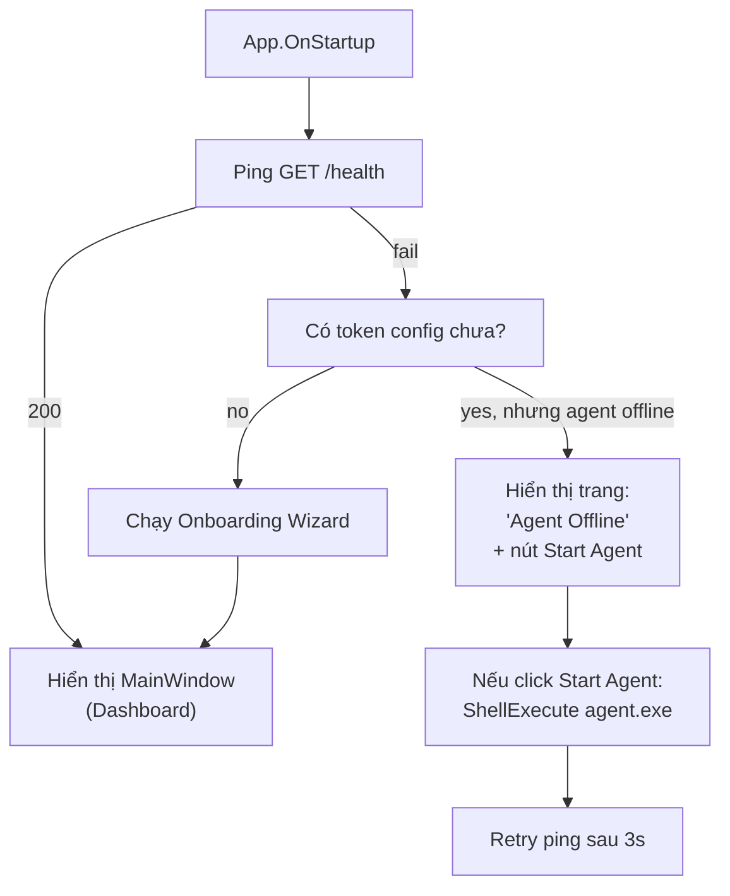
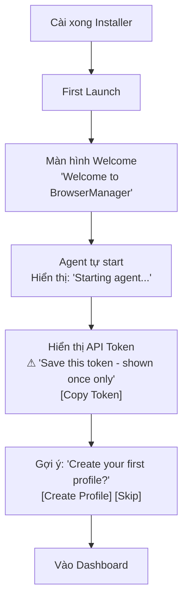

# 08 — Desktop GUI

> **Phiên bản**: 1.2 | **Ngày**: 2026-02-18 | **Trạng thái**: Review  
> **EPIC tương ứng**: H — Desktop GUI

---

## 1. Mục tiêu tài liệu

Đặc tả đầy đủ giao diện Desktop:
- Kiến trúc GUI (MVVM, WPF).
- Các màn hình chính.
- Wireframe logic (layout + behaviors).
- Onboarding flow.
- Kết nối với Agent.

---

## 2. Kiến trúc GUI

### 2.1 Framework: WPF (.NET 8) + MVVM

```
BrowserManager.Gui/
├── App.xaml
├── App.xaml.cs
├── Views/
│   ├── MainWindow.xaml
│   ├── Dashboard/
│   │   └── DashboardView.xaml
│   ├── Profiles/
│   │   ├── ProfileListView.xaml
│   │   ├── ProfileCreateView.xaml
│   │   └── ProfileDetailView.xaml
│   ├── Jobs/
│   │   ├── JobListView.xaml
│   │   └── JobDetailView.xaml
│   └── Settings/
│       └── SettingsView.xaml
├── ViewModels/
│   ├── MainViewModel.cs
│   ├── DashboardViewModel.cs
│   ├── ProfileListViewModel.cs
│   ├── ProfileCreateViewModel.cs
│   ├── JobListViewModel.cs
│   ├── JobDetailViewModel.cs
│   └── SettingsViewModel.cs
├── Services/
│   ├── AgentClient.cs          ← HttpClient wrapper cho Local API
│   ├── LogStreamService.cs     ← SSE subscriber
│   └── NavigationService.cs
└── Models/
    └── (DTOs mirror từ Core)
```

### 2.2 Agent Connection Pattern

GUI là **thin client** — chỉ display và relay commands:

```
GUI ViewModel ──► AgentClient (HttpClient) ──► Local API ──► Agent
         ▲
         │
    SSE LogStream ◄── Server-Sent Events
```

GUI **không** trực tiếp gọi database hay browser runtime.

### 2.3 Khởi động GUI



---

## 3. Màn hình 1: Dashboard

### 3.1 Layout

```
┌─────────────────────────────────────────────────────┐
│  BrowserManager                    [_][□][X]        │
├──────────┬──────────────────────────────────────────┤
│  Nav     │  DASHBOARD                               │
│          │                                          │
│ Dashboard│  ┌──────────┐ ┌──────────┐ ┌──────────┐ │
│ Profiles │  │ AGENT     │ │ SESSIONS │ │  JOBS    │ │
│ Jobs     │  │ ● Online  │ │  3 / 10  │ │  2 run   │ │
│ Scripts  │  │ v1.0.0    │ │  active  │ │  1 queue │ │
│ Extensions│ │ Uptime 2h │ │          │ │          │ │
│ Trash    │  └──────────┘ └──────────┘ └──────────┘ │
│ Settings │  │                                          │
│          │  ┌────────────────────────────────────┐  │
│          │  │ Active Sessions                    │  │
│          │  │ ┌──────────┬──────────┬──────────┐ │  │
│          │  │ │ Profile  │ Status   │ Uptime   │ │  │
│          │  │ ├──────────┼──────────┼──────────┤ │  │
│          │  │ │ Profile A│ ● Running│ 00:05:32 │ │  │
│          │  │ │ Profile B│ ● Running│ 00:01:10 │ │  │
│          │  │ │ Profile C│ ● Running│ 00:00:45 │ │  │
│          │  │ └──────────┴──────────┴──────────┘ │  │
│          │  └────────────────────────────────────┘  │
│          │                                          │
│          │  [CPU: 12%] [RAM: 1.2 GB] [Disk: 4.5 GB]│
└──────────┴──────────────────────────────────────────┘
```

### 3.2 Dashboard components

| Component | Data source | Refresh |
|---|---|---|
| Agent status card | `GET /health` | Every 30s |
| Sessions count | `GET /sessions` | Every 10s |
| Jobs count | `GET /jobs?status=running,queued` | Every 10s |
| Active sessions table | `GET /sessions?status=running` | Every 10s |
| CPU/RAM gauges | `GET /api/agent/status` | Every 5s |

### 3.4 Arrange Windows Dialog

Mở từ Dashboard toolbar (Active Sessions section) → nút `[☰ Arrange Windows]`, hoặc từ context menu của session.

```
┌──────────────────────────────────────┐
│  Arrange Windows              [×]    │
├──────────────────────────────────────┤
│  Layout:  [Grid ▼]                    │
│           (Grid / Cascade / Tile)    │
│  Monitor: [Primary ▼]               │
│  Columns: [3   ]                     │
│  Width:   [600  ]  Height: [400  ]   │
├──────────────────────────────────────┤
│  Select sessions to arrange:        │
│  ☑ Select All                        │
│  ☑ Profile A  ● Running  Port 9222   │
│  ☑ Profile B  ● Running  Port 9223   │
│  ☐ Profile C  ○ Idle    (not running)│
├──────────────────────────────────────┤
│  ℹ Chỉ sessions đang chạy mới được liệt kê │
│     [Cancel]  [✓ Arrange 2 Windows]  │
└──────────────────────────────────────┘
```

**Layout options:**
| Layout | Mô tả |
|---|---|
| **Grid** | Sắp xếp theo lưới N cột, từ trái-sang-phải |
| **Cascade** | Xếp chồng lệch (25px offset mỗi window) |
| **Tile** | Chia đều diện tích màn hình (auto-fit) |

**Behavior**: Gọi `POST /api/env/arrangeWindows` với `{envIds, cols, screenId, width, height}`. Toast: "Arranged 2 windows in Grid layout".

### 3.3 Agent offline state

Khi agent không respond:
```
┌─────────────────────────────────────────┐
│  ⚠ AGENT OFFLINE                        │
│  Could not connect to agent at          │
│  http://127.0.0.1:{port}               │
│  (port mặc định: 40000)                 │
│                                         │
│  [Start Agent]  [Change Settings]       │
└─────────────────────────────────────────┘
```

> **Ghi chú**: URL hiển thị trong cờ "Agent Offline" phản ánh port thực tế từ `config.yaml` (`api.port`, mặc định `40000`).

---

## 4. Màn hình 2: Profiles

### 4.1 Profile List View

```
┌─────────────────────────────────────────────────────────┐
│  PROFILES             [🔄 Refresh]  [+ New Profile]      │
├───────────────────────────────────────────────────────  │
│  🔍 Search profiles...                                  │
│  [Group ▼] [Tag ▼] [Status ▼] [Proxy Type ▼]           │
│  [Date Created ▼] [Sort ▼]  [⚙ Columns ▼]              │
├─────────────────────────────────────────────────────────  │
│  ☐ Name            Group     Status    Proxy     Actions│
├─────────────────────────────────────────────────────────  │
│  ☐ Profile A       Group 1   ● Active  SOCKS5    ▶ ⋮  │
│  ☐ Profile B       Group 1   ○ Idle    HTTP      ▶ ⋮  │
│  ☐ Profile C       —         ○ Idle    None      ▶ ⋮  │
│  ☐ Profile D       Group 2   ✗ Error   SOCKS5    ▶ ⋮  │
├─────────────────────────────────────────────────────────  │
│  Showing 4 of 42   [‹ 1 2 3 ... ›]                     │
│                                                         │
│  [Delete Selected]  [Export Selected]  [Clone Selected] │
└─────────────────────────────────────────────────────────┘
```

**Filter bar đầy đủ:**
- `[Group ▼]` — filter theo group (show list groups + "Ungrouped")
- `[Tag ▼]` — filter theo tag (multi-select)
- `[Status ▼]` — All / Active / Idle / Error / Locked
- `[Proxy Type ▼]` — All / HTTP / SOCKS5 / SSH / None
- `[Date Created ▼]` — Today / Last 7 days / Last 30 days / Custom range
- `[Sort ▼]` — Name A-Z / Name Z-A / Newest / Oldest / Last Used
- `[⚙ Columns ▼]` — dropdown checkboxes chọn cột hiển thị (xem §4.1a)

#### 4.1a Column Settings Dropdown

```
┌────────────────────────┐
│  ⚙ Columns            │
├────────────────────────┤
│  ☑ Name              │
│  ☑ Group             │
│  ☑ Status            │
│  ☑ Proxy             │
│  ☐ Remark            │
│  ☐ Tags              │
│  ☐ Last Used         │
│  ☐ Created           │
├────────────────────────┤
│  [Reset to Default]   │
└────────────────────────┘
```

**Actions menu (⋮):**
- Launch / Stop Session
- **Copy Profile ID** — copy UUID vào clipboard (parity MoreLogin "Copy envId")
- Edit Profile
- Clone Profile
- Export Profile
- Lock Profile / Unlock Profile
- **Operation Authorization** `[Restricted — Phase 2]` — set permission ai được phép launch/edit/delete profile này (chỉ admin)
- Delete Profile
- **Refresh Fingerprint** [Restricted — v1.3+] — sinh lại fingerprint ngẫu nhiên
- View Jobs for this Profile

> **Operation Authorization** (ghi chú phase 2): mở dialog cho phép admin chỉ định role-based permission trên từng profile (ai được launch, ai được edit, ai được delete). Không implement RBAC trong v1.0 — mục này chỉ hiển thị với tooltip "Available in Phase 2" khi click.

### 4.2 Create Profile Wizard

**Step 1/3: Basic Info**
```
┌──────────────────────────────────┐
│  Create Profile  (1 of 3)        │
├──────────────────────────────────┤
│  Profile Name *                  │
│  [________________________]      │
│                                  │
│  Group (optional)                │
│  [________________________]      │
│                                  │
│  Tags (optional)                 │
│  [+ Add tag] [ecommerce ×]       │
│                                  │
│  Start URL                       │
│  [https://...]                   │
│                                  │
│        [Cancel]    [Next →]      │
└──────────────────────────────────┘
```

**Step 2a/3: Proxy Configuration**
```
┌──────────────────────────────────┐
│  Create Profile  (2 of 3)        │
├──────────────────────────────────┤
│  Proxy Type                      │
│  [None ▼]  (None/HTTP/SOCKS5/SSH)│
│                                  │
│  (khi chọn type khác None)       │
│  Host: [_______________]         │
│  Port: [_____]                   │
│  Username: [___________]         │
│  Password: [***********]         │
│                                  │
│  [Test Connection]               │
│  ✓ Connection OK — IP: 1.2.3.4  │
│                                  │
│  [← Back]          [Next →]      │
└──────────────────────────────────┘
```

**Step 2b/3: Advanced Settings (Optional)**
```
┌──────────────────────────────────┐
│  Create Profile  (2b of 3)       │
├──────────────────────────────────┤
│  ─── Advanced Settings (Optional) ─  │
│                                  │
│  User Agent:                     │
│  [Auto ▼]  /  [Custom...]         │
│                                  │
│  OS Version:                     │
│  [Windows 10 ▼]                  │
│                                  │
│  Screen Resolution:              │
│  [1920x1080 ▼]                   │
│                                  │
│  Timezone:                       │
│  [Asia/Ho_Chi_Minh ▼]           │
│                                  │
│  Language:                       │
│  [vi-VN ▼]                       │
│                                  │
│  ℹ Cài đặt này được lưu vào     │
│    profile.metadata JSON blob.   │
│                                  │
│  [← Back]          [Next →]      │
└──────────────────────────────────┘
```

**Advanced settings được hiển thị ở Step 2b** (bước giữa Proxy và Review). Có thể bỏ qua bằng `[Skip →]`. Các fields cũng có trong tab **Advanced** khi Edit Profile (Profile Detail panel):

| Field | Options | Mặc định |
|---|---|---|
| `user_agent` | Auto (Chrome/OS detected) / Custom string | Auto |
| `os_version` | Windows 10 / Windows 11 / macOS / Linux | Windows 10 |
| `screen_res` | 1280x720 / 1366x768 / 1920x1080 / 2560x1440 / Custom | 1920x1080 |
| `timezone` | IANA timezone list (dropdown search) | Auto (system TZ) |
| `language` | BCP 47 language tags (vi-VN, en-US, zh-CN…) | Auto (system lang) |

> **Lưu ý triển khai**: BrowserManager lưu các fields này vào `profiles.metadata` JSON blob. Không có fingerprint emulation (inject vào browser runtime) trong v1.0 — chỉ lưu metadata. Fingerprint emulation [Restricted] sẽ được xem xét trong Phase 2.

**Step 3/3: Review & Create**
```
┌──────────────────────────────────┐
│  Create Profile  (3 of 3)        │
├──────────────────────────────────┤
│  Review your settings:           │
│                                  │
│  Name:    Profile A              │
│  Group:   Group 1                │
│  Start:   https://example.com    │
│  Proxy:   SOCKS5 proxy.ex.com    │
│                                  │
│  All data stored locally at:     │
│  %APPDATA%\BrowserManager\       │
│  profiles\{uuid}\                │
│                                  │
│  [← Back]    [✓ Create Profile]  │
└──────────────────────────────────┘
```

### 4.3 Profile Detail / Edit View

Side panel mở khi click profile:
```
┌──────────────────────────────────┐
│  Profile: Profile A        [×]   │
├──────────────────────────────────┤
│  Status: ● Active                │
│  Created: 2026-02-10             │
│  Data dir: ...profiles/{uuid}/   │
│                                  │
│  [▶ Launch]  [⏹ Stop]  [🔄 Clone]│
│                                  │
│  ─── Edit Fields ─────────────── │
│  Name: [Profile A_________]      │
│  Group: [Group 1__________]      │
│  Proxy: [SOCKS5 proxy.ex.com___] │
│  [Test Proxy]                    │
│                                  │
│  ─── Cache Management ─────────  │
│  [🧹 Clear Cache ▼]              │
│    ☐ Cookies                     │
│    ☐ LocalStorage                │
│    ☐ IndexedDB                   │
│    ☐ Extension Data              │
│    ─────────────────────         │
│    [Clear Selected]  [Clear All] │
│                                  │
│  ─── Job History ──────────────  │
│  [View Jobs →]                   │
│                                  │
│  [💾 Save]  [🗑 Delete]          │
└──────────────────────────────────┘
```

**Clear Cache behavior:**
- Khi profile đang `running`: nút bị disable, tooltip: "Stop session before clearing cache".
- Sau khi clear: toast "Cache cleared. Freed 1.2 MB".

### 4.4 Profile List — Bulk Actions

Khi chọn nhiều checkboxes, toolbar bulk action xuất hiện:
```
┌─────────────────────────────────────────────────────────┐
│  PROFILES                          [+ New Profile]      │
├───────────────────────────────────────────────────────  │
│  🔍 Search profiles...   [Group ▼] [Tag ▼] [Sort ▼]    │
├───────────────────────────────────────────────────────  │
│  ☑ 3 selected  [Set Group ▼] [Set Proxy ▼]             │
│                [Add Tag] [Remove Tag]                  │
│                [Export Selected] [Modify UA ▼]         │
│                [Set Start URL] [Clear Cache]           │
│                [Delete Selected]                       │
├───────────────────────────────────────────────────────  │
│  ☑ Profile A       Group 1   ● Active  SOCKS5    ▶ ⋮  │
│  ☑ Profile B       Group 1   ○ Idle    HTTP      ▶ ⋮  │
│  ☑ Profile C       —         ○ Idle    None      ▶ ⋮  │
│  ☐ Profile D       Group 2   ✗ Error   SOCKS5    ▶ ⋮  │
├───────────────────────────────────────────────────────  │
│  Showing 4 of 42   [‹ 1 2 3 ... ›]                     │
└─────────────────────────────────────────────────────────┘
```

**Bulk operations được hỗ trợ:**
- **Set Group** — chuyển toàn bộ selected profiles sang group khác.
- **Set Proxy** — gán cùng một proxy cho các profiles đã chọn.
- **Add Tag / Remove Tag** — thêm hoặc xóa tag từ nhiều profiles.
- **Export Selected** — export nhiều profiles thành file ZIP (mỗi profile 1 JSON file bên trong); gửi `POST /api/profiles/export/batch` với danh sách id.
- **Modify UA** — đổi User-Agent cho nhiều profiles cùng lúc (dropdown: Chrome Latest / Firefox Latest / Custom); cập nhật field `userAgent` trong profile.
- **Set Start URL** — đặt start URL đồng loạt (input dialog); cập nhật field `startPage` trong profile.
- **Clear Cache** — xóa cache cho nhiều profiles cùng lúc; gửi `POST /api/profiles/clear-cache/batch`; disable nếu bất kỳ profile nào trong selection đang `running` (tooltip: "Stop running sessions first").
- **Delete Selected** — soft delete, chuyển vào Trash.

### 4.5 Trash / Recycle Bin View

Mục "Trash" trong nav sidebar, hiển thị danh sách profiles đã xoá:
```
┌─────────────────────────────────────────────────────────┐
│  TRASH (Recycle Bin)                    [🗑 Empty Trash] │
├───────────────────────────────────────────────────────  │
│  Profiles deleted within 7 days can be restored.       │
├───────────────────────────────────────────────────────  │
│  🔍 Search by name...  [Group ▼] [Date Deleted ▼]       │
│  [Show: All ▼]  (All / Expiring Soon / Expired)         │
├─────────────────────────────────────────────────────────  │
│  ☐ Name            Deleted       Expires      Actions  │
├─────────────────────────────────────────────────────────  │
│  ☐ Profile X       2026-02-15    2026-02-22   [Restore] │
│  ☐ Profile Y       2026-02-16    2026-02-23   [Restore] │
│  ☐ Profile Z       2026-02-10    ⚠ Expired   [Perm Del]│
├─────────────────────────────────────────────────────────  │
│  ⚠ Expired profiles will be permanently deleted soon.  │
├─────────────────────────────────────────────────────────  │
│  [Restore Selected]  [Permanently Delete Selected]      │
└─────────────────────────────────────────────────────────┘
```

**Filter được hỗ trợ trong Trash view:**
- **Search** — tìm kiếm theo tên profile.
- **Group** — lọc theo group gốc của profile trước khi xóa.
- **Date Deleted** — sắp xếp / filter theo ngày xóa (Today / Last 3 days / Last 7 days).
- **Show** — filter theo trạng thái hết hạn: `All` / `Expiring Soon` (≤1 ngày) / `Expired` (quá 7 ngày).

- `[Restore]`: gọi `POST /api/profiles/{id}/restore`, toast "Profile restored".
- `[Perm Del]`: confirm dialog → gọi `DELETE /api/profiles/{id}/permanent`.
- `[Empty Trash]`: confirm → permanent delete tất cả profiles trong trash.

---

## 4B. Màn hình: Group Management

### 4B.1 Groups View

Trúy cập qua nav sidebar mục **Groups** hoặc từ Settings.

```
┌─────────────────────────────────────────────────────────┐
│  GROUPS                           [+ New Group]       │
├─────────────────────────────────────────────────────────  │
│  🔍 Search groups...                                    │
├─────────────────────────────────────────────────────────  │
│  Group Name         Profiles    Created       Actions  │
├─────────────────────────────────────────────────────────  │
│  📁 Marketing Team   15          2026-02-01   [✏] [🗑]   │
│  📁 QA Testing         8          2026-02-05   [✏] [🗑]   │
│  📁 Production          3          2026-02-10   [✏] [🗑]   │
├─────────────────────────────────────────────────────────  │
│  Ungrouped          24          —                      │
└─────────────────────────────────────────────────────────┘
```

**Behaviors:**
- [✏] — inline edit tên group.
- [🗑] — hiển thị confirm dialog: "Xóa group này? {N} profiles trong group sẽ chuyển về Ungrouped."
- Click vào tên group — lọc danh sách Profile List theo group
- [+ New Group] — hiển thị inline input fórm.
- "Ungrouped" không thể đổi tên hay xóa.

---

## 4C. Màn hình: Tag Management

### 4C.1 Tags View

Trúy cập qua nav sidebar mục **Tags** hoặc Settings.

```
┌─────────────────────────────────────────────────────────┐
│  TAGS                             [+ New Tag]         │
├─────────────────────────────────────────────────────────  │
│  Tag               Color    Profiles   Actions        │
├─────────────────────────────────────────────────────────  │
│  ⬤ VIP             #FF5733   5 profs    [✏] [🗑]       │
│  ⬤ ecommerce        #2ECC71  12 profs   [✏] [🗑]       │
│  ⬤ test-account     #3498DB   8 profs   [✏] [🗑]       │
│  ⬤ campaign-x       #9B59B6   3 profs   [✏] [🗑]       │
└─────────────────────────────────────────────────────────┘
```

**[+ New Tag] dialog:**
```
┌────────────────────────────────────┐
│  New Tag                   [×]  │
├────────────────────────────────────┤
│  Tag Name                       │
│  [________________________]     │
│                                  │
│  Color                           │
│  [⬤ #FF5733 ___] [Color Picker] │
│                                  │
│  Preview: ⬤ VIP                  │
│                                  │
│     [Cancel]      [✓ Create]     │
└────────────────────────────────────┘
```

**Behaviors:**
- [✏] — edit tên và màu tag.
- [🗑] — confirm "Xóa tag {name}? Tag sẽ bị gỡ khỏi tất cả {N} profile.".
- Tag hiển thị dưới dạng badge màu trong danh sách Profile.

---

## 4D. Màn hình: Bookmarks Management

> **Parity**: MoreLogin H/S8/T2 — Import Chrome HTML bookmarks, assign to profiles, copy/reorder/search.

### 4D.1 Bookmarks View

Trúy cập qua nav sidebar mục **Bookmarks**.

```
┌─────────────────────────────────────────────────────────┐
│  BOOKMARKS                    [+ Import Chrome HTML]   │
├─────────────────────────────────────────────────────────┤
│  🔍 Search bookmarks...                                 │
├─────────────────────────────────────────────────────────┤
│  Name              URL                         Actions  │
├─────────────────────────────────────────────────────────┤
│  ☰ Google            https://google.com          [⋮]       │
│  ☰ GitHub            https://github.com          [⋮]       │
│  ☰ Dashboard         https://app.example.com     [⋮]       │
├─────────────────────────────────────────────────────────┤
│  Showing 3 bookmarks                                     │
│  [Assign to Profiles ▼]  [Export]                       │
└─────────────────────────────────────────────────────────┘
```

**Actions menu (⋮) cho mỗi bookmark:**
- **Copy URL** — copy URL vào clipboard.
- **Reorder** — kéo-thả (☰ icon) để đổi thứ tự.
- **Delete** — confirm dialog trước xóa.

### 4D.2 Import Chrome HTML

Khi click `[+ Import Chrome HTML]`:

```
┌────────────────────────────────────────────┐
│  Import Bookmarks                         [x]   │
├────────────────────────────────────────────┤
│  Select Chrome bookmarks HTML file:       │
│  [Browse...] bookmarks_2026.html          │
│                                            │
│  ℹ Export từ Chrome: Settings →          │
│    Bookmarks → Export Bookmarks           │
│                                            │
│  Preview (3 bookmarks found):             │
│    • Google — https://google.com          │
│    • GitHub — https://github.com          │
│    • Dashboard — https://app.example.com  │
│                                            │
│         [Cancel]      [✓ Import 3 Items]  │
└────────────────────────────────────────────┘
```

**Behavior**: Agent parse file HTML (Netscape Bookmark File Format), extract `<A>` tags → tạo list bookmarks. Duplicate URL được bỏ qua (no overwrite).

### 4D.3 Assign Bookmarks to Profiles

Khi click `[Assign to Profiles ▼]`:

```
┌──────────────────────────────────────────────────┐
│  Assign Bookmarks to Profiles         [x]    │
├──────────────────────────────────────────────────┤
│  Assign to:                                     │
│  (●) All Profiles                               │
│  ( ) Specific Profiles (select below)           │
│  ( ) By Platform: [All ▼]                       │
│      (All / Windows / macOS / Linux)            │
├────────────────────────────────────────────────┤
│  (khi chọn "Specific Profiles")                 │
│  🔍 Search profiles...   [Group ▼]              │
│  ☑ Profile A  ☑ Profile B  ☐ Profile C          │
├────────────────────────────────────────────────┤
│     [Cancel]   [✓ Assign]                       │
└────────────────────────────────────────────────┘
```

**Assign to options:**
- **All Profiles** — áp dụng bookmarks cho toàn bộ profiles trong hệ thống.
- **Specific Profiles** — hiển thị danh sách profiles với search + Group filter để chọn thủ công.
- **By Platform** — chỉ assign cho profiles có `platform` khớp (All / Windows / macOS / Linux); lọc theo field `metadata.platform` trong profile.

**Behavior khi làm việc**: Khi profile được launch, bookmarks được inject vào Chromium `Default/Bookmarks` JSON file trước khi browser start. Nếu profile đang chạy, bookmark injection sẽ áp dụng lần launch tiếp theo.

---

## 4E. Browser Synchronizer

> **Trạng thái**: Spec đầy đủ (v1.1 feature) | **Tham chiếu MoreLogin**: Batch-control / multi-browser sync

Tính năng đồng bộ thao tác từ 1 browser nguồn (Leader) sang nhiều browser đích (Followers) cùng lúc.

### 4E.1 Wireframe — Browser Synchronizer Screen

```
┌─────────────────────────────────────────────────────────────────┐
│  BROWSER SYNCHRONIZER                              [?] Help     │
├─────────────────────────────────────────────────────────────────┤
│                                                                 │
│  Sync Mode:  [ OFF ◄────────────────────────────► ON ]         │
│                                                                 │
├──────────────────────┬──────────────────────────────────────────┤
│  LEADER BROWSER      │  FOLLOWER BROWSERS                      │
│  (nguồn phát thao tác)│  (đích nhận thao tác)                  │
│                      │                                          │
│  ┌──────────────────┐│  ☑ Select All   [+ Add]  [- Remove]    │
│  │ Profile A        ││  ┌────────────────────────────────────┐ │
│  │ ● Running        ││  │☑ Profile B  ● Running   Connected  │ │
│  │ Port 9222        ││  │☑ Profile C  ● Running   Connected  │ │
│  │ [Change Leader]  ││  │☑ Profile D  ● Running   Lag 120ms  │ │
│  └──────────────────┘│  │☐ Profile E  ○ Idle      (not avail)│ │
│                      │  └────────────────────────────────────┘ │
│  Status:             │                                          │
│  ● SYNC ACTIVE       │  Followers: 3 connected / 3 selected   │
│  Leader → 3 targets  │  Avg lag: 85ms                          │
│                      │                                          │
├──────────────────────┴──────────────────────────────────────────┤
│  Sync Operations:  ☑ Mouse  ☑ Keyboard  ☑ Scroll              │
│                    ☑ Navigation  ☑ Tab open/close              │
│                                              [⏹ Stop Sync]     │
└─────────────────────────────────────────────────────────────────┘
```

**Trạng thái sync realtime:**
| Status | Hiển thị | Màu |
|---|---|---|
| Connected | ● Connected | Xanh lá |
| Disconnected | ○ Disconnected | Xám |
| Lag | ⚠ Lag 120ms | Vàng |
| Error | ✗ Error | Đỏ |

### 4E.2 Các thao tác được đồng bộ

| Loại thao tác | Mô tả kỹ thuật |
|---|---|
| **Mouse click** | Tọa độ tương đối (% width/height) để scale theo window size của mỗi follower |
| **Keyboard input** | Keydown/keyup events, bao gồm modifier keys (Ctrl, Alt, Shift) |
| **Scroll** | Delta X/Y, chuẩn hóa theo scroll height của follower |
| **Navigation** | URL change (gọi `Page.navigate` trên mỗi follower) |
| **Tab open/close** | Mở/đóng tab tương ứng trong follower session |

**Ghi chú**: Chỉ đồng bộ **foreground tab** của Leader → **foreground tab** của mỗi Follower.

### 4E.3 API Endpoints — Browser Sync

```
POST /api/sync/start       — Bắt đầu sync session
POST /api/sync/stop        — Dừng sync session
GET  /api/sync/status      — Trạng thái sync hiện tại
POST /api/sync/event       — Gửi event từ leader → agent dispatch đến followers
```

**POST /api/sync/start**
```json
// Request
{
  "leader_session_id": "uuid-profile-a-session",
  "follower_session_ids": ["uuid-profile-b", "uuid-profile-c", "uuid-profile-d"],
  "sync_operations": ["mouse", "keyboard", "scroll", "navigation", "tab"]
}

// Response 200
{
  "data": {
    "sync_id": "sync-uuid-abc123",
    "leader": "uuid-profile-a-session",
    "followers": [
      { "session_id": "uuid-profile-b", "status": "connected" },
      { "session_id": "uuid-profile-c", "status": "connected" },
      { "session_id": "uuid-profile-d", "status": "connected" }
    ],
    "started_at": "2026-02-20T10:00:00Z"
  },
  "request_id": "req-sync-001",
  "timestamp": "2026-02-20T10:00:00Z"
}
```

**POST /api/sync/stop**
```json
// Request
{ "sync_id": "sync-uuid-abc123" }

// Response 200
{
  "data": { "stopped_at": "2026-02-20T10:05:00Z" },
  "request_id": "req-sync-002",
  "timestamp": "2026-02-20T10:05:00Z"
}
```

**GET /api/sync/status**
```json
// Response 200
{
  "data": {
    "active": true,
    "sync_id": "sync-uuid-abc123",
    "leader_session_id": "uuid-profile-a-session",
    "followers": [
      { "session_id": "uuid-profile-b", "status": "connected", "lag_ms": 45 },
      { "session_id": "uuid-profile-c", "status": "connected", "lag_ms": 120 },
      { "session_id": "uuid-profile-d", "status": "disconnected", "lag_ms": null }
    ],
    "events_dispatched": 1502,
    "started_at": "2026-02-20T10:00:00Z"
  },
  "request_id": "req-sync-003",
  "timestamp": "2026-02-20T10:02:00Z"
}
```

**POST /api/sync/event**
```json
// Request — gửi khi leader thực hiện thao tác
{
  "sync_id": "sync-uuid-abc123",
  "event_type": "mouse_click",
  "payload": {
    "x_ratio": 0.52,
    "y_ratio": 0.33,
    "button": "left",
    "click_count": 1
  }
}

// Response 200
{
  "data": {
    "dispatched_to": 3,
    "failed": 0
  },
  "request_id": "req-sync-004",
  "timestamp": "2026-02-20T10:01:00Z"
}
```

### 4E.4 Cơ chế kỹ thuật

**Transport**: Agent sử dụng **WebSocket** hoặc **SSE** để relay events từ Leader đến Followers:
- GUI mở sync session → Agent lắng nghe CDP events từ Leader browser
- Mỗi event được chuẩn hóa → Agent dispatch đến tất cả Follower sessions qua CDP

**CDP inject vào Follower browsers**:
- `Input.dispatchMouseEvent` — inject mouse click/move vào follower
- `Input.dispatchKeyEvent` — inject keyboard input vào follower
- `Input.dispatchScrollEvent` — inject scroll events
- `Page.navigate` — sync URL navigation
- `Target.createTarget` / `Target.closeTarget` — sync tab open/close

**Timeout policy**:
- Nếu follower không respond trong **500ms** → log warning, ghi vào audit log, **không dừng sync**
- Nếu follower disconnect hoàn toàn → hiển thị `○ Disconnected`, tiếp tục sync cho các followers còn lại
- Khi sync đang hoạt động: không cho đóng GUI mà không dừng sync trước (confirm dialog)

**Error handling**:
```
Leader session bị close → sync tự động dừng, hiển thị toast "Sync stopped: leader session closed"
Tất cả followers disconnect → sync tự động dừng, hiển thị toast "Sync stopped: no followers connected"
```

---

## 5. Màn hình 3: Extensions Management

### 5.1 Extensions Registry View

```
┌─────────────────────────────────────────────────────────┐
│  EXTENSIONS Registry               [+ Add Extension]   │
├───────────────────────────────────────────────────────  │
│  Centrally manage extensions and assign to profiles.   │
├───────────────────────────────────────────────────────  │
│  Name                  Ver    Assigned  Verified  Actions│
├───────────────────────────────────────────────────────  │
│  uBlock Origin         1.56   45 prof   ✅ Store  [⋮]  │
│  EditThisCookie        3.2    12 prof   ✅ Store  [⋮]  │
│  Custom Script Inj.    1.0     3 prof   ⚠ Local  [⋮]  │
├───────────────────────────────────────────────────────  │
│  Showing 3 extensions                                   │
└─────────────────────────────────────────────────────────┘
```

**Actions menu (⋮):**
- Assign to Profiles…
- Remove from Profiles…
- Delete from Registry
- View Details

### 5.2 Add Extension Dialog

```
┌──────────────────────────────────────┐
│  Add Extension                 [×]   │
├──────────────────────────────────────┤
│  Source URL or CRX path             │
│  [https://chrome.google.com/webstore │
│   /detail/ublock-origin/...........] │
│                                      │
│  Name (auto-detected)               │
│  [uBlock Origin__________________]   │
│                                      │
│  ⓘ Extensions from Chrome Web Store │
│  are signature-verified.             │
│                                      │
│         [Cancel]    [✓ Add]          │
└──────────────────────────────────────┘
```

### 5.3 Assign Extension to Profiles

```
┌──────────────────────────────────────────────────────┐
│  Assign "uBlock Origin" to Profiles          [×]     │
├──────────────────────────────────────────────────────┤
│  Action: (●) Add  ( ) Remove                        │
├──────────────────────────────────────────────────────┤
│  🔍 Search profiles...   [Group ▼]                  │
├──────────────────────────────────────────────────────┤
│  ☑ Select All                                       │
│  ☑ Profile A       Group 1   ○ Idle                │
│  ☑ Profile B       Group 1   ● Active              │
│  ☐ Profile C       —         ○ Idle                │
│  ☐ Profile D       Group 2   ○ Idle                │
├──────────────────────────────────────────────────────┤
│  2 profiles selected                                │
│              [Cancel]    [✓ Assign to 2 Profiles]   │
└──────────────────────────────────────────────────────┘
```

**Behavior**: Calls `POST /api/extensions/{id}/assign` with selected profile IDs. Toast: "Extension assigned to 2 profiles."

---

## 6. Màn hình 4: Jobs

### 6.1 Job List View

```
┌─────────────────────────────────────────────────────────┐
│  JOBS                                                   │
├───────────────────────────────────────────────────────  │
│  [All ▼] [Today ▼] [Profile ▼]         🔍 Search       │
├───────────────────────────────────────────────────────  │
│  ID          Type           Profile   Status   Started  │
├───────────────────────────────────────────────────────  │
│  abc123...   run_script     Profile A ● Running 10:30   │
│  def456...   launch_session Profile B ✓ Done   10:25   │
│  ghi789...   run_script     Profile C ✗ Failed 10:20   │
│  jkl012...   create_profile —         ✓ Done   10:15   │
├───────────────────────────────────────────────────────  │
│  [Export Logs]                              [1 2 3 ...]  │
└─────────────────────────────────────────────────────────┘
```

### 6.2 Job Detail Panel (realtime logs)

```
┌─────────────────────────────────────────────────┐
│  Job: abc123...                    [×]  [Export]│
├─────────────────────────────────────────────────┤
│  Type: run_script   Script: health-check        │
│  Profile: Profile A                             │
│  Status: ● Running                              │
│  Started: 10:30:00   Elapsed: 00:00:32          │
│                                    [⏹ Cancel]   │
├─────────────────────────────────────────────────┤
│  LOGS                     Level: [INFO ▼] 🔄    │
├─────────────────────────────────────────────────┤
│  10:30:00 [INFO]  Script started                │
│  10:30:01 [INFO]  Navigating to https://ex.com  │
│  10:30:03 [INFO]  Page loaded: status 200       │
│  10:30:03 [INFO]  Title: "Example Domain"       │
│  ▌ (cursor blinks — live streaming)             │
├─────────────────────────────────────────────────┤
│  RESULT (when completed)                        │
│  { "status": "ok", "data": { ... } }           │
└─────────────────────────────────────────────────┘
```

**Log streaming**: GUI subscribe SSE endpoint `GET /api/logs/stream?job_id={id}`.

### 6.3 Failed job view

```
├─────────────────────────────────────────────────┤
│  Status: ✗ Failed                               │
│  Error: "Navigation timeout after 15000ms"      │
│                                                 │
│  ARTIFACTS                                      │
│  📷 error.png  [View] [Download]               │
│  📄 console.log [Download]                     │
│                                                 │
│  [🔄 Retry Job]                                │
└─────────────────────────────────────────────────┘
```

---

## 7. Màn hình 5: Settings

```
┌─────────────────────────────────────────────────┐
│  SETTINGS                                       │
├─────────────────────────────────────────────────┤
│  ─── Agent ────────────────────────────────     │
│  Mode:       [Tray App ▼]                       │
│  Auto-start: [✓] Start with Windows             │
│                                                 │
│  ─── API ──────────────────────────────────     │
│  Port:       [40000___]                         │
│  API Token:  [••••••••••••••••] [Show] [Rotate] │
│              ⚠ Rotating will disconnect clients │
│                                                 │
│  ─── Sessions ─────────────────────────────     │
│  Max concurrent: [10___]                        │
│  Crash retries:  [2____]                        │
│                                                 │
│  ─── Storage ──────────────────────────────     │
│  Data path: [C:\Users\...\BrowserManager]       │
│             [Browse...]                         │
│  Log level: [INFO ▼]                            │
│  Log retention: [30 days ▼]                     │
│                                                 │
│  ─── About ────────────────────────────────     │
│  Version: 1.0.0   [Check for updates]          │
│                                                 │
│  [💾 Save Settings]  [↺ Reset Defaults]         │
└─────────────────────────────────────────────────┘
```

---

## 8. System Tray

Khi có icon trong system tray (hoặc taskbar):
- Icon: BM logo, badge đỏ nếu có lỗi.
- Right-click menu:

```
┌─────────────────────────┐
│  BrowserManager Agent   │
│  ─────────────────────  │
│  ● Agent: Online        │
│  📊 3 sessions running  │
│  ─────────────────────  │
│  Open Dashboard         │
│  ─────────────────────  │
│  Start Agent            │
│  Stop Agent             │
│  ─────────────────────  │
│  Settings               │
│  ─────────────────────  │
│  Quit                   │
└─────────────────────────┘
```

---

## 9. Onboarding Flow

Lần đầu cài đặt:



---

## 10. Error Handling trong GUI

| Tình huống | GUI response |
|---|---|
| Agent không respond | Toast notification + Agent Offline banner |
| API token sai | Toast: "Authentication failed. Check your token in Settings." |
| Create profile thất bại | Form inline error messages |
| Session launch fail | Job panel mở tự động, hiển thị error + log |
| Disk gần đầy (>90%) | Warning banner trên Dashboard |
| Max sessions đạt | Disable "Launch" button + tooltip: "Max sessions reached" |

---

## 11. Accessibility & UX

- Keyboard navigation đầy đủ.
- Tất cả button có tooltip.
- Loading states (spinner) cho mọi async operation.
- Confirm dialog trước khi delete (với checkbox "Don't ask again").
- Undo: xoá profile → toast "Profile deleted. [Undo - 5s]".
- Dark mode / Light mode theo Windows system theme.

---

## 12. Definition of Done (DoD) — EPIC H

- [ ] Dashboard: agent status, sessions, jobs hit, CPU/RAM hiển thị live.
- [ ] Profile CRUD đầy đủ qua GUI (create wizard → list → edit → delete).
- [ ] Import/Export profile qua GUI (file picker).
- [ ] Jobs list + detail panel với realtime log streaming.
- [ ] Settings: save port, token rotate, max sessions → áp dụng sau reload.
- [ ] Tray icon hoạt động đúng.
- [ ] Onboarding chạy lần đầu đúng flow.
- [ ] Extensions Registry: add/assign/remove extension qua GUI.
- [ ] Trash/Recycle Bin: restore và permanent delete hoạt động đúng.
- [ ] Bulk Actions: set group/proxy/tag, export, modify UA, set URL, clear cache cho nhiều profiles.
- [ ] Cache Clear: chọn loại cache (Cookies/LocalStorage/IndexedDB/ExtData) từ Profile Detail panel.
- [ ] **Group Management screen** (§4B): tạo/sửa/xóa group, inline edit, confirm delete, filter-by-group link.
- [ ] **Tag Management screen** (§4C): tạo/sửa/xóa tag, color picker, hiển thị profile count.
- [ ] **Bookmarks Management** (§4D): import Chrome HTML, assign to profiles, reorder.
- [ ] **Full filter bar** (§4.1): Group / Tag / Status / Proxy Type / Date Created / Sort.
- [ ] **Column Settings** (§4.1a): dropdown checkboxes `[⚙ Columns ▼]` + Reset default.
- [ ] **Copy Profile ID** trong Actions menu (⋮): copy UUID vào clipboard.
- [ ] **Arrange Windows dialog** (§3.4): layout grid/cascade/tile, session selection, gọi compat endpoint.
- [ ] **Restricted placeholders** hiển thị disabled + tooltip "Phase 2": Refresh Fingerprint, E2E Encryption toggle, Operation Authorization.
- [ ] **Advanced Profile Settings** (§4.2 step 2b): User Agent / OS / Screen / TZ / Language.
- [ ] User test: người dùng không biết kỹ thuật tạo được profile và launch session.
- [ ] Thân thiện với lỗi: không có unhandled exception dialog hiện ra với người dùng cuối.

---

---

## 4F. Operation Authorization & Token Management

> **Trạng thái**: Spec đầy đủ | **Tham chiếu MoreLogin**: Role-based operation authorization

### 4F.1 Token Management Screen (Settings > Token Management)

```
┌─────────────────────────────────────────────────────┐
│  SETTINGS > Token Management                        │
├─────────────────────────────────────────────────────┤
│  [+ Tạo Token Mới]                                  │
│                                                     │
│  Token Name    │ Scope      │ Created   │ Actions   │
│  ─────────────────────────────────────────────────  │
│  automation-1  │ OPERATOR   │ 2026-02   │ [Revoke]  │
│  viewer-token  │ VIEWER     │ 2026-02   │ [Revoke]  │
│  admin-backup  │ ADMIN      │ 2026-01   │ [Revoke]  │
│  ─────────────────────────────────────────────────  │
│  Showing 3 tokens                                   │
└─────────────────────────────────────────────────────┘
```

**Data source**: `GET /api/agent/tokens` (masked — plain-text không hiển thị lại)  
**Revoke**: Gọi `DELETE /api/agent/tokens/{id}`, confirm dialog trước khi revoke.

### 4F.2 Create Token Dialog

```
┌──────────────────────────────────────────────────────┐
│  Tạo Token Mới                                 [×]  │
├──────────────────────────────────────────────────────┤
│                                                      │
│  Token Name:                                         │
│  [automation-bot-1____________________________]      │
│                                                      │
│  Role / Scope:                                       │
│  (●) ADMIN     — full access                         │
│  ( ) OPERATOR  — launch/stop, automation, logs       │
│  ( ) VIEWER    — read-only (profiles, status)        │
│                                                      │
│  Expiry:                                             │
│  [ Never ▼ ]  (Never / 7 days / 30 days / 90 days / Custom) │
│                                                      │
│         [Cancel]           [✓ Generate Token]        │
└──────────────────────────────────────────────────────┘
```

**Sau khi Generate** — hiển thị dialog "Token Generated":
```
┌──────────────────────────────────────────────────────┐
│  ⚠ Token Generated — Save this token now            │
├──────────────────────────────────────────────────────┤
│  Token (shown once only):                            │
│  ┌──────────────────────────────────────────────┐   │
│  │ bm_live_Xt9kLmNp2qRs7vYw...                 │   │
│  └──────────────────────────────────────────────┘   │
│  [📋 Copy to Clipboard]                             │
│                                                      │
│  ⚠ This token will NOT be shown again.              │
│  Store it securely.                                  │
│                                                      │
│                              [✓ Done]               │
└──────────────────────────────────────────────────────┘
```

### 4F.3 Behavior khi User không đủ quyền

Khi VIEWER token cố gắng thực hiện action yêu cầu quyền cao hơn:

| Tình huống | GUI Behavior |
|---|---|
| Nút bị restrict theo role | Nút disabled + tooltip "Yêu cầu quyền ADMIN" hoặc "Yêu cầu quyền OPERATOR" |
| Token hết hạn | Toast: "Phiên đăng nhập hết hạn" → redirect Settings > Token |
| API trả 403 Forbidden | Toast: "Không có quyền thực hiện thao tác này (403)" |
| VIEWER cố launch session | Launch button disabled + tooltip "Yêu cầu quyền OPERATOR hoặc ADMIN" |
| OPERATOR cố xóa profile | Delete button disabled + tooltip "Yêu cầu quyền ADMIN" |

### 4F.4 Audit Log View

```
┌─────────────────────────────────────────────────────┐
│  AUDIT LOG                        [Filter] [Export] │
├─────────────────────────────────────────────────────┤
│  Date/Time          │ Role    │ Action         │ Result │
│  ─────────────────────────────────────────────────  │
│  2026-02-20 10:00:01│ ADMIN   │ profile.delete │ ✅    │
│  2026-02-20 09:55:22│ VIEWER  │ session.start  │ ❌    │
│  2026-02-20 09:50:10│ OPERATOR│ session.start  │ ✅    │
│  2026-02-20 09:45:00│ ADMIN   │ token.create   │ ✅    │
│  ─────────────────────────────────────────────────  │
│  Showing 4 of 1,542  [‹ 1 2 3 ... ›]               │
└─────────────────────────────────────────────────────┘
```

**Data source**: `GET /api/audit` (stream hoặc paginated)  
**Filter**: theo Role, Action type, Result (Success/Fail), Date range  
**Export**: CSV download qua `GET /api/audit?format=csv`

---

## 13. Visual Design Specification

> **Mục đích**: Hướng dẫn visual cho developer implement WPF MVVM UI nhất quán.

### 13.1 Color Palette

```
─── Dark Mode ──────────────────────────────────────────
Primary:      #1A73E8   (button active, links, highlights)
Background:   #1E1E2E   (main window background)
Surface:      #2D2D3F   (card, panel, dialog background)
Surface-Alt:  #3A3A52   (hover state, alternating rows)
Success:      #34A853   (status: running, connected)
Error:        #EA4335   (status: failed, error, offline)
Warning:      #FBBC04   (status: lag, warning, caution)
Info:         #4285F4   (informational badges, links)
Text-Primary: #E8EAED   (main text)
Text-Muted:   #9AA0A6   (secondary text, placeholders)
Border:       #3C3C54   (dividers, input borders)

─── Light Mode ─────────────────────────────────────────
Primary:      #1A73E8
Background:   #F8F9FA
Surface:      #FFFFFF
Surface-Alt:  #F1F3F4
Success:      #34A853
Error:        #EA4335
Warning:      #F9A825
Info:         #1A73E8
Text-Primary: #202124
Text-Muted:   #5F6368
Border:       #DADCE0
```

> GUI tự động chuyển Dark/Light theo Windows System Theme (`SystemParameters.HighContrast` / `Theme`).

### 13.2 Typography

```
Font Family:    "Segoe UI", system-ui, -apple-system, sans-serif
Monospace:      "Cascadia Code", "Consolas", monospace

─── Scale ──────────────────────────────────────────────
Heading 1:  20px / Weight 600 / Line-height 28px  (màn hình title)
Heading 2:  16px / Weight 600 / Line-height 22px  (section header)
Heading 3:  14px / Weight 600 / Line-height 20px  (card header)
Body:       14px / Weight 400 / Line-height 20px  (main content)
Caption:    12px / Weight 400 / Line-height 16px  (labels, timestamps)
Code/Mono:  13px / Weight 400                     (logs, code, UUIDs)
```

### 13.3 Component Specifications

#### ProfileCard

```
┌──────────────────────────────────────────┐  height: 64px (table row)
│  ☐  Profile Name        Group 1          │  padding: 0 16px
│     ● Running  SOCKS5   2026-02-20       │
└──────────────────────────────────────────┘
Hover:    background → Surface-Alt
Selected: background → Primary (10% opacity) + left border 3px Primary
```

#### StatusBadge

```
● Running   — màu Success #34A853, icon filled circle
○ Idle      — màu Text-Muted #9AA0A6, icon empty circle
✗ Error     — màu Error #EA4335, icon X
🔒 Locked   — màu Warning #FBBC04, icon lock
⏸ Paused   — màu Info #4285F4, icon pause
```

Border-radius: 4px | Padding: 2px 8px | Font: Caption 12px

#### JobProgressBar

```
┌────────────────────────────────────────┐
│ ████████████░░░░░░░░░░░ 58%  Running  │  height: 8px bar
└────────────────────────────────────────┘
Filled color:  Primary #1A73E8
Track color:   Border  #3C3C54 (dark) / #DADCE0 (light)
Text:          Caption 12px, aligned right of bar
```

#### ProxyTag

```
[SOCKS5 ●]  — màu Primary, icon dot = online/offline
[HTTP ○]    — màu Text-Muted khi offline
[None]      — màu Border, italic
```

Border-radius: 12px (pill shape) | Padding: 2px 10px

#### ConfirmDialog (Destructive Actions)

```
┌──────────────────────────────────────────────┐
│  ⚠ Xác nhận xóa                        [×] │
├──────────────────────────────────────────────┤
│  Bạn có chắc muốn xóa "Profile A"?          │
│  Thao tác này không thể hoàn tác.            │
│                                              │
│  ☐ Không hỏi lại cho phiên này              │
│                                              │
│        [Hủy]          [🗑 Xóa]              │
└──────────────────────────────────────────────┘
```
Button "Xóa": màu Error #EA4335 | Icon: trash | Focus: outline 2px Error

### 13.4 Spacing & Layout

```
─── Fixed Dimensions ───────────────────────────────────
Nav width (expanded):   220px
Nav width (collapsed):  56px  (icon-only mode)
Content padding:        24px  (main content area)
Card gap:               12px  (between cards)
Table row height:       48px  (profile list rows)
Modal max-width:        560px
Section header height:  48px

─── Grid ───────────────────────────────────────────────
Status cards (Dashboard): 3 columns, gap 16px
Profile list:             1 column full-width
Job list:                 1 column full-width
Settings:                 1 column, max-width 640px
```

### 13.5 Window Size & Responsive Behavior

```
─── Size Constraints ───────────────────────────────────
Minimum window:     1024 × 640 px
Recommended:        1440 × 900 px
Maximum nav expand: 1200 px window width

─── Responsive Breakpoints ─────────────────────────────
≥ 1200px:  Nav expanded (220px), full content
< 1200px:  Nav auto-collapse → icon-only (56px)
           Content area expands to fill space
< 1024px:  Minimum — UI still functional but not optimized
           (horizontal scrollbar allowed for tables)
```

**Nav collapse behavior**:
- Auto-collapse khi window width < 1200px
- Manual toggle: click icon `[☰]` ở top of nav
- State lưu vào `localStorage` (WPF: `ApplicationSettings`)
- Khi collapsed: chỉ hiển thị icon, tooltip khi hover

---

*Tài liệu tiếp theo: [09-bao-mat-va-luu-tru.md](09-bao-mat-va-luu-tru.md)*
