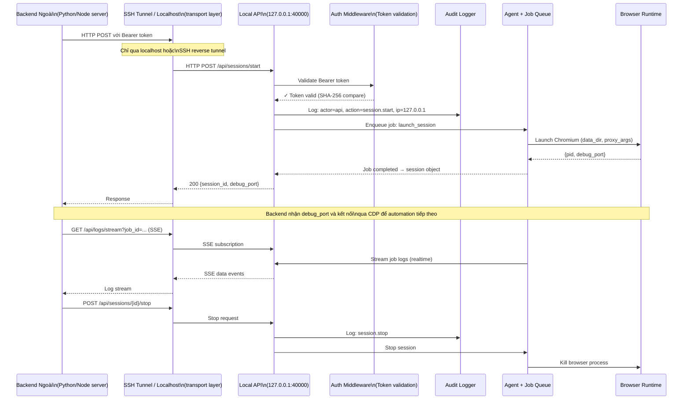

# 09 — Bảo Mật & Lưu Trữ

> **Phiên bản**: 1.2 | **Ngày**: 2026-02-18 | **Trạng thái**: Review  
> **EPIC tương ứng**: B3 (Threat Model) + J2 (Security Review)

---

## 1. Mục tiêu tài liệu

Mô tả toàn bộ chiến lược bảo mật:
- Mã hoá secrets (DPAPI, hashing).
- API token management.
- Audit trail.
- Log masking.
- Threat model đầy đủ.
- Storage security.

---

## 2. Nguyên tắc bảo mật cốt lõi

| Nguyên tắc | Áp dụng |
|---|---|
| **Least privilege** | Agent chỉ bind localhost; script chỉ truy cập script dir |
| **Defense in depth** | Token auth + rate limit + log masking + DPAPI |
| **Fail secure** | Token không khớp → từ chối ngay, không fallback |
| **No secrets in logs** | Middleware mask trước khi ghi |
| **Local-only attack surface** | API chỉ `127.0.0.1`, không expose ra network |
| **Encrypt at rest** | Proxy passwords, API token → DPAPI / SHA-256 |

> **Tham chiếu MoreLogin**: blog bảo mật mô tả "local extension data encryption", "cookies và passwords encrypted by default". Dự án này áp dụng cùng nguyên lý nhưng dùng DPAPI (Windows OS-native) thay vì proprietary scheme — kiểm chứng được, không phải marketing claim.

---

## 3. API Token

### 3.1 Tạo token

Khi cài đặt lần đầu (hoặc rotate):

```csharp
public static class TokenService
{
    public static string GenerateToken(int length = 48)
    {
        // URL-safe base64 random bytes
        var bytes = RandomNumberGenerator.GetBytes(length);
        return Convert.ToBase64String(bytes)
            .Replace('+', '-').Replace('/', '_').TrimEnd('=');
    }
    
    public static string HashToken(string plainToken)
    {
        // SHA-256 hash → hex → lưu vào DB
        var bytes = SHA256.HashData(Encoding.UTF8.GetBytes(plainToken));
        return Convert.ToHexString(bytes).ToLowerInvariant();
    }
    
    public static bool VerifyToken(string plainToken, string storedHash)
    {
        var computed = HashToken(plainToken);
        // Constant-time comparison (chống timing attack)
        return CryptographicOperations.FixedTimeEquals(
            Encoding.UTF8.GetBytes(computed),
            Encoding.UTF8.GetBytes(storedHash)
        );
    }
}
```

### 3.2 Lưu trữ token

- Trong DB `settings`: key `api_token_hash`, value = SHA-256 hex.
- Token plain-text **không bao giờ** lưu.
- Chỉ hiển thị plain-text một lần khi tạo/rotate.

### 3.3 Token rotation

```
POST /api/agent/token/rotate
→ Sinh token mới
→ Lưu hash mới vào DB
→ Invalidate hash cũ ngay lập tức
→ Response: { "token": "new-plain-token", "message": "Save this token - shown once only" }
```

Sau rotation:
- CLI cần cập nhật config: `bm config set-token <new-token>`.
- Backend bên ngoài cần update token của họ.
- GUI tự update từ settings.

### 3.4 Authentication Middleware

```csharp
app.Use(async (context, next) =>
{
    // Bỏ qua /health (public endpoint)
    if (context.Request.Path == "/health")
    {
        await next();
        return;
    }
    
    var authHeader = context.Request.Headers["Authorization"].ToString();
    if (!authHeader.StartsWith("Bearer "))
    {
        context.Response.StatusCode = 401;
        await context.Response.WriteAsJsonAsync(new {
            code = -1501,
            msg = "Unauthorized: missing token",
            data = (object?)null,
            requestId = context.TraceIdentifier
        });
        return;
    }
    
    var token = authHeader["Bearer ".Length..].Trim();
    var storedHash = await _settings.GetAsync("api_token_hash");
    
    if (!TokenService.VerifyToken(token, storedHash))
    {
        // Log warning (không log token)
        _logger.LogWarning("Invalid token attempt from {IP}", context.Connection.RemoteIpAddress);
        context.Response.StatusCode = 401;
        await context.Response.WriteAsJsonAsync(new {
            code = -1502,
            msg = "Unauthorized: invalid token",
            data = (object?)null,
            requestId = context.TraceIdentifier
        });
        return;
    }
    
    await next();
});
```

---

## 4. Mã Hoá Secrets — Windows DPAPI

### 4.1 DPAPI là gì?

**Windows Data Protection API (DPAPI)** là cơ chế mã hoá OS-native:
- Khoá bảo vệ bởi **Windows credential của user account** (hoặc machine account).
- Dữ liệu đã mã hoá chỉ giải mã được trên cùng máy + cùng user account.
- Không cần quản lý khoá thủ công.
- Tương đương cơ chế "local encryption" của Chrome password store.

### 4.2 Áp dụng cho proxy passwords

```csharp
public class DpapiProtector
{
    private static readonly byte[] OptionalEntropy = 
        Encoding.UTF8.GetBytes("BrowserManager-ProxySecret-v1");
    
    public static string Encrypt(string plaintext)
    {
        var data = Encoding.UTF8.GetBytes(plaintext);
        var encrypted = ProtectedData.Protect(
            data, 
            OptionalEntropy, 
            DataProtectionScope.CurrentUser
        );
        return Convert.ToBase64String(encrypted);
    }
    
    public static string Decrypt(string ciphertext)
    {
        var encrypted = Convert.FromBase64String(ciphertext);
        var decrypted = ProtectedData.Unprotect(
            encrypted, 
            OptionalEntropy, 
            DataProtectionScope.CurrentUser
        );
        return Encoding.UTF8.GetString(decrypted);
    }
}
```

### 4.3 Lifecycle của proxy password

```
User nhập password (plain-text)
  → Encrypt via DPAPI
  → Lưu `password_enc` (base64 ciphertext) vào DB
  → Plain-text bỏ khỏi bộ nhớ ngay lập tức

Khi cần sử dụng (launch session):
  → Decrypt via DPAPI → plain-text
  → Truyền vào ChromiumLauncher args
  → Bỏ khỏi bộ nhớ sau khi launch

Log: KHÔNG bao giờ log plain-text password
API response: KHÔNG bao giờ trả `password_enc` hoặc plain-text
Export với `exclude_secrets=true`: bỏ password field
```

### 4.4 Limitations của DPAPI

| Limitation | Giải thích | Xử lý |
|---|---|---|
| Machine-tied | Data decrypt được trên cùng máy | Export sẽ loại secrets; user phải nhập lại khi import sang máy khác |
| User-tied | Nếu user account bị thay đổi → mất access | Document rõ ràng trong help |
| Backup | Encrypted data không decrypt được trên máy khác | Refer user đến Windows DPAPI backup documentation |

---

## 5. Log Masking

### 5.1 Middleware log masking

```csharp
public class LogMaskingMiddleware
{
    private static readonly HashSet<string> SensitiveHeaders = new(StringComparer.OrdinalIgnoreCase)
    {
        "Authorization",
        "X-Api-Key"
    };
    
    private static readonly HashSet<string> SensitiveFields = new(StringComparer.OrdinalIgnoreCase)
    {
        "password",
        "password_enc",
        "proxy_password",
        "token",
        "api_token",
        "secret"
    };
    
    public static string MaskJson(string json)
    {
        // Regex-based mask cho JSON fields
        foreach (var field in SensitiveFields)
        {
            json = Regex.Replace(
                json,
                $@"""{field}""\s*:\s*""[^""]*""",
                $@"""{field}"": ""***""",
                RegexOptions.IgnoreCase
            );
        }
        return json;
    }
}
```

### 5.2 Serilog enricher

```csharp
public class SensitiveDataDestructuringPolicy : IDestructuringPolicy
{
    public bool TryDestructure(object value, ILogEventPropertyValueFactory factory, out LogEventPropertyValue result)
    {
        // Mask toàn bộ object có chứa sensitive fields
        // ...
    }
}
```

### 5.3 Rule: KHÔNG log

- `Authorization` header value.
- Proxy password (plain hoặc encrypted).
- API token (plain hoặc hash).
- Script params có `sensitive: true`.
- Bất kỳ dữ liệu nào user mark là confidential.

### 5.4 Rule: CÓ THỂ log

- Profile ID, name, group, tags.
- Job ID, type, status.
- Session ID, debug_port.
- HTTP method, path, status code.
- Timestamps, request_id.
- Error messages (không chứa secrets).

---

## 6. Storage Security

### 6.1 SQLite database

| Biện pháp | Áp dụng |
|---|---|
| File location | `%APPDATA%\BrowserManager\data\` — folder chỉ accessible bởi current user |
| File permissions | ACL: chỉ current user + SYSTEM có quyền đọc/ghi |
| Encryption | Không dùng SQLite Encryption Extension (quá phức tạp); thay vào đó encrypt sensitive fields trong application layer (DPAPI) |
| WAL mode | Bật WAL mode để giảm nguy cơ corruption |
| Backup | User có thể copy folder → dữ liệu portable nhưng secrets không decrypt được trên máy khác |

### 6.2 Profile data directories

| Biện pháp | Áp dụng |
|---|---|
| Location | `%APPDATA%\BrowserManager\profiles\{uuid}\` |
| Permissions | Restricted to current user |
| Chromium built-in encryption | Chromium tự encrypt cookies/passwords trong profile (OS Keychain / DPAPI) — behavior mặc định không bị disable |

### 6.3 Log files

| Biện pháp | Áp dụng |
|---|---|
| Location | `%APPDATA%\BrowserManager\logs\` |
| Permissions | Current user only |
| Rotation | Daily rotation, keep 30 days |
| Sensitivity | Log masking đã áp dụng (section 5) |

---

## 7. Network Security

### 7.1 Bind address

```csharp
// Bắt buộc — không thay đổi
builder.WebHost.UseUrls($"http://127.0.0.1:{port}");
// KHÔNG PHẢI: "http://0.0.0.0:{port}" hay "http://*:{port}"
```

### 7.2 Rate limiting

```csharp
builder.Services.AddRateLimiter(options =>
{
    options.AddFixedWindowLimiter("default", config =>
    {
        config.PermitLimit = 100;        // 100 requests
        config.Window = TimeSpan.FromSeconds(1); // per second
        config.QueueLimit = 0;           // không queue, từ chối ngay
    });
});
```

### 7.3 TLS (nâng cao, out-of-phase-1)

Phase 1: HTTP localhost only (TLS không cần thiết vì chỉ localhost).  
Phase 2 (nếu cần): HTTPS với self-signed cert, cert pinning trong CLI/GUI.

### 7.4 CORS

```csharp
// Không cần CORS vì API không dành cho browser-origin requests
// Disable CORS hoàn toàn
app.UseCors(policy => policy.WithOrigins()); // no origins allowed
```

---

## 8. Threat Model

### 8.1 Attack vectors

| # | Threat | Likelihood | Impact | Biện pháp |
|---|---|---|---|---|
| T1 | Token stolen from config file | Medium | High | Token lưu trong CLI config (`%APPDATA%\BrowserManager\config.json`) DPAPI-encrypted at rest |
| T2 | Token brute-force qua Local API | Low | High | Rate limit 100 req/s; token length 48 chars (entropy quá cao để brute) |
| T3 | Local process inject vào agent port | Low | High | Bind 127.0.0.1; Windows firewall rules; process isolation OS responsibility |
| T4 | Proxy password extracted từ DB | Medium | Medium | DPAPI encrypted; plain-text không tồn tại trong DB |
| T5 | Log file chứa secrets | Medium | Medium | Log masking middleware; audit log review |
| T6 | Script injection (malicious script package) | Medium | High | Scripts chỉ run từ registry; admin phải approve; sandbox restrictions |
| T7 | SQLite DB copied và analyzed | Medium | Low | Sensitive fields DPAPI encrypted; không decrypt được trên máy khác |
| T8 | Memory dump khi process running | Low | High | Phòng thủ OS-level; bỏ plain-text khỏi memory ngay sau dùng |
| T9 | Port conflict / port hijacking | Low | Medium | Bind trước khi announce; check port available trước khi bind |
| T10 | Webhook URL SSRF | Low | Medium | Validate webhook URL (không cho localhost/internal ranges) |

### 8.2 Risk Matrix

```
         Impact
         Low    Medium   High
Low  T7         T9,T3    T8
Low-
Medium         T5,T10    T6
Medium         T4        T1
High                     T2
```

### 8.3 Biện pháp bổ sung

**Webhook URL validation (T10):**
```csharp
public static bool IsWebhookUrlSafe(string url)
{
    if (!Uri.TryCreate(url, UriKind.Absolute, out var uri)) return false;
    if (uri.Scheme != "https") return false; // enforce HTTPS for webhooks
    
    // Block internal/loopback addresses
    var host = uri.Host;
    if (IPAddress.TryParse(host, out var ip))
    {
        if (IPAddress.IsLoopback(ip)) return false;
        if (IsPrivateIP(ip)) return false;
    }
    if (host == "localhost") return false;
    
    return true;
}
```

---

## 8B. Threat Model — Kịch bản "Backend Ngoài Điều Khiển qua Local API"

### 8B.1 Mô tả kịch bản

Đây là mô hình triển khai điển hình: **một backend server ở nơi khác** (trên cùng máy hoặc qua SSH reverse tunnel) gửi lệnh đến Local API để điều khiển browser sessions. Đây là kịch bản **cần được threat model riêng** vì bề mặt tấn công khác với người dùng GUI.

### 8B.2 Sequence Diagram: Backend ngoài → Local API → Agent



### 8B.3 Threat Scenarios — Backend Ngoài

| # | Threat | Likelihood | Impact | Biện pháp |
|---|---|---|---|---|
| T11 | Token lộ qua network (nếu backend gọi qua HTTP không phải localhost) | Medium | Critical | **Bắt buộc**: chỉ cho phép qua localhost hoặc SSH reverse tunnel. Tuyệt đối không expose port ra internet |
| T12 | Backend bị compromise → gọi `agent/shutdown` hoặc xoá toàn bộ profiles | Medium | High | Implement **scope/permission** cho token: token "readonly" vs "full-control"; log mọi action |
| T13 | SSRF: backend dùng Local API làm proxy để gọi internal services | Low | Medium | Rate limit; validate params URL (không cho gọi internal ranges qua automation) |
| T14 | Replay attack: token bị intercept, dùng lại | Low | High | Token không có expiry nhưng có rotate; xem xét thêm request timestamp + nonce cho critical operations |
| T15 | Debug port (CDP) bị expose ra ngoài | Low | Critical | Debug port chỉ bind `127.0.0.1`; không expose qua network; document rõ ràng |
| T16 | Backend gọi `/api/profiles/batch` xoá hàng loạt profiles | Low | High | Audit log bắt buộc; confirm step cho destructive batch ops |
| T17 | Webhook URL bị đổi sang `file://` hoặc internal service | Low | Medium | Validate webhook URL (section 8.3 T10 — đã có) |

### 8B.4 Điểm kiểm soát bảo mật trong sequence

| Điểm kiểm soát | Vị trí | Mô tả |
|---|---|---|
| **CP1: Transport** | SSH tunnel / localhost only | Không cho remote HTTP không mã hoá |
| **CP2: Auth** | Auth Middleware | Token SHA-256 verify, constant-time comparison |
| **CP3: Audit** | Audit Logger | Mọi action ghi rõ actor=api, ip=127.0.0.1 |
| **CP4: Rate limit** | ASP.NET Core rate limiter | 100 req/s, chống automation loop |
| **CP5: Log masking** | Log middleware | Mask Authorization header + sensitive fields |
| **CP6: Scope control** (khuyến nghị) | Token service | Phân biệt read-only vs write token cho backends khác nhau |
| **CP7: Webhook validation** | Webhook service | Block localhost/internal IPs, enforce HTTPS |

### 8B.5 Khuyến nghị triển khai khi backend ngoài điều khiển

1. **Không expose port 40000 ra internet** — chỉ dùng SSH reverse tunnel nếu backend ở máy chủ khác.
2. **Mỗi backend nhận token riêng** — khi cần revoke chỉ rotate token của backend đó.
3. **Bật verbose audit logging** khi có backend ngoài tích hợp — tracking toàn bộ request_id.
4. **Monitor `/api/agent/status` định kỳ** từ backend để phát hiện degraded state sớm.
5. **Implement scope-based token** (P2 roadmap): token chỉ cho phép một tập operations nhất định.

---

## 8E. Phạm vi Security v1 vs v1.2+ (G5 Scope Clarification)

> **Mục đích**: Chốt rõ tính năng nào **bắt buộc trong v1** và tính năng nào **Phase 2 / v1.2+**, tránh mâu thuẫn khi đánh giá Gate G5.

### Security v1 — Bắt buộc (enforcement trong build đầu tiên)

| # | Tính năng | File spec | Enforcement rule |
|---|---|---|---|
| S1 | API Token authentication | `04-local-api.md` §2, `09` §3 | Không có token → 401; token sai → 401 |
| S2 | DPAPI proxy password encryption | `09` §4 | Proxy password KHÔNG được lưu plaintext |
| S3 | Rate limiting (100 req/s) | `04-local-api.md` §2.3, `09` §7 | Rate limit exceeded → 429 Too Many Requests |
| S4 | Localhost-only binding | `03-background-agent.md` §5, `09` §7 | API KHÔNG bind ra interface ngoài `127.0.0.1` |
| S5 | Log masking (token, password) | `09` §5 | `Authorization` header và `password` field bị mask thành `***` trong mọi log |
| S6 | Threat model documented | `09` §8, `01` §8 | Threat model pass review trước build |

**G5 v1 Pass condition**: S1–S6 đều có enforcement trong code.

---

### Security v1.2+ (Phase 2) — Spec sẵn, chưa implement v1

| # | Tính năng | File spec | Ghi chú |
|---|---|---|---|
| P1 | E2E Encryption | `09` §8C | Interface spec đầy đủ; implementation = v1.2+; v1 chỉ cần lưu field `e2e_encryption_enabled` |
| P2 | Lock Status enforcement | `09` §8D | Interface spec đầy đủ; implementation = v1.2+; v1 chỉ cần lưu field `lock_status` |
| P3 | HTTPS / self-signed cert | `09` §7 (note) | v1 chạy plaintext localhost; HTTPS là optional hardening |
| P4 | Scope-based token | `09` §8B.4 | P2 roadmap; v1 dùng single-token model |

> **Lưu ý quan trọng**: Việc `e2e_encryption_enabled` và `lock_status` là **Phase 2 về enforcement** KHÔNG ảnh hưởng đến G5 PASS, vì G5 Gate condition chỉ yêu cầu **interface spec đầy đủ + threat model pass** (không yêu cầu implementation). Nếu tiêu chí duyệt nâng lên "v1 phải enforce E2E/Lock", thì G5 sẽ cần điều chỉnh lại.

---

## 8C. E2E Encryption [Restricted — v1.2+]

> Parity: MoreLogin `e2eEncryptionEnabled` + `encryptKey`. Tham chiếu: `13-baseline-morelogin-public.md` §7.

### 8C.1 Mô tả tính năng

When `e2e_encryption_enabled = true` cho một profile:
- Client **buộc phải** cung cấp `encryptKey` trong request `POST /api/env/start`.
- Key không được lưu trong database.
- Key chỉ tồn tại trong memory trong suốt session — biến mất khi session stop.

### 8C.2 API Behaviour

```json
// Request start session với E2E enabled
POST /api/env/start
{
  "envId": "uuid",
  "encryptKey": "my-secret-key-32-chars-minimum"
}

// Nếu thiếu encryptKey → 400 Bad Request
{
  "code": -1601,
  "msg": "encryptKey is required for E2E-encrypted profiles",
  "data": null,
  "requestId": "req-abc123"
}
```

Trường hợp native endpoint:
```json
POST /api/sessions/start
{
  "profile_id": "uuid",
  "encrypt_key": "my-secret-key-32-chars-minimum"
}
```

### 8C.3 Security Constraints

| Constraint | Value |
|---|---|
| `encryptKey` min length | 32 ký tự |
| `encryptKey` max length | 256 ký tự |
| `encryptKey` trong DB | **KHÔNG LƯ U** bất kỳ dưới mọi hình thức |
| `encryptKey` trong logs | **KHÔNG LOG** (mask to `***`) |
| `encryptKey` trong API response | **KHÔNG TRẢ** lại |
| Key re-use across sessions | Được phép (client chịu trách nhiệm) |

### 8C.4 GUI Representation

Trong Profile Detail panel:
```
─── Security [Requires agent v1.2+] ──
  E2E Encryption: [ OFF ◄► ON ]
  (! Bật tính năng này yêu cầu nhập encryptKey
     mỗi lần mở browser session)
```

Khi launch session và profile có `e2e_encryption_enabled = true`, GUI hiển thị dialog:
```
┌────────────────────────────────────┐
│  Enter Encryption Key          [×]  │
├────────────────────────────────────┤
│  Profile: "Account A"               │
│  E2E Encryption is enabled.         │
│                                      │
│  Encryption Key:                     │
│  [**************************]        │
│  (key is NOT saved to disk)          │
│                                      │
│     [Cancel]      [▶ Launch]         │
└────────────────────────────────────┘
```

---

## 8D. Lock Status [Restricted — v1.2+]

> Parity: MoreLogin `lockStatus` field. Tham chiếu: `13-baseline-morelogin-public.md` §7.

### 8D.1 Mô tả tính năng

`lock_status` có thể là `"unlocked"` (default) hoặc `"locked"`.

Khi `lock_status = "locked"`:
- Không thể start session cho profile này.
- API trả về `403 Forbidden` với message rõ ràng.
- GUI hiển thị biểu tượng 🔒 và disable nút Launch.

### 8D.2 API Behaviour

```json
// Khi gọi start session với profile bị lock
POST /api/env/start
{ "envId": "uuid" }

// Response 403 Forbidden
{
  "code": -1504,
  "msg": "Profile is locked. Unlock in profile settings before starting a session.",
  "data": null,
  "requestId": "req-abc123"
}
```

### 8D.3 Lock / Unlock via API

```json
// Lock
PATCH /api/profiles/{id}
{ "lock_status": "locked" }

// Unlock
PATCH /api/profiles/{id}
{ "lock_status": "unlocked" }
```

### 8D.4 GUI Representation

Trong Profile List View:
- Profile bị lock hiển thị biểu tượng 🔒 trong cột Status.
- Nút ▶ (Launch) bị disable, tooltip: "Profile is locked".

Trong Profile Detail panel:
```
─── Security [Requires agent v1.2+] ──
  Lock Status: [🔓 Unlocked ◄► 🔒 Locked]
```

### 8D.5 Use Case

Admin muốn ngăn người dùng vô ý khởi động một profile quan trọng (production account) — lock profile lại. Chỉ có admin role (trong phase 2) mới được unlock.

---

## 9. Audit Trail (chi tiết)

### 9.1 Audit log schema

```sql
CREATE TABLE audit_logs (
    id           INTEGER PRIMARY KEY AUTOINCREMENT,
    timestamp    DATETIME DEFAULT CURRENT_TIMESTAMP,
    actor        TEXT NOT NULL,    -- "gui" | "cli" | "api" | "agent" | "system"
    ip_address   TEXT,             -- luôn là 127.0.0.1 nếu qua API
    request_id   TEXT,
    action       TEXT NOT NULL,
    resource_type TEXT,            -- "profile" | "session" | "job" | "agent" | ...
    resource_id  TEXT,
    result       TEXT NOT NULL,    -- "ok" | "error"
    error_code   TEXT,
    detail_json  TEXT              -- sanitized (không chứa secrets)
);
```

### 9.2 Actions buộc phải audit

```
profile.create          profile.update          profile.delete
profile.clone           profile.import          profile.export
session.start           session.stop            session.crashed
job.create              job.cancel              job.retry
script.add              script.remove           script.run
proxy.add               proxy.update            proxy.delete
agent.shutdown          agent.token.rotate
settings.update         webhook.add             webhook.remove
```

### 9.3 Audit log retention

- Giữ tối thiểu 90 ngày.
- Export CSV qua GUI Settings → Audit Logs → Export.
- Không tự động xoá khi lưu trữ thấp (chỉ warn).

---

## 10. Security Checklist (Pre-Release)

- [ ] API token: SHA-256 hash lưu trong DB, không plain-text.
- [ ] DPAPI: proxy password encrypt/decrypt round-trip pass test.
- [ ] Log masking: check 100 log lines — không có password/token.
- [ ] Bind address: `netstat` confirm chỉ `127.0.0.1:{port}`.
- [ ] Rate limit: send >100 req/s → excess requests nhận 429.
- [ ] Auth: 100 requests không có token → tất cả 401.
- [ ] Audit log: mọi action trong danh sách 9.2 đều có bản ghi.
- [ ] Export: `exclude_secrets=true` → ZIP manifest không có password field.
- [ ] Webhook URL: localhost URL → reject.
- [ ] Sensitive script params: `sensitive: true` → không xuất hiện trong logs.
- [ ] DB file: ACL chỉ current user.
- [ ] Profile dirs: ACL chỉ current user.

---

## 11. Definition of Done (DoD) — B3 + J2

- [ ] Tất cả items trong Security Checklist pass.
- [ ] E2E Encryption: `encryptKey` không xuất hiện trong logs, DB, response.
- [ ] Lock Status: profile bị lock → start session trả `403`, GUI disable Launch nút.
- [ ] Penetration test cơ bản: thử brute-force token, truy cập từ external IP → đều fail.
- [ ] Code review bởi ít nhất 1 người khác cho: auth middleware, DPAPI code, log masking.
- [ ] Threat model được review và update sau mỗi thay đổi kiến trúc lớn.
- [ ] Security regression test trong CI pipeline.

---

---

## 8F. RBAC & Scope-Based Token (Phase 2)

> **Trạng thái**: Spec đầy đủ (Phase 2 implementation) | **Tham chiếu MoreLogin**: Admin / Member / Viewer roles

### 8F.1 Role Model

BrowserManager hỗ trợ 3 roles được phân quyền rõ ràng:

| Role | Mô tả | Scope |
|---|---|---|
| **ADMIN** | Full access — tạo/sửa/xóa profile, quản lý token, cài đặt hệ thống | `admin` |
| **OPERATOR** | Launch/stop session, chạy automation, đọc logs | `profile:read`, `session:start`, `session:stop`, `job:run`, `logs:read` |
| **VIEWER** | Chỉ đọc profile list, session status, không thực hiện thao tác | `profile:read`, `session:read`, `logs:read` |

### 8F.2 Cấu trúc Token Scope

Token được phát hành với `scope` field (JWT claims hoặc opaque token):

```json
{
  "sub": "user-uuid",
  "token_name": "automation-bot-1",
  "role": "OPERATOR",
  "scope": ["profile:read", "session:start", "session:stop", "job:run", "logs:read"],
  "iat": 1708416000,
  "exp": 1711094400
}
```

**Scope definitions:**

| Scope | Mô tả |
|---|---|
| `admin` | Full access — bao gồm tất cả scopes bên dưới |
| `profile:read` | Đọc danh sách và chi tiết profile |
| `profile:write` | Tạo / sửa / xóa profile |
| `session:read` | Xem trạng thái session |
| `session:start` | Khởi động browser session |
| `session:stop` | Dừng browser session |
| `job:run` | Tạo và chạy automation jobs |
| `logs:read` | Đọc logs và audit trail |
| `settings:write` | Thay đổi cài đặt hệ thống |
| `token:manage` | Tạo / revoke tokens |

### 8F.3 Permission Matrix

| Endpoint | ADMIN | OPERATOR | VIEWER |
|---|---|---|---|
| `GET /api/profiles` | ✅ | ✅ | ✅ |
| `POST /api/profiles` | ✅ | ❌ | ❌ |
| `PATCH /api/profiles/{id}` | ✅ | ❌ | ❌ |
| `DELETE /api/profiles/{id}` | ✅ | ❌ | ❌ |
| `POST /api/env/create/quick` | ✅ | ❌ | ❌ |
| `POST /api/env/create/advanced` | ✅ | ❌ | ❌ |
| `POST /api/sessions/{id}/start` | ✅ | ✅ | ❌ |
| `POST /api/sessions/{id}/stop` | ✅ | ✅ | ❌ |
| `POST /api/env/start` | ✅ | ✅ | ❌ |
| `POST /api/env/close` | ✅ | ✅ | ❌ |
| `POST /api/env/closeAll` | ✅ | ✅ | ❌ |
| `GET /api/sessions` | ✅ | ✅ | ✅ |
| `POST /api/env/list` | ✅ | ✅ | ✅ |
| `POST /api/env/detail` | ✅ | ✅ | ✅ |
| `POST /api/env/getAllDebugInfo` | ✅ | ✅ | ❌ |
| `POST /api/env/getAllProcessIds` | ✅ | ✅ | ❌ |
| `POST /api/env/getAllScreen` | ✅ | ✅ | ✅ |
| `POST /api/env/arrangeWindows` | ✅ | ✅ | ❌ |
| `GET /api/jobs` | ✅ | ✅ | ✅ |
| `POST /api/jobs` | ✅ | ✅ | ❌ |
| `POST /api/jobs/{id}/cancel` | ✅ | ✅ | ❌ |
| `GET /api/logs/stream` | ✅ | ✅ | ✅ |
| `GET /api/audit` | ✅ | ✅ | ❌ |
| `POST /api/sync/start` | ✅ | ✅ | ❌ |
| `POST /api/sync/stop` | ✅ | ✅ | ❌ |
| `GET /api/sync/status` | ✅ | ✅ | ✅ |
| `GET /api/envgroup/*` | ✅ | ✅ | ✅ |
| `POST /api/envgroup/create` | ✅ | ❌ | ❌ |
| `POST /api/envgroup/edit` | ✅ | ❌ | ❌ |
| `POST /api/envgroup/delete` | ✅ | ❌ | ❌ |
| `GET /api/envtag/all` | ✅ | ✅ | ✅ |
| `POST /api/envtag/create` | ✅ | ❌ | ❌ |
| `POST /api/envtag/edit` | ✅ | ❌ | ❌ |
| `POST /api/envtag/delete` | ✅ | ❌ | ❌ |
| `POST /api/proxyInfo/add` | ✅ | ❌ | ❌ |
| `POST /api/proxyInfo/update` | ✅ | ❌ | ❌ |
| `POST /api/proxyInfo/delete` | ✅ | ❌ | ❌ |
| `POST /api/proxyInfo/page` | ✅ | ✅ | ✅ |
| `POST /api/env/removeLocalCache` | ✅ | ✅ | ❌ |
| `POST /api/env/removeToRecycleBin/batch` | ✅ | ❌ | ❌ |
| `POST /api/agent/token/rotate` | ✅ | ❌ | ❌ |
| `POST /api/agent/tokens` | ✅ | ❌ | ❌ |
| `GET /api/agent/tokens` | ✅ | ❌ | ❌ |
| `DELETE /api/agent/tokens/{id}` | ✅ | ❌ | ❌ |
| `GET /api/agent/status` | ✅ | ✅ | ✅ |
| `POST /api/agent/shutdown` | ✅ | ❌ | ❌ |
| `GET /health` | ✅ | ✅ | ✅ |

### 8F.4 Token Management API

```
POST   /api/agent/tokens          — Tạo token mới với scope
GET    /api/agent/tokens          — Liệt kê tokens (token value bị mask)
DELETE /api/agent/tokens/{id}     — Revoke (xóa) token theo ID
```

**POST /api/agent/tokens — Tạo token mới**
```json
// Request
{
  "name": "automation-bot-1",
  "role": "OPERATOR",
  "expires_in_days": 30
}

// Response 201 Created
{
  "data": {
    "id": "token-uuid-abc",
    "name": "automation-bot-1",
    "role": "OPERATOR",
    "scope": ["profile:read", "session:start", "session:stop", "job:run", "logs:read"],
    "token": "bm_live_Xt9kLmNp2qRs7vYw...",
    "expires_at": "2026-03-20T00:00:00Z",
    "created_at": "2026-02-20T10:00:00Z",
    "message": "Save this token - shown once only"
  },
  "request_id": "req-tok-001",
  "timestamp": "2026-02-20T10:00:00Z"
}
```

**GET /api/agent/tokens — Liệt kê tokens (masked)**
```json
// Response 200
{
  "data": [
    {
      "id": "token-uuid-abc",
      "name": "automation-bot-1",
      "role": "OPERATOR",
      "token_preview": "bm_live_Xt9k...****",
      "expires_at": "2026-03-20T00:00:00Z",
      "created_at": "2026-02-20T10:00:00Z",
      "last_used_at": "2026-02-20T09:55:00Z"
    }
  ],
  "request_id": "req-tok-002",
  "timestamp": "2026-02-20T10:00:00Z"
}
```

**DELETE /api/agent/tokens/{id} — Revoke token**
```json
// Response 200
{
  "data": { "revoked": true, "token_name": "automation-bot-1" },
  "request_id": "req-tok-003",
  "timestamp": "2026-02-20T10:00:00Z"
}
```

### 8F.5 Implementation Notes

- **v1.0**: Single-token model (1 admin token từ khi install). RBAC enforced Phase 2.
- **Phase 2**: Multi-token model — mỗi token có scope riêng, permission check trước mỗi request.
- **Token validation**: Middleware kiểm tra `scope` claim → 403 Forbidden nếu scope không đủ.
- **Token storage**: Token hash (SHA-256) lưu trong DB `agent_tokens` table, kèm `role` và `scope_json`.
- **Backward compatibility**: Token không có scope field → treat as ADMIN (legacy single-token).

---

*Tài liệu tiếp theo: [10-qa-release-checklist.md](10-qa-release-checklist.md)*
