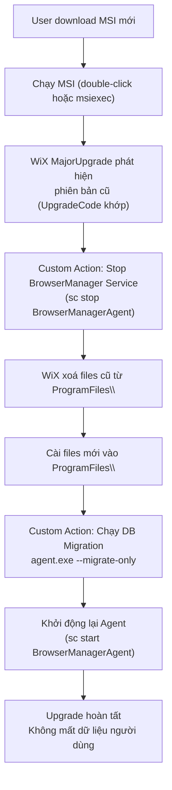

# 11 — Installer Specification

> **Phiên bản**: 1.1 | **Ngày**: 2026-02-18 | **Trạng thái**: Review  
> **EPIC tương ứng**: I — Installer & Distribution

---

## 1. Mục tiêu tài liệu

Đặc tả đầy đủ quá trình đóng gói, phân phối và cài đặt `BrowserManager`:
- Toolchain lựa chọn (WiX Toolset).
- Cấu trúc MSI / installer package.
- Build pipeline (GitHub Actions YAML).
- Upgrade / migration strategy (không mất dữ liệu).
- Rollback procedure.
- Code signing spec.
- Silent install / enterprise deployment.

---

## 2. Toolchain

### 2.1 ADR-006: Installer Toolchain

| Option | Ưu điểm | Nhược điểm |
|---|---|---|
| **WiX Toolset v4** | MSI chuẩn Windows, hỗ trợ upgrade/component rules, rollback built-in | Phức tạp, XML-heavy |
| **NSIS** | Đơn giản, scriptable, phổ biến | Không tạo MSI thực sự; rollback thủ công |
| **Inno Setup** | Dễ dùng, community tốt | Không MSI; enterprise deployment hạn chế |
| **Squirrel** | Update tự động tốt, dùng cho Electron | Phụ thuộc NuGet; phức tạp cho .NET service |
| **Advanced Installer** | GUI visual, full MSI | Commercial license |

**Quyết định: WiX Toolset v4 (MSI)**  
Lý do: MSI là chuẩn Windows enterprise; hỗ trợ upgrade component rules (không xoá dữ liệu user); rollback transaction tích hợp; tương thích Group Policy deployment.

### 2.2 Bộ công cụ

```
WiX v4         → build .wxs → .msi
heat.exe       → harvest files tự động
candle.exe     → compile .wxs → .wixobj
light.exe      → link .wixobj → .msi
signtool.exe   → code sign .msi
dotnet publish → build các projects
```

---

## 3. Cấu Trúc Installer Package

### 3.1 Files được cài đặt

```
%ProgramFiles%\BrowserManager\
├── agent.exe                    ← Background Agent (ASP.NET Core)
├── gui.exe                      ← WPF Desktop GUI
├── bm.exe                       ← CLI tool
├── Microsoft.Playwright\        ← Playwright + bundled Chromium
│   └── .playwright\
│       └── chromium-{version}\
├── runtimes\                    ← .NET runtime (self-contained)
└── appsettings.json             ← default config (không chứa secrets)

%ProgramFiles%\BrowserManager\
└── uninstall.exe                ← WiX uninstaller (tự động)
```

### 3.2 Dữ liệu người dùng (KHÔNG xoá khi upgrade/uninstall)

```
%APPDATA%\BrowserManager\
├── data\
│   └── profiles.db              ← SQLite database
├── profiles\                    ← User-data-dirs (KHÔNG đụng vào)
├── scripts\                     ← Script registry
└── logs\                        ← Log files (retain per config)
```

> **Quy tắc vàng**: Installer/Uninstaller **không bao giờ** đụng vào `%APPDATA%\BrowserManager\`. Chỉ xoá `%ProgramFiles%\BrowserManager\`.

### 3.3 Registry keys

```
HKLM\SOFTWARE\BrowserManager\
  InstallDate = {timestamp}
  Version     = 1.0.0
  InstallPath = C:\Program Files\BrowserManager\

HKCU\SOFTWARE\Microsoft\Windows\CurrentVersion\Run\
  BrowserManagerTray = "C:\Program Files\BrowserManager\gui.exe" --tray-only
```

---

## 4. WiX Project Structure

```
installer/
├── BrowserManager.wxs           ← Main WiX source
├── variables.wxi                ← version, paths
├── Components/
│   ├── AgentFiles.wxs
│   ├── GuiFiles.wxs
│   ├── CliFiles.wxs
│   ├── PlaywrightRuntime.wxs
│   └── Shortcuts.wxs
├── Dialogs/
│   ├── WelcomeDlg.wxs
│   ├── InstallDirDlg.wxs
│   └── FinishDlg.wxs
├── CustomActions/
│   ├── StopAgent.wxs            ← Custom action: stop agent trước upgrade
│   ├── RunMigrations.wxs        ← Custom action: chạy DB migrations
│   └── RegisterService.wxs      ← Custom action: sc create (nếu service mode)
└── Localization/
    └── en-US.wxl
```

### 4.1 Đoạn WiX cốt lõi — Upgrade configuration

```xml
<!-- BrowserManager.wxs -->
<Product Id="*" 
         Name="BrowserManager" 
         Language="1033" 
         Version="$(var.Version)"
         Manufacturer="YourCompany"
         UpgradeCode="{FIXED-GUID-NEVER-CHANGE}">
  
  <!-- MajorUpgrade: remove old version, install new, bảo toàn data -->
  <MajorUpgrade 
    DowngradeErrorMessage="A newer version of [ProductName] is already installed."
    Schedule="afterInstallInitialize"
    AllowSameVersionUpgrades="no" />

  <!-- InstallDir: không đụng AppData -->
  <Directory Id="TARGETDIR" Name="SourceDir">
    <Directory Id="ProgramFiles64Folder">
      <Directory Id="INSTALLDIR" Name="BrowserManager" />
    </Directory>
  </Directory>

  <!-- CustomAction: Stop agent trước khi upgrade -->
  <InstallExecuteSequence>
    <Custom Action="StopAgentService" Before="InstallFiles">
      UPGRADINGPRODUCTCODE
    </Custom>
    <Custom Action="RunDbMigrations" After="InstallFiles">
      NOT Installed
    </Custom>
    <Custom Action="RunDbMigrationsUpgrade" After="InstallFiles">
      UPGRADINGPRODUCTCODE
    </Custom>
  </InstallExecuteSequence>

</Product>
```

---

## 5. Build Pipeline — GitHub Actions

### 5.1 Workflow: `release.yml`

```yaml
name: Build & Release BrowserManager

on:
  push:
    tags:
      - 'v*.*.*'

env:
  DOTNET_VERSION: '8.0.x'
  WIX_VERSION: '4.0.2'

jobs:
  build:
    runs-on: windows-latest
    
    steps:
      - name: Checkout
        uses: actions/checkout@v4
        with:
          fetch-depth: 0

      - name: Setup .NET
        uses: actions/setup-dotnet@v4
        with:
          dotnet-version: ${{ env.DOTNET_VERSION }}

      - name: Extract version from tag
        id: version
        run: |
          $version = "${{ github.ref_name }}" -replace "^v", ""
          echo "VERSION=$version" >> $env:GITHUB_OUTPUT

      - name: Restore dependencies
        run: dotnet restore ./BrowserManager.sln

      - name: Build & Publish Agent
        run: |
          dotnet publish ./src/BrowserManager.Agent \
            -c Release -r win-x64 --self-contained \
            /p:Version=${{ steps.version.outputs.VERSION }} \
            /p:PublishSingleFile=false \
            -o ./dist/agent

      - name: Build & Publish GUI
        run: |
          dotnet publish ./src/BrowserManager.Gui \
            -c Release -r win-x64 --self-contained \
            /p:Version=${{ steps.version.outputs.VERSION }} \
            -o ./dist/gui

      - name: Build & Publish CLI
        run: |
          dotnet publish ./src/BrowserManager.Cli \
            -c Release -r win-x64 --self-contained \
            /p:PublishSingleFile=true \
            /p:Version=${{ steps.version.outputs.VERSION }} \
            -o ./dist/cli

      - name: Install Playwright Chromium
        run: |
          ./dist/agent/playwright.exe install chromium
          # Copy Playwright runtime to dist
          
      - name: Install WiX Toolset
        run: dotnet tool install --global wix --version ${{ env.WIX_VERSION }}

      - name: Build MSI
        run: |
          wix build ./installer/BrowserManager.wxs `
            -d Version=${{ steps.version.outputs.VERSION }} `
            -d AgentDir=./dist/agent `
            -d GuiDir=./dist/gui `
            -d CliDir=./dist/cli `
            -o ./dist/BrowserManager-${{ steps.version.outputs.VERSION }}-win-x64.msi

      - name: Code Sign MSI
        if: secrets.CODESIGN_CERT_BASE64 != ''
        env:
          CERT_BASE64: ${{ secrets.CODESIGN_CERT_BASE64 }}
          CERT_PASSWORD: ${{ secrets.CODESIGN_CERT_PASSWORD }}
        run: |
          $cert = [Convert]::FromBase64String($env:CERT_BASE64)
          [IO.File]::WriteAllBytes("cert.pfx", $cert)
          signtool sign /fd SHA256 /p $env:CERT_PASSWORD /f cert.pfx `
            /t http://timestamp.digicert.com `
            ./dist/BrowserManager-${{ steps.version.outputs.VERSION }}-win-x64.msi
          Remove-Item cert.pfx

      - name: Upload artifact
        uses: actions/upload-artifact@v4
        with:
          name: BrowserManager-MSI
          path: ./dist/*.msi

      - name: Create GitHub Release
        uses: softprops/action-gh-release@v1
        with:
          files: |
            ./dist/BrowserManager-${{ steps.version.outputs.VERSION }}-win-x64.msi
          generate_release_notes: true
```

### 5.2 Workflow: `pr-build.yml` (CI cho PRs)

```yaml
name: CI Build

on:
  pull_request:
    branches: [main, develop]

jobs:
  build-test:
    runs-on: windows-latest
    steps:
      - uses: actions/checkout@v4
      - uses: actions/setup-dotnet@v4
        with:
          dotnet-version: '8.0.x'
      - run: dotnet restore ./BrowserManager.sln
      - run: dotnet build ./BrowserManager.sln -c Release --no-restore
      - run: dotnet test ./tests/BrowserManager.Unit.Tests -c Release --no-build --verbosity normal
```

---

## 6. Upgrade / Migration Strategy

### 6.1 Quy trình upgrade



### 6.2 DB Migration script chạy khi upgrade

```bash
# agent.exe với flag --migrate-only
agent.exe --migrate-only
# → Chạy EF Core pending migrations
# → Exit 0 nếu thành công, exit 1 nếu lỗi
# → Log ra Windows Event Log
```

Nếu migration fail → Installer rollback (WiX transaction rollback tự động).

### 6.3 Version compatibility matrix

| Installer Version | DB Schema Version | Ghi chú |
|---|---|---|
| 1.0.0 | 001_initial_schema | Lần cài đầu tiên |
| 1.1.0 | 002_add_extensions | Thêm bảng extensions, profile_extensions |
| 1.2.0 | 003_add_trash | Thêm bảng profile_trash; thêm deleted_at, user_agent, kernel_ver vào profiles |
| 1.3.0 | 004_add_webhooks | Thêm bảng webhooks, cache_clear_history |

---

## 7. Rollback Procedure

### 7.1 WiX Transaction Rollback (tự động)

Nếu cài đặt thất bại ở bất kỳ bước nào, WiX tự động rollback:
- Khôi phục files đã xoá.
- Undo registry changes.
- Custom Action rollback: re-start agent service nếu đã stop.

### 7.2 Manual Rollback (người dùng)

Nếu upgrade thành công nhưng user muốn quay về version cũ:
1. Gỡ cài đặt version mới: `Add/Remove Programs → BrowserManager → Uninstall`.
2. Cài lại version cũ từ MSI archive.
3. DB schema sẽ ở version mới hơn — agent cũ có thể không đọc được các cột mới. → **Solution**: agent cũ bỏ qua cột không biết (EF Core ignore unknown columns).
4. **Không mất dữ liệu** vì `%APPDATA%\BrowserManager\` không bị uninstaller xoá.

### 7.3 Emergency Rollback Script

```powershell
# rollback.ps1 — dùng khi cần khôi phục khNzn cấp
param([string]$PreviousMsiPath)

# Stop service
Stop-Service BrowserManagerAgent -Force -ErrorAction SilentlyContinue

# Backup current AppData (profiles database)
$backupPath = "$env:TEMP\BM_Backup_$(Get-Date -Format 'yyyyMMddHHmm')"
Copy-Item "$env:APPDATA\BrowserManager\data" $backupPath -Recurse

# Uninstall current version
$msiName = (Get-WmiObject -Class Win32_Product | Where-Object { $_.Name -eq "BrowserManager" }).IdentifyingNumber
if ($msiName) {
    msiexec /x $msiName /qn
}

# Install previous version
msiexec /i $PreviousMsiPath /qn

Write-Host "Rollback completed. Database backup at: $backupPath"
```

---

## 8. Code Signing

### 8.1 Yêu cầu

- Certificate: **Extended Validation (EV) Code Signing Certificate** (recommended) hoặc **OV Code Signing Certificate**.
- Issuer: DigiCert, Sectigo, GlobalSign, hoặc tương đương.
- EV cert không trigger SmartScreen "Unknown Publisher" warning.

### 8.2 Ký MSI

```powershell
# Ký với timestamp (quan trọng — tránh hết hạn cert làm mất tính hợp lệ)
signtool sign `
  /fd SHA256 `
  /tr http://timestamp.digicert.com `
  /td SHA256 `
  /f "cert.pfx" `
  /p "<password>" `
  "BrowserManager-1.0.0-win-x64.msi"

# Verify chữ ký
signtool verify /pa "BrowserManager-1.0.0-win-x64.msi"
```

### 8.3 Ký EXE files

Ký tất cả EXE trong package trước khi đóng gói vào MSI:
- `agent.exe`
- `gui.exe`
- `bm.exe`

```powershell
# Ký tất cả EXE trong dist/
Get-ChildItem -Path ./dist -Recurse -Filter "*.exe" | ForEach-Object {
    signtool sign /fd SHA256 /tr http://timestamp.digicert.com /td SHA256 /f cert.pfx /p $password $_.FullName
}
```

---

## 9. Silent Install / Enterprise Deployment

### 9.1 Silent install command

```batch
:: Cài đặt silent (không hiện dialog)
msiexec /i BrowserManager-1.0.0-win-x64.msi /qn /l*v install.log

:: Với custom install dir
msiexec /i BrowserManager-1.0.0-win-x64.msi /qn INSTALLDIR="D:\Apps\BrowserManager"

:: Uninstall silent
msiexec /x BrowserManager-1.0.0-win-x64.msi /qn
```

### 9.2 Group Policy / SCCM Deployment

MSI hỗ trợ deploy qua:
- **Group Policy Software Installation** (`gpmc.msc`).
- **Microsoft SCCM / Intune** — upload MSI, deploy to device groups.
- **PDQ Deploy** — silent deployment tool phổ biến.

### 9.3 Pre-deployment checklist

- [ ] .NET 8 Runtime đã có (self-contained MSI không cần riêng, nhưng verify).
- [ ] Visual C++ Redistributable: Playwright Chromium yêu cầu VC++ 2019+.
- [ ] Windows 10 version 1903+ (requires Windows 10+ cho .NET 8).
- [ ] Port 40000 chưa bị chiếm (agent bind check khi start). Nếu MoreLogin đang chạy trên cùng máy (dùng port 40000), cần đổi port BrowserManager trong Settings trước khi deploy.
- [ ] Disk space: tối thiểu 500MB (Chromium ~150MB + agent/gui + data).

---

## 10. Installer Checklist (Pre-Release)

- [ ] Build MSI thành công từ clean CI environment (không dùng developer machine).
- [ ] MSI ký bởi EV cert; SmartScreen không hiển thị "Unknown Publisher".
- [ ] Install từ đầu: `agent.exe` chạy như service, `gui.exe` mở được, `bm health` trả 200.
- [ ] Upgrade từ v1.0 lên v1.1: dữ liệu profiles giữ nguyên, DB migration chạy đúng.
- [ ] Uninstall: `%ProgramFiles%\BrowserManager\` bị xoá; `%APPDATA%\BrowserManager\` **không** bị xoá.
- [ ] Silent install (`/qn`) không có dialog, exit code 0.
- [ ] Rollback: test cài đặt thất bại (kill mid-install) → system trở về trạng thái trước.
- [ ] Log file `install.log` chứa đủ thông tin để debug nếu cần.
- [ ] Version number trong MSI khớp với git tag và `agent.exe --version`.
- [ ] Signature verify: `signtool verify /pa *.msi` và `*.exe` — tất cả pass.

---

## 11. Definition of Done (DoD) — EPIC I

- [ ] MSI build pipeline chạy trong GitHub Actions (không lỗi trên fresh Windows runner).
- [ ] Upgrade từ phiên bản trước không mất DB hay profiles.
- [ ] Code signing với cert hợp lệ; SmartScreen pass.
- [ ] Silent install hoạt động (`/qn`).
- [ ] Rollback procedure document đầy đủ và test thành công.
- [ ] Enterprise deployment guide (SCCM/GPO) có ít nhất 1 test trên máy domain.

---

*Tài liệu tiếp theo: [12-api-compatibility.md](12-api-compatibility.md)*
