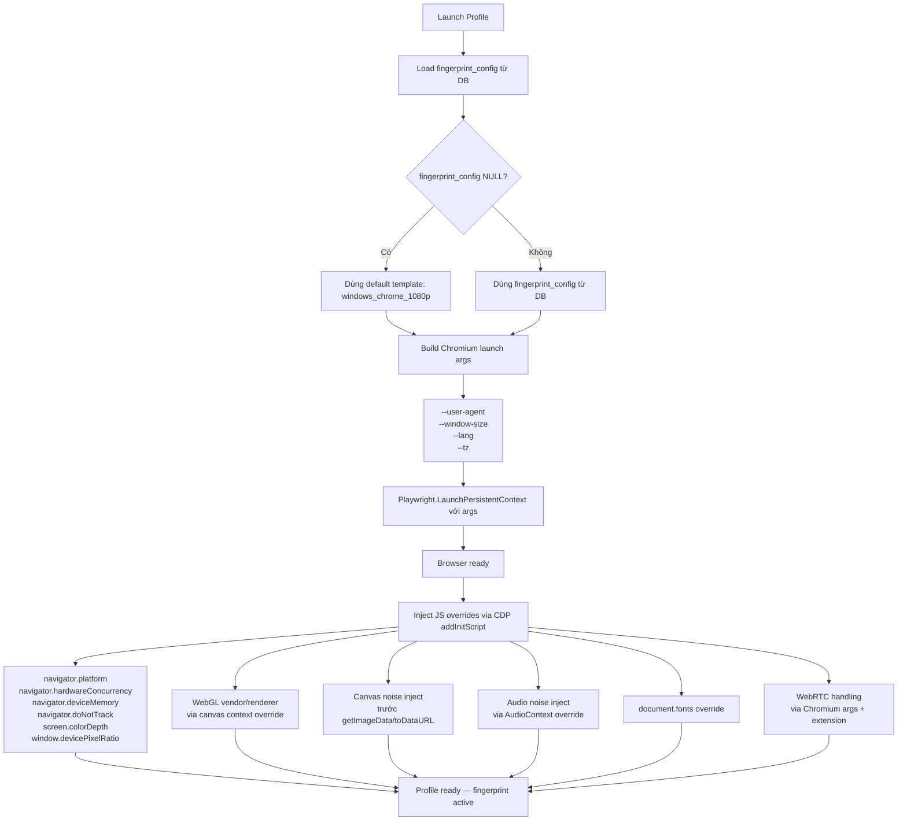

# 15 — Fingerprint Engine

> **Phiên bản**: 1.0 | **Ngày**: 2026-02-20 | **Trạng thái**: Approved
> **EPIC tương ứng**: K — Fingerprint Engine
> **SSOT cho**: Fingerprint spoofing spec, DB schema extension, API endpoints

---

## 1. Mục tiêu tài liệu

Tài liệu này đặc tả **Fingerprint Engine** — thành phần cho phép mỗi browser profile trong BrowserManager trông như một thiết bị thật khác nhau khi bị quét bởi các hệ thống anti-fraud.

Mục tiêu cụ thể:
- Giả mạo (spoof) các thuộc tính browser fingerprint per-profile
- Mỗi profile có một tập fingerprint nhất quán và độc lập
- Hỗ trợ randomize fingerprint có kiểm soát (seed-based)
- Tương đương 100% với MoreLogin baseline cho tất cả fingerprint properties

Tài liệu này là SSOT cho các nhóm:
- **Backend**: schema DB, inject logic, API endpoints
- **Frontend (GUI)**: Fingerprint tab trong Profile Wizard
- **QA**: test cases fingerprint injection
- **MoreLogin Compat**: mapping `fingerprint_config` object

Tham chiếu liên quan: [`02-he-thong-profile.md`](02-he-thong-profile.md), [`06-browser-runtime.md`](06-browser-runtime.md), [`04-local-api.md`](04-local-api.md), [`08-desktop-gui.md`](08-desktop-gui.md), [`13-baseline-morelogin-public.md`](13-baseline-morelogin-public.md).

---

## 2. Danh sách Fingerprint Properties

Bảng dưới đây liệt kê tất cả properties cần spoof, cách inject và chiến lược giá trị.

| # | Property | Inject Method | Giá trị mặc định / Randomize Strategy | Ưu tiên |
|---|---|---|---|---|
| 1 | `user_agent` | Chromium arg `--user-agent` | Theo template OS+Browser | P0 |
| 2 | `platform` | CDP `navigator.platform` override | `"Win32"` / theo OS template | P0 |
| 3 | `screen_resolution` | Chromium arg `--window-size` + JS override `screen.width/height` | `1920x1080` / theo template | P0 |
| 4 | `timezone` | Chromium arg `--tz` + CDP `Emulation.setTimezoneOverride` | `"Asia/Ho_Chi_Minh"` | P0 |
| 5 | `language` / `languages` | Chromium arg `--lang` + CDP `Emulation.setLocaleOverride` | `"vi-VN"` / `["vi-VN","vi","en-US"]` | P0 |
| 6 | `hardware_concurrency` | CDP `navigator.hardwareConcurrency` override | `8` / ngẫu nhiên 2–16 | P1 |
| 7 | `device_memory` | CDP `navigator.deviceMemory` override | `8` / ngẫu nhiên 2–32 | P1 |
| 8 | `webgl_vendor` | JS CDP canvas/WebGL context override | `"Google Inc. (NVIDIA)"` | P1 |
| 9 | `webgl_renderer` | JS CDP canvas/WebGL context override | `"ANGLE (NVIDIA, NVIDIA GeForce RTX 3060...)"` | P1 |
| 10 | `canvas_noise` | JS inject noise via `CDP Runtime.evaluate` trước `getImageData/toDataURL` | Seed-based noise | P1 |
| 11 | `audio_noise` | JS inject `AudioContext` noise override | Seed-based AudioBuffer noise | P1 |
| 12 | `webrtc_mode` | Chromium args + extension | `"disabled"` / `"replace"` / `"real"` | P0 |
| 13 | `font_list` | JS CDP override `document.fonts` | Subset cố định theo OS template | P2 |
| 14 | `do_not_track` | CDP `navigator.doNotTrack` override | `false` | P2 |
| 15 | `color_depth` | CDP `screen.colorDepth` override | `24` | P2 |
| 16 | `pixel_ratio` | CDP `window.devicePixelRatio` override | `1.0` / theo template | P2 |

> **Mức ưu tiên**: P0 = bắt buộc v1.0 | P1 = quan trọng v1.0 | P2 = có thể defer v1.1

---

## 3. Schema DB — Mở rộng bảng `profiles`

### 3.1 Migration 009

```sql
-- Migration 009: add fingerprint_config to profiles
-- File: migrations/009_add_fingerprint_config.sql

ALTER TABLE profiles ADD COLUMN fingerprint_config TEXT; -- JSON, nullable
```

> Migration này forward-only, idempotent, auto-run on startup theo quy ước `migration-plan.md`.

### 3.2 JSON Schema của `fingerprint_config`

Trường `fingerprint_config` trong bảng `profiles` là một JSON string theo schema sau:

```json
{
  "user_agent": "Mozilla/5.0 (Windows NT 10.0; Win64; x64) AppleWebKit/537.36 (KHTML, like Gecko) Chrome/120.0.0.0 Safari/537.36",
  "platform": "Win32",
  "screen_width": 1920,
  "screen_height": 1080,
  "timezone": "Asia/Ho_Chi_Minh",
  "language": "vi-VN",
  "languages": ["vi-VN", "vi", "en-US"],
  "hardware_concurrency": 8,
  "device_memory": 8,
  "webgl_vendor": "Google Inc. (NVIDIA)",
  "webgl_renderer": "ANGLE (NVIDIA, NVIDIA GeForce RTX 3060 Ti Direct3D11 vs_5_0 ps_5_0, D3D11)",
  "canvas_noise_seed": 12345,
  "audio_noise_seed": 67890,
  "webrtc_mode": "disabled",
  "font_list_override": ["Arial", "Times New Roman", "Courier New", "Verdana", "Georgia"],
  "do_not_track": false,
  "color_depth": 24,
  "pixel_ratio": 1.0
}
```

#### Quy ước trường

| Trường | Kiểu | Nullable | Mô tả |
|---|---|---|---|
| `user_agent` | string | Không | User-Agent string đầy đủ |
| `platform` | string | Không | `"Win32"`, `"MacIntel"`, `"Linux x86_64"` |
| `screen_width` | integer | Không | Chiều rộng màn hình (pixels) |
| `screen_height` | integer | Không | Chiều cao màn hình (pixels) |
| `timezone` | string | Không | IANA timezone ID |
| `language` | string | Không | BCP-47 language tag chính |
| `languages` | array[string] | Không | Danh sách ngôn ngữ theo thứ tự ưu tiên |
| `hardware_concurrency` | integer | Không | Số CPU logical (2–64) |
| `device_memory` | integer | Không | RAM tính bằng GB (1, 2, 4, 8, 16, 32) |
| `webgl_vendor` | string | Không | WebGL vendor string |
| `webgl_renderer` | string | Không | WebGL renderer string |
| `canvas_noise_seed` | integer | Không | Seed cho canvas noise (reproducible) |
| `audio_noise_seed` | integer | Không | Seed cho audio noise (reproducible) |
| `webrtc_mode` | string | Không | `"disabled"` / `"replace"` / `"real"` |
| `font_list_override` | array[string] | Có | null = dùng font list mặc định |
| `do_not_track` | boolean | Không | `navigator.doNotTrack` value |
| `color_depth` | integer | Không | `screen.colorDepth` (thường là 24) |
| `pixel_ratio` | number | Không | `window.devicePixelRatio` (1.0, 1.5, 2.0) |

> Khi `fingerprint_config` = NULL trong DB, hệ thống dùng giá trị mặc định của template `windows_chrome_1080p`.

---

## 4. API Endpoints

### 4.1 Native Endpoints (thêm vào `04-local-api.md`)

| Method | Path | Mô tả |
|---|---|---|
| `GET` | `/api/profiles/{id}/fingerprint` | Lấy fingerprint config của profile |
| `PUT` | `/api/profiles/{id}/fingerprint` | Cập nhật fingerprint config |
| `POST` | `/api/profiles/{id}/fingerprint/randomize` | Randomize tất cả properties (seed mới) |
| `GET` | `/api/fingerprint/templates` | Lấy danh sách fingerprint templates có sẵn |

#### Request / Response mẫu

**GET `/api/profiles/{id}/fingerprint`**

```json
// Response 200
{
  "data": {
    "profile_id": "abc123",
    "fingerprint_config": { /* JSON object như schema §3.2 */ },
    "template": "windows_chrome_1080p",
    "last_randomized_at": "2026-02-20T10:00:00Z"
  }
}
```

**PUT `/api/profiles/{id}/fingerprint`**

```json
// Request body
{
  "fingerprint_config": { /* JSON object như schema §3.2 */ }
}

// Response 200
{
  "data": { "updated": true }
}
```

**POST `/api/profiles/{id}/fingerprint/randomize`**

```json
// Request body (optional)
{
  "template": "windows_chrome_1080p"
}

// Response 200
{
  "data": {
    "fingerprint_config": { /* JSON object với giá trị mới */ },
    "seeds": {
      "canvas_noise_seed": 99182,
      "audio_noise_seed": 43217
    }
  }
}
```

**GET `/api/fingerprint/templates`**

```json
// Response 200
{
  "data": [
    { "id": "windows_chrome_1080p", "os": "Windows 10", "browser": "Chrome 120", "screen": "1920x1080" },
    { "id": "windows_chrome_1440p", "os": "Windows 10", "browser": "Chrome 120", "screen": "2560x1440" },
    { "id": "windows_chrome_laptop", "os": "Windows 11", "browser": "Chrome 121", "screen": "1366x768" },
    { "id": "mac_chrome_retina", "os": "macOS 13", "browser": "Chrome 120", "screen": "2560x1600" }
  ]
}
```

### 4.2 MoreLogin Compat Endpoints (thêm vào compat layer)

| Method | Path | Tương đương Native | Mô tả |
|---|---|---|---|
| `POST` | `/api/env/fingerprint/get` | `GET /api/profiles/{id}/fingerprint` | Lấy fingerprint config |
| `POST` | `/api/env/fingerprint/update` | `PUT /api/profiles/{id}/fingerprint` | Cập nhật fingerprint config |
| `POST` | `/api/env/fingerprint/randomize` | `POST /api/profiles/{id}/fingerprint/randomize` | Randomize fingerprint |

**Request/Response format**: theo compat envelope `{code, msg, data, requestId}` như các endpoint compat khác (xem `12-api-compatibility.md`).

---

## 5. Cơ chế Inject Fingerprint

### 5.1 Luồng xử lý khi Launch Profile



### 5.2 Chromium Launch Args

```csharp
var args = new List<string>
{
    $"--user-agent={config.UserAgent}",
    $"--window-size={config.ScreenWidth},{config.ScreenHeight}",
    $"--lang={config.Language}",
    $"--tz={config.Timezone}",
};

// WebRTC
if (config.WebRtcMode == "disabled")
{
    args.Add("--disable-webrtc");
}
```

### 5.3 CDP addInitScript (JS inject trước page load)

Dùng `page.addInitScript()` của Playwright để inject JavaScript **trước khi bất kỳ page nào load**. Script này override các properties bằng `Object.defineProperty`:

```javascript
// Navigator overrides
Object.defineProperty(navigator, 'platform', { get: () => '{{PLATFORM}}' });
Object.defineProperty(navigator, 'hardwareConcurrency', { get: () => {{HARDWARE_CONCURRENCY}} });
Object.defineProperty(navigator, 'deviceMemory', { get: () => {{DEVICE_MEMORY}} });
Object.defineProperty(navigator, 'doNotTrack', { get: () => {{DO_NOT_TRACK}} });

// Screen overrides
Object.defineProperty(screen, 'width', { get: () => {{SCREEN_WIDTH}} });
Object.defineProperty(screen, 'height', { get: () => {{SCREEN_HEIGHT}} });
Object.defineProperty(screen, 'colorDepth', { get: () => {{COLOR_DEPTH}} });
Object.defineProperty(window, 'devicePixelRatio', { get: () => {{PIXEL_RATIO}} });

// WebGL overrides
const getParameter = WebGLRenderingContext.prototype.getParameter;
WebGLRenderingContext.prototype.getParameter = function(parameter) {
    if (parameter === 37445) return '{{WEBGL_VENDOR}}';   // UNMASKED_VENDOR_WEBGL
    if (parameter === 37446) return '{{WEBGL_RENDERER}}'; // UNMASKED_RENDERER_WEBGL
    return getParameter.call(this, parameter);
};

// Canvas noise (seed-based)
const toDataURL = HTMLCanvasElement.prototype.toDataURL;
HTMLCanvasElement.prototype.toDataURL = function(type) {
    addCanvasNoise(this, CANVAS_SEED);
    return toDataURL.apply(this, arguments);
};

// Audio noise (seed-based)
const createBuffer = AudioContext.prototype.createBuffer;
AudioContext.prototype.createBuffer = function() {
    const buffer = createBuffer.apply(this, arguments);
    addAudioNoise(buffer, AUDIO_SEED);
    return buffer;
};
```

> Placeholders `{{...}}` được thay thế bởi backend trước khi inject, dùng dữ liệu từ `fingerprint_config`.

---

## 6. Randomize Strategy

### 6.1 Nguyên tắc Randomize

| Nguyên tắc | Mô tả |
|---|---|
| **Consistent (seed-based)** | Cùng seed → cùng kết quả (reproducible). Đảm bảo profile không đổi fingerprint giữa các lần launch. |
| **OS-matched** | `user_agent`, `platform`, `screen_resolution`, `color_depth` phải nhất quán với nhau. |
| **Browser-matched** | `webgl_vendor`, `webgl_renderer` phải phù hợp với Chromium version đang dùng. |
| **Realistic ranges** | Các giá trị trong khoảng thực tế (VD: `hardware_concurrency` từ 2–16, không phải 1 hay 100). |

### 6.2 Profile Templates

| Template ID | OS | Browser | Screen | UA Pattern |
|---|---|---|---|---|
| `windows_chrome_1080p` | Windows 10 | Chrome 120 | 1920×1080 | `Mozilla/5.0 (Windows NT 10.0; Win64; x64) ... Chrome/120.0.0.0` |
| `windows_chrome_1440p` | Windows 10 | Chrome 120 | 2560×1440 | `Mozilla/5.0 (Windows NT 10.0; Win64; x64) ... Chrome/120.0.0.0` |
| `windows_chrome_laptop` | Windows 11 | Chrome 121 | 1366×768 | `Mozilla/5.0 (Windows NT 10.0; Win64; x64) ... Chrome/121.0.0.0` |
| `mac_chrome_retina` | macOS 13 | Chrome 120 | 2560×1600 | `Mozilla/5.0 (Macintosh; Intel Mac OS X 10_15_7) ... Chrome/120.0.0.0` |

### 6.3 Thuật toán Randomize

```csharp
public FingerprintConfig Randomize(string templateId, int? masterSeed = null)
{
    var seed = masterSeed ?? Random.Shared.Next();
    var rng  = new SeededRandom(seed);
    var template = Templates[templateId];

    return new FingerprintConfig
    {
        UserAgent          = template.UserAgent,
        Platform           = template.Platform,
        ScreenWidth        = template.ScreenWidth,
        ScreenHeight       = template.ScreenHeight,
        Timezone           = template.Timezone,
        Language           = template.Language,
        Languages          = template.Languages,
        HardwareConcurrency = rng.Choice(new[] { 2, 4, 6, 8, 10, 12, 16 }),
        DeviceMemory       = rng.Choice(new[] { 2, 4, 8, 16 }),
        WebGlVendor        = template.WebGlVendor,
        WebGlRenderer      = template.WebGlRenderer,
        CanvasNoiseSeed    = rng.Next(),
        AudioNoiseSeed     = rng.Next(),
        WebRtcMode         = "disabled",
        FontListOverride   = template.FontList,
        DoNotTrack         = false,
        ColorDepth         = 24,
        PixelRatio         = template.PixelRatio,
    };
}
```

---

## 7. GUI — Fingerprint Settings trong Create/Edit Profile Wizard

### 7.1 Vị trí trong Wizard

Fingerprint settings nằm trong **Step 2 — Advanced Settings** của Create/Edit Profile Wizard (xem `08-desktop-gui.md` §4.2 và §4.3):

```
┌─────────────────────────────────────────────────────────────┐
│  Create Profile — Step 2: Advanced Settings                  │
│                                                             │
│  [Basic Info] [Proxy] [Fingerprint] [Extensions] [More]     │
│                                    ^^^^^^^^^^^               │
│  ┌─────────────────────────────────────────────────────┐   │
│  │ Template:  [windows_chrome_1080p ▼]  [Randomize All]│   │
│  │                                                       │   │
│  │ User Agent:  [Mozilla/5.0 (Windows NT 10.0; ...   ] │   │
│  │ Screen:      [1920x1080        ▼]                    │   │
│  │ Timezone:    [Asia/Ho_Chi_Minh ▼]                    │   │
│  │ Language:    [vi-VN            ▼]                    │   │
│  │                                                       │   │
│  │ [Check Fingerprint]                                   │   │
│  │                                                       │   │
│  │ ▶ Advanced (click to expand)                         │   │
│  │   WebGL Vendor:   [Google Inc. (NVIDIA)           ] │   │
│  │   WebGL Renderer: [ANGLE (NVIDIA, ...)            ] │   │
│  │   Canvas Noise:   [✓ Enabled]  Seed: [12345      ] │   │
│  │   Audio Noise:    [✓ Enabled]  Seed: [67890      ] │   │
│  │   WebRTC Mode:    [Disabled ▼]                       │   │
│  │   Font List:      [Default ▼]  [Edit...]             │   │
│  └─────────────────────────────────────────────────────┘   │
└─────────────────────────────────────────────────────────────┘
```

### 7.2 Hành vi các controls

| Control | Hành vi |
|---|---|
| **Template dropdown** | Chọn template → tự động điền các trường theo template. Chọn "Custom" → cho phép sửa thủ công. |
| **Randomize All** | Gọi `POST /api/profiles/{id}/fingerprint/randomize` → cập nhật toàn bộ fields với seed mới. |
| **Check Fingerprint** | Mở trình duyệt hệ thống đến `https://browserleaks.com` (hoặc trang kiểm tra fingerprint nội bộ) với profile hiện tại. |
| **Advanced section** | Collapsible panel — ẩn mặc định, hiện khi click "Advanced". |
| **WebRTC Mode** | Dropdown: `Disabled` / `Replace IP` / `Real`. |
| **Font List** | Dropdown: `Default` / `Custom`. Nếu chọn Custom → hiện dialog chỉnh sửa danh sách font. |

---

## 8. Unit Tests

Danh sách test cases cần implement cho Fingerprint Engine:

```
✅ FingerprintBuilder_UserAgent_InjectCorrectly
   → Verify --user-agent arg được set đúng khi launch Chromium

✅ FingerprintBuilder_WebGL_OverrideViaCDP
   → Verify WebGL getParameter trả về webgl_vendor và webgl_renderer từ config

✅ FingerprintBuilder_CanvasNoise_InjectBeforeGetImageData
   → Verify canvas toDataURL bị intercept và noise được thêm

✅ FingerprintBuilder_AudioNoise_OverrideAudioContext
   → Verify AudioContext.createBuffer bị intercept và noise được thêm

✅ FingerprintRandomizer_SameSeed_SameResult
   → Gọi Randomize(template, seed=42) 2 lần → kết quả giống nhau

✅ FingerprintRandomizer_DifferentSeeds_DifferentResult
   → Gọi Randomize(template, seed=42) và Randomize(template, seed=43) → kết quả khác nhau

✅ FingerprintRandomizer_OSConsistency_UAMatchesPlatform
   → UserAgent chứa "Windows" ↔ Platform = "Win32"
   → UserAgent chứa "Macintosh" ↔ Platform = "MacIntel"

✅ FingerprintConfig_Serialize_ValidJSON
   → FingerprintConfig object → JSON.Serialize() → valid JSON, không mất field

✅ FingerprintConfig_Deserialize_ValidObject
   → JSON string → JSON.Deserialize<FingerprintConfig>() → object đúng kiểu, đúng giá trị

✅ API_GetFingerprint_Returns200
   → GET /api/profiles/{id}/fingerprint → 200 + fingerprint_config object

✅ API_UpdateFingerprint_Returns200
   → PUT /api/profiles/{id}/fingerprint với body hợp lệ → 200 + { updated: true }

✅ API_RandomizeFingerprint_Returns200WithNewValues
   → POST /api/profiles/{id}/fingerprint/randomize → 200 + fingerprint_config với seeds mới
```

---

## 9. ADR-008: Fingerprint Injection Strategy

### Ngữ cảnh

Để inject fingerprint properties vào mỗi browser session, có 3 phương án:

### Các option đã xem xét

| Option | Mô tả | Ưu điểm | Nhược điểm |
|---|---|---|---|
| **A** | Chromium launch args only | Đơn giản, ít code | Chỉ cover user-agent, window-size, lang, tz. Không cover WebGL, canvas, audio, fonts. |
| **B** | CDP `page.addInitScript` | Inject JS trước page load, cover hầu hết properties. Không cần custom build. | Một số properties có thể bị detect bởi advanced bot detection. |
| **C** | Custom Chromium build (patches) | Mạnh nhất, khó phát hiện nhất | Phức tạp cao, khó maintain, khó update Chromium version, ngoài phạm vi v1.0. |

### Quyết định: **Option B — CDP `page.addInitScript`** ✅

**Lý do chọn Option B**:
1. Cover đủ tất cả 14+ properties trong danh sách v1.0
2. Không cần custom Chromium build (giữ dependency đơn giản)
3. Playwright hỗ trợ `addInitScript` natively — ít code hơn, dễ test hơn
4. Script inject trước mọi page code → không bị race condition
5. Có thể update script mà không cần rebuild browser

**Kết hợp**: Option A (Chromium args) + Option B (CDP JS) — dùng args cho những gì args hỗ trợ, dùng CDP JS cho phần còn lại.

**Rủi ro chấp nhận được**: Advanced anti-bot có thể detect CDP injection patterns. Mitigated bằng: sử dụng `Object.defineProperty` thay vì gán trực tiếp, và inject đúng timing (addInitScript).

---

## 10. Tham chiếu MoreLogin Baseline

BrowserManager Fingerprint Engine được thiết kế đạt **100% parity** với MoreLogin fingerprint properties:

| MoreLogin Property | BrowserManager Field | Inject Method | Trạng thái |
|---|---|---|---|
| User Agent | `user_agent` | Chromium arg | ✅ Full |
| WebGL Renderer | `webgl_renderer` | CDP JS | ✅ Full |
| WebGL Vendor | `webgl_vendor` | CDP JS | ✅ Full |
| Canvas fingerprint | `canvas_noise_seed` | CDP JS | ✅ Full |
| Font list | `font_list_override` | CDP JS | ✅ Full |
| Screen resolution | `screen_width` / `screen_height` | Arg + CDP JS | ✅ Full |
| Timezone | `timezone` | Arg + CDP | ✅ Full |
| Language | `language` / `languages` | Arg + CDP | ✅ Full |
| Hardware Concurrency | `hardware_concurrency` | CDP JS | ✅ Full |
| Platform / OS | `platform` | CDP JS | ✅ Full |
| WebRTC IP masking | `webrtc_mode` | Arg + extension | ✅ Full |
| Audio fingerprint | `audio_noise_seed` | CDP JS | ✅ Full |
| Device Memory | `device_memory` | CDP JS | ✅ Full (bổ sung) |
| Color Depth | `color_depth` | CDP JS | ✅ Full (bổ sung) |
| Do Not Track | `do_not_track` | CDP JS | ✅ Full (bổ sung) |
| Pixel Ratio | `pixel_ratio` | CDP JS | ✅ Full (bổ sung) |

### Mapping MoreLogin API

- **MoreLogin `POST /api/env/create`** nhận `fingerprint_config` object trong body
- **BrowserManager**: field `fingerprint_config` JSON trong profile DB và tất cả native + compat endpoints
- Compat endpoints `/api/env/fingerprint/*` ánh xạ 1-1 với native endpoints `/api/profiles/{id}/fingerprint/*`

---

## 11. Tài liệu liên quan

| File | Vai trò |
|---|---|
| [`02-he-thong-profile.md`](02-he-thong-profile.md) | Profile model, trường `fingerprint_config` trong profile entity |
| [`06-browser-runtime.md`](06-browser-runtime.md) | Browser launch flow, Playwright config |
| [`04-local-api.md`](04-local-api.md) | Native API endpoints (thêm fingerprint endpoints) |
| [`08-desktop-gui.md`](08-desktop-gui.md) | GUI spec — Fingerprint tab trong Profile Wizard |
| [`13-baseline-morelogin-public.md`](13-baseline-morelogin-public.md) | MoreLogin public API baseline reference |
| [`migration-plan.md`](migration-plan.md) | Migration 009 — fingerprint_config column |
| [`data-dictionary.md`](data-dictionary.md) | DB schema, fingerprint_config field definition |
| [`scope.md`](scope.md) | M11 Fingerprint Engine — in-scope definition |

---

*Tài liệu này được phê duyệt. Mọi thay đổi fingerprint spec phải cập nhật tài liệu này và thông qua review.*
