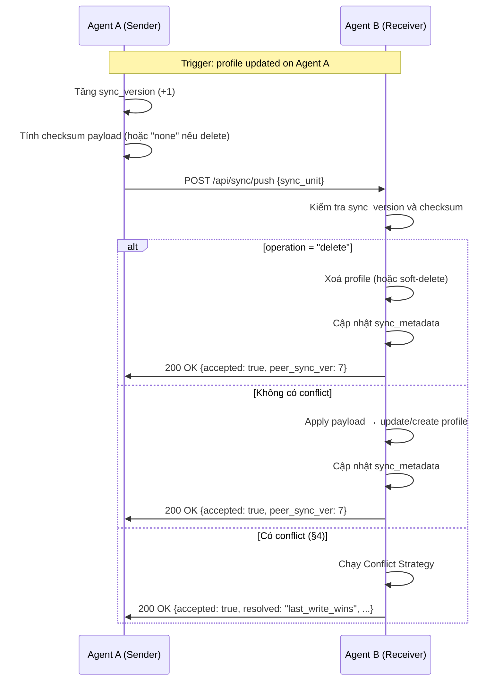
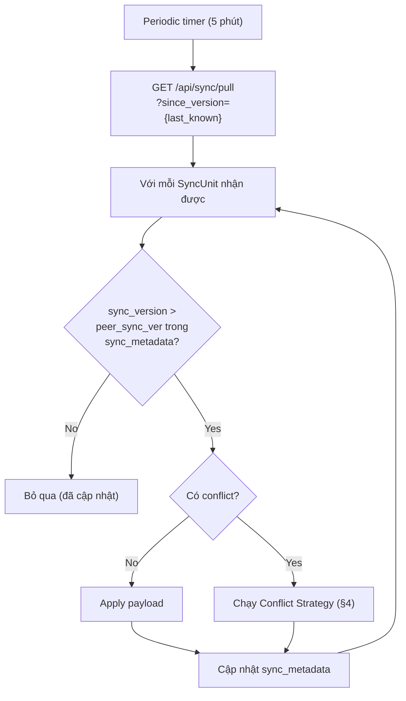
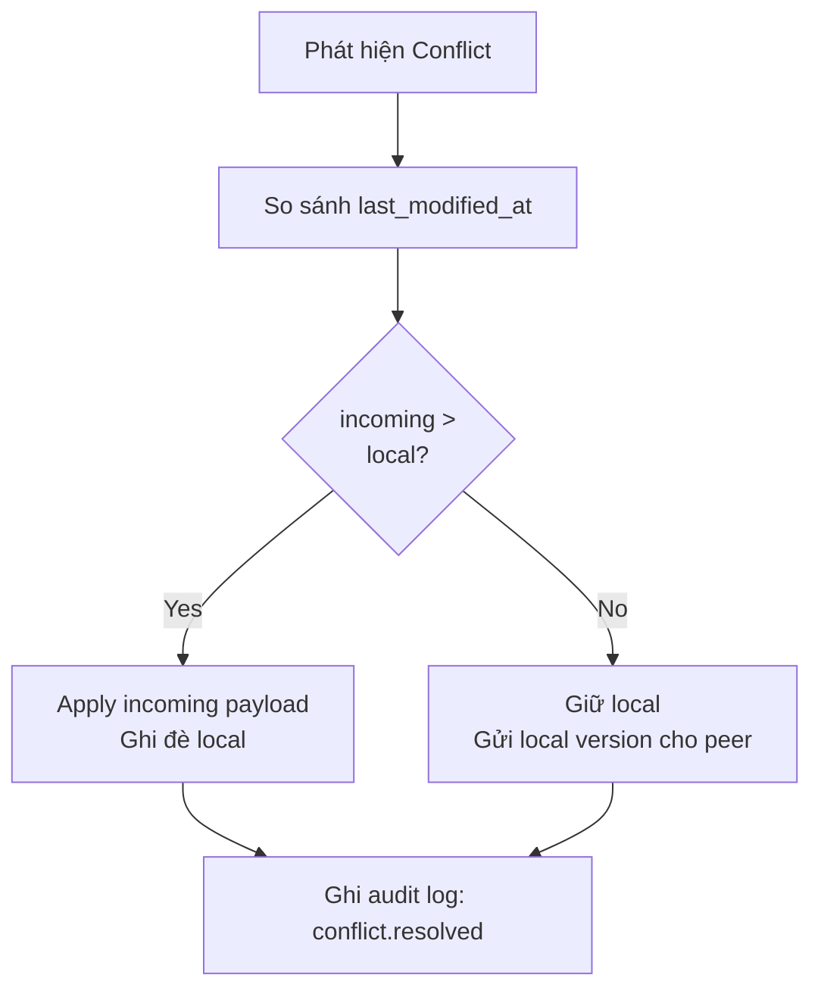
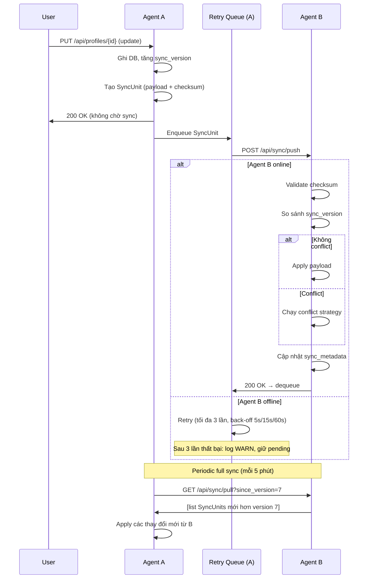

# 24 — Browser Synchronizer: Sync Contract

> **Phiên bản**: 1.0 | **Ngày**: 2026-02-21 | **Trạng thái**: Draft  
> **EPIC tương ứng**: S — Browser Synchronizer (đồng bộ profile/browser state giữa các agent)

---

## 1. Mục tiêu tài liệu

Tài liệu này xác định **Sync Contract** giữa các BrowserManager Agent khi đồng bộ
profile và browser state:

- Định nghĩa **Sync Object** — các trường dữ liệu được đồng bộ.
- **Luồng đồng bộ** (Sync Flow) — thời điểm và cơ chế kích hoạt sync.
- **Conflict Strategy** — cách xử lý xung đột khi hai agent cùng sửa một profile.
- **Versioning** — cơ chế phiên bản để phát hiện thay đổi và điều phối merge.

> **Phạm vi**: Tài liệu này mô tả giao thức đồng bộ **agent-to-agent** qua Local API.
> Đồng bộ cloud (nếu có) nằm ngoài phạm vi phiên bản này.

---

## 2. Định nghĩa Sync Object

### 2.1 Đơn vị đồng bộ (Sync Unit)

Mỗi **Sync Unit** đại diện cho một snapshot đầy đủ của một profile tại một thời điểm.

```json
{
  "sync_unit": {
    "schema_version": "1.0",
    "profile_id": "550e8400-e29b-41d4-a716-446655440000",
    "agent_id": "agent-primary-01",
    "sync_version": 7,
    "operation": "update",
    "last_modified_at": "2026-02-21T08:30:00Z",
    "checksum": "sha256:aabbcc...",
    "payload": { }
  }
}
```

| Trường | Kiểu | Mô tả |
|---|---|---|
| `schema_version` | `string` | Phiên bản schema của Sync Object (SemVer minor-only, ví dụ `"1.0"`) |
| `profile_id` | `string (UUID)` | ID profile cần đồng bộ |
| `agent_id` | `string` | ID của agent gửi bản đồng bộ |
| `sync_version` | `integer` | Vector clock riêng của profile trên agent gửi (tăng +1 mỗi lần ghi) |
| `operation` | `string` | Loại thao tác: `"create"` \| `"update"` \| `"delete"` |
| `last_modified_at` | `datetime (ISO 8601 UTC)` | Thời điểm thay đổi cuối cùng trên agent gửi |
| `checksum` | `string` | SHA-256 của `payload` sau khi serialize JSON; `"none"` khi `operation = "delete"` |
| `payload` | `object` \| `null` | Dữ liệu profile cần đồng bộ (xem §2.2); `null` khi `operation = "delete"` |

### 2.2 Payload — Trường được đồng bộ

```json
{
  "name": "Profile A",
  "group_id": "grp-001",
  "remark": "Account farming VN",
  "tags": ["vn", "farming"],
  "proxy_id": "proxy-007",
  "start_url": "https://example.com",
  "user_agent": "Mozilla/5.0 ...",
  "kernel_ver": "120.0.6099.109",
  "os_version": "Windows 10",
  "screen_res": "1920x1080",
  "timezone": "Asia/Ho_Chi_Minh",
  "language": "vi-VN,vi;q=0.9",
  "headless_default": false,
  "extensions": ["cfhdojbkjhnklbpkdaibdccddilifddb"],
  "metadata": { }
}
```

Khi `operation = "delete"`, `payload` là `null` và `checksum` là `"none"`.
Receiver sẽ xoá profile tương ứng và ghi `deleted_at` vào lịch sử nếu soft-delete được bật.

**Trường KHÔNG đồng bộ** (excluded):

| Trường | Lý do loại trừ |
|---|---|
| `data_dir` | Đường dẫn tuyệt đối, phụ thuộc máy |
| `password_enc` | Mã hoá DPAPI, không di chuyển được sang máy khác |
| `e2e_encryption_enabled` | Security-sensitive, cài đặt riêng từng agent |
| `lock_status` | Trạng thái cục bộ, không đồng bộ xuyên agent |
| `sessions` | Trạng thái runtime, không lưu trữ |
| `last_used_at` | Chỉ cập nhật khi session start (xem `03-background-agent.md` §9.1) |

### 2.3 Sync Metadata Table

Mỗi agent lưu bảng `sync_metadata` để theo dõi trạng thái đồng bộ:

```sql
CREATE TABLE sync_metadata (
    profile_id      TEXT NOT NULL REFERENCES profiles(id) ON DELETE CASCADE,
    peer_agent_id   TEXT NOT NULL,
    peer_sync_ver   INTEGER NOT NULL DEFAULT 0,  -- sync_version cuối đã nhận thành công
    last_synced_at  DATETIME,
    status          TEXT DEFAULT 'ok',           -- ok | conflict | pending
    PRIMARY KEY (profile_id, peer_agent_id)
);
```

---

## 3. Luồng Đồng Bộ (Sync Flow)

### 3.1 Tổng quan



### 3.2 Thời điểm kích hoạt Sync (Sync Triggers)

| Trigger | Mô tả | Độ trễ tối đa |
|---|---|---|
| **Write trigger** | Profile được tạo/sửa/xoá trên agent | Ngay lập tức (async, fire-and-forget với retry) |
| **Periodic full sync** | Đồng bộ toàn bộ danh sách profile | Mỗi 5 phút (configurable) |
| **On-demand sync** | Người dùng hoặc API yêu cầu sync ngay | Ngay lập tức |
| **Peer reconnect** | Agent B kết nối lại sau khi offline | Ngay sau khi `/health` của B khả dụng |

> **Lưu ý**: Write trigger là **async fire-and-forget** — không chặn response của API gốc.
> Agent sử dụng retry queue (tối đa 3 lần, back-off 5s/15s/60s) nếu peer không khả dụng.

### 3.3 Push Endpoint (Receiver API)

```
POST /api/sync/push
Authorization: Bearer {token}
Content-Type: application/json

Body: SyncUnit (xem §2.1)
```

Response thành công:
```json
{
  "accepted": true,
  "profile_id": "550e8400-...",
  "peer_sync_ver": 7,
  "resolved": null
}
```

Response khi conflict đã giải quyết:
```json
{
  "accepted": true,
  "profile_id": "550e8400-...",
  "peer_sync_ver": 9,
  "resolved": "last_write_wins",
  "winning_agent": "agent-primary-01"
}
```

### 3.4 Pull Endpoint (Receiver kéo dữ liệu)

```
GET /api/sync/pull?since_version={n}&agent_id={id}
Authorization: Bearer {token}
```

Response:
```json
{
  "agent_id": "agent-primary-01",
  "units": [
    { "sync_unit": { ... } },
    { "sync_unit": { ... } }
  ],
  "total": 2
}
```

Dùng khi agent vừa online trở lại và cần kéo toàn bộ thay đổi từ peer.

### 3.5 Luồng Full Sync (Periodic)



### 3.6 Initial Peer Join (Lần đầu kết nối)

Khi một Agent B kết nối lần đầu tới Agent A (hoặc sau khi database bị reset):

1. Agent B gọi `GET /api/sync/capabilities` để xác định schema version và conflict strategy chung.
2. Agent B gọi `GET /api/sync/pull?since_version=0&agent_id={B_id}` để kéo **toàn bộ** profile từ A.
3. Agent A trả về tất cả SyncUnit với `sync_version ≥ 1`.
4. Agent B áp dụng từng SyncUnit theo thứ tự tăng dần của `sync_version`.
5. Sau khi hoàn tất, Agent B ghi `peer_sync_ver` vào `sync_metadata` cho từng profile.

> **Lưu ý**: `since_version=0` là giá trị đặc biệt chỉ ra "kéo toàn bộ". Agent A trả về tất cả profile đang có (không bao gồm các profile đã xoá hoàn toàn khỏi DB).

---

## 4. Conflict Strategy

### 4.1 Định nghĩa Conflict

**Conflict** xảy ra khi:
- Agent B nhận `SyncUnit` từ Agent A với `profile_id = X`.
- Agent B đã có local change trên `profile_id = X` **sau** thời điểm sync cuối cùng
  (tức là `local.sync_version > peer_sync_ver` trong `sync_metadata`).

Điều kiện conflict:
```
conflict = (local_sync_version > known_peer_sync_version)
           AND (incoming.last_modified_at != local.last_modified_at)
```

**Trường hợp đặc biệt — Delete vs. Update**:

| Incoming operation | Local state | Hành vi |
|---|---|---|
| `delete` | Không có local change | Xoá profile trên B (no conflict) |
| `delete` | Có local change chưa sync | **Conflict**: áp dụng LWW theo `last_modified_at`; nếu incoming mới hơn → xoá; nếu local mới hơn → giữ lại và gửi lại cho A |
| `create` / `update` | Profile không tồn tại trên B | Tạo mới (no conflict) |
| `create` / `update` | Profile tồn tại, không có local change | Apply (no conflict) |
| `create` / `update` | Profile tồn tại, có local change | Conflict → chạy strategy |

### 4.2 Chiến lược mặc định: Last-Write-Wins (LWW)

**Mặc định** BrowserManager dùng **Last-Write-Wins** dựa trên `last_modified_at`:

```
winner = max(incoming.last_modified_at, local.last_modified_at)
```

- Nếu `incoming.last_modified_at` > `local.last_modified_at` → apply incoming, ghi đè local.
- Nếu `local.last_modified_at` ≥ `incoming.last_modified_at` → giữ local, từ chối incoming.



> **Hạn chế LWW**: Clock drift giữa các máy có thể gây ra kết quả sai. Khuyến nghị
> đồng bộ NTP giữa các máy chạy agent. Nếu clock drift > 30s, Agent sẽ log WARN.

### 4.3 Chiến lược nâng cao: Field-Level Merge (FLM)

Bật qua config `sync.conflict_strategy: "field_merge"` (mặc định: `"last_write_wins"`).

Field-Level Merge áp dụng từng trường độc lập:

| Trường | Merge Rule |
|---|---|
| `name` | LWW (last_modified_at) |
| `group_id` | LWW |
| `remark` | LWW |
| `tags` | Union (thêm mới từ cả hai bên, không xoá) |
| `proxy_id` | LWW |
| `start_url` | LWW |
| `user_agent` | LWW |
| `extensions` | Union (thêm mới từ cả hai bên, không xoá) |
| `metadata` | Deep merge (key-level LWW) |

> **Xoá tag/extension**: Trong chế độ FLM, xoá tag/extension cần thêm **tombstone** vào
> `metadata._deleted_tags` / `metadata._deleted_extensions` (xem §4.4).

### 4.4 Tombstone cho xoá (Deletion Tombstones)

Để tránh "resurrected" tag/extension sau khi union merge, agent ghi tombstone:

```json
{
  "metadata": {
    "_deleted_tags": [
      { "value": "old-tag", "deleted_at": "2026-02-21T07:00:00Z" }
    ],
    "_deleted_extensions": [
      { "value": "cfhdojbkjhnklbpkdaibdccddilifddb", "deleted_at": "2026-02-21T07:00:00Z" }
    ]
  }
}
```

Tombstone TTL: **30 ngày** — sau đó tự xoá khỏi metadata.

### 4.5 Conflict Log

Mọi conflict được ghi vào `audit_logs`:

```json
{
  "action": "sync.conflict.resolved",
  "resource_id": "550e8400-...",
  "detail": {
    "strategy": "last_write_wins",
    "winning_agent": "agent-primary-01",
    "local_modified_at": "2026-02-21T08:00:00Z",
    "incoming_modified_at": "2026-02-21T08:30:00Z",
    "incoming_agent": "agent-primary-01"
  }
}
```

---

## 5. Versioning

### 5.1 Schema Version

`schema_version` trong Sync Object dùng định dạng `"MAJOR.MINOR"`:

| Version | Thay đổi | Tương thích |
|---|---|---|
| `1.0` | Initial release | — |
| `1.x` | Thêm trường mới (backward compat) | Agent cũ bỏ qua trường lạ |
| `2.0` | Breaking change (đổi cấu trúc payload) | Cần negotiation trước khi sync |

**Negotiation khi connect**:

```
GET /api/sync/capabilities
→ { "schema_versions": ["1.0", "1.1"], "conflict_strategies": ["last_write_wins", "field_merge"] }
```

Agent chọn phiên bản cao nhất mà cả hai đều hỗ trợ. Nếu không có version chung →
sync bị từ chối, log ERROR.

### 5.2 Sync Version (Vector Clock đơn giản)

Mỗi profile có một counter `sync_version` riêng trên mỗi agent:

- **Tăng +1** mỗi khi profile được ghi (create/update/delete) trên agent đó.
- **Không giảm** — chỉ tăng đơn điệu.
- **Không chia sẻ** counter giữa agent; mỗi agent có counter độc lập.

Quy tắc quyết định "đã biết" hay "mới":

```
incoming là mới  =  incoming.sync_version > peer_sync_ver trong sync_metadata
```

### 5.3 Compatibility Matrix

| Sender version | Receiver version | Hành vi |
|---|---|---|
| `1.0` | `1.0` | Sync bình thường |
| `1.1` | `1.0` | Receiver bỏ qua trường lạ; sync bình thường |
| `1.0` | `1.1` | Sync bình thường (receiver hiểu ngược về trước) |
| `2.0` | `1.x` | Sync từ chối; log ERROR `sync.schema_incompatible` |
| `1.x` | `2.0` | Sync từ chối; log ERROR `sync.schema_incompatible` |

### 5.4 Cấu hình (Settings DB)

| Key | Default | Mô tả |
|---|---|---|
| `sync.enabled` | `false` | Bật/tắt tính năng sync (opt-in) |
| `sync.conflict_strategy` | `last_write_wins` | `last_write_wins` hoặc `field_merge` |
| `sync.full_sync_interval_sec` | `300` | Chu kỳ full sync (giây) |
| `sync.push_retry_count` | `3` | Số lần retry khi push thất bại |
| `sync.push_retry_backoff_sec` | `[5, 15, 60]` | Back-off giữa các lần retry (giây) |
| `sync.peers` | `[]` | Danh sách `{agent_id, url, token}` của các peer agent |
| `sync.clock_drift_warn_sec` | `30` | Ngưỡng cảnh báo clock drift (giây) |

Ví dụ cấu hình peer:
```json
{
  "sync.peers": [
    {
      "agent_id": "agent-secondary-01",
      "url": "http://192.168.1.100:40000",
      "token": "..."
    }
  ]
}
```

---

## 6. Sơ đồ luồng tổng hợp



---

## 7. Bảo mật

| Khía cạnh | Biện pháp |
|---|---|
| **Xác thực** | Mỗi push/pull request phải có `Authorization: Bearer {token}` hợp lệ của peer |
| **Transport** | Khuyến nghị TLS (HTTPS) cho kết nối cross-machine; trong cùng máy có thể dùng HTTP localhost |
| **Dữ liệu nhạy cảm** | `proxy.password`, `api_token` không được đưa vào `payload` — xem §2.2 |
| **Checksum** | SHA-256 của payload để phát hiện corrupt/tamper |
| **Token riêng cho sync** | Có thể dùng token riêng cho sync peer (scope: `sync`) thay vì admin token |

---

## 8. Error Catalog (Sync-specific)

| Mã lỗi | HTTP | Mô tả |
|---|---|---|
| `sync.schema_incompatible` | `422` | Schema version không tương thích giữa sender và receiver |
| `sync.checksum_mismatch` | `400` | Checksum payload không khớp — payload bị corrupt |
| `sync.profile_not_found` | `404` | `profile_id` không tồn tại trên receiver (sẽ tạo mới) |
| `sync.conflict.unresolved` | `409` | Conflict không thể tự giải quyết (chỉ xảy ra với chiến lược manual) |
| `sync.peer_unauthorized` | `401` | Token peer không hợp lệ |

---

## 9. Definition of Done (DoD) — EPIC S

- [ ] Tài liệu này được đội review và sign-off.
- [ ] Bảng `sync_metadata` được thêm vào migration script.
- [ ] Endpoint `POST /api/sync/push` và `GET /api/sync/pull` được implement và có test.
- [ ] Conflict strategy `last_write_wins` hoạt động đúng với unit tests.
- [ ] Full sync periodic job chạy đúng chu kỳ.
- [ ] Audit log ghi đúng sự kiện `sync.conflict.resolved`.
- [ ] Clock drift warning hoạt động khi delta > `sync.clock_drift_warn_sec`.
- [ ] Sync không làm lộ `password_enc` hay `api_token` trong payload.
- [ ] Capabilities negotiation từ chối đúng khi schema không tương thích.

---

*Tài liệu liên quan: [01-kien-truc-he-thong.md](01-kien-truc-he-thong.md) | [03-background-agent.md](03-background-agent.md) | [04-local-api.md](04-local-api.md) | [09-bao-mat-va-luu-tru.md](09-bao-mat-va-luu-tru.md)*
